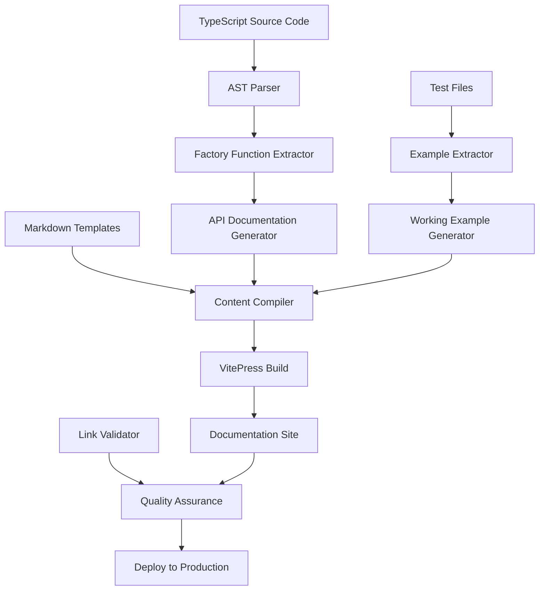

# Design Document

## Overview

This design outlines the comprehensive implementation of TypeKro's documentation site, transforming it from 11 existing pages to a complete 50+ page professional documentation platform. The design focuses on user journey optimization, automated content generation, and production-ready infrastructure while maintaining the existing VitePress foundation.

## Current State Analysis

### Existing Infrastructure ✅

- **VitePress Configuration**: Professional setup with TypeKro branding, navigation, and search
- **Core Content**: 11 pages exist with good quality (Getting Started, API Index, Simple WebApp, etc.)
- **Visual Design**: TypeKro logos, consistent theming, mobile-responsive layout
- **Build System**: Automated builds with `docs:dev`, `docs:build`, `docs:preview` scripts

### Critical Gaps ❌

- **Missing Content**: 40+ configured pages return 404 errors
- **Broken Navigation**: Sidebar links lead to non-existent pages
- **Content Inaccuracy**: Some existing examples use outdated APIs
- **Limited Interactivity**: No copy buttons, code playground, or enhanced UX features

## Architecture Design

### Content Organization Strategy

```
docs/
├── guide/                    # User-focused guides (13 pages)
│   ├── introduction/         # What is TypeKro, Getting Started, Quick Start
│   ├── core-concepts/        # Resource Graphs, References, CEL, Status
│   ├── deployment/           # Direct, KRO, Alchemy, GitOps strategies  
│   └── advanced/             # Custom factories, Performance, Type Safety
├── api/                      # Developer-focused reference (9 pages)
│   ├── core/                 # toResourceGraph, CEL, Types
│   └── factories/            # Categorized factory documentation
├── examples/                 # Practical tutorials (6 pages)
│   ├── basic/                # Simple WebApp, Database, Microservices
│   └── advanced/             # Multi-env, CI/CD, Monitoring
└── assets/                   # Shared resources, diagrams, images
```

### Content Generation Pipeline



## Implementation Strategy

### Phase 1: Content Infrastructure (Week 1)

#### 1.1 Template System
Create consistent templates for each content type:

```typescript
// Template structure for factory documentation
interface FactoryDocTemplate {
  name: string;
  category: 'workloads' | 'networking' | 'storage' | 'config' | 'rbac';
  signature: TypeSignature;
  description: string;
  examples: CodeExample[];
  relatedFactories: string[];
  commonPatterns: Pattern[];
}
```

#### 1.2 Content Extraction Tools
Build tools to extract documentation from source code:

```typescript
// Extract factory functions from source
async function extractFactoryDocs(): Promise<FactoryDocTemplate[]> {
  const sourceFiles = await glob('src/factories/**/*.ts');
  return sourceFiles.map(file => ({
    ...parseTypeScriptFile(file),
    examples: extractExamplesFromTests(file)
  }));
}
```

#### 1.3 Validation Pipeline
Implement automated content validation:

```typescript
// Validate all code examples compile and run
async function validateCodeExamples(content: string[]): Promise<ValidationResult> {
  for (const example of extractCodeBlocks(content)) {
    await validateTypeScriptCode(example);
    await validateAgainstCurrentAPI(example);
  }
}
```

### Phase 2: Core Guide Pages (Week 2)

#### 2.1 Missing Core Guides
Implement the 9 missing guide pages with comprehensive content:

**Resource Graphs Guide** (`guide/resource-graphs.md`)
- Complete toResourceGraph() documentation
- Schema definition patterns
- Resource builder functions
- Status mapping strategies

**Status Hydration Guide** (`guide/status-hydration.md`) 
- How status fields are populated at runtime
- CEL expression evaluation in status
- Debugging status issues
- Performance considerations

**Deployment Strategy Guides** (4 pages)
- `guide/direct-deployment.md` - factory('direct') comprehensive guide
- `guide/kro-integration.md` - KRO mode, installation, advanced features
- `guide/alchemy-integration.md` - Multi-cloud patterns and best practices
- `guide/gitops.md` - YAML generation, ArgoCD/Flux integration

#### 2.2 Advanced Topic Guides
Create advanced user documentation:

**Custom Factories Guide** (`guide/custom-factories.md`)
- Step-by-step factory creation
- TypeScript patterns and best practices
- Integration with TypeKro system
- Testing custom factories

**Type Safety Guide** (`guide/type-safety.md`)
- Advanced TypeScript patterns
- Schema validation strategies
- Runtime type checking
- Error handling patterns

**Performance Guide** (`guide/performance.md`)
- Bundle optimization techniques
- Runtime performance considerations
- Memory usage patterns
- Scaling recommendations

### Phase 3: API Reference (Week 3)

#### 3.1 Automated API Generation
Build comprehensive API documentation from source code:

```typescript
// Generate factory category documentation
async function generateFactoryDocs(category: string): Promise<string> {
  const factories = await extractFactoriesFromCategory(category);
  return factories.map(factory => ({
    signature: extractTypeSignature(factory),
    description: extractJSDocDescription(factory),
    examples: extractWorkingExamples(factory),
    parameters: extractParameterDocs(factory)
  })).reduce((doc, factory) => doc + renderFactoryDoc(factory), '');
}
```

#### 3.2 Complete Factory Documentation
Generate documentation for all 50+ factory functions:

**Workloads Category** (`api/factories/workloads.md`)
- simpleDeployment, simpleStatefulSet, simpleDaemonSet
- simpleJob, simpleCronJob, simpleReplicaSet
- Complete parameter documentation and examples

**Networking Category** (`api/factories/networking.md`)
- simpleService, simpleIngress, simpleNetworkPolicy
- simpleEndpoints, simpleIngressClass
- Service discovery patterns and examples

**Storage, Configuration, RBAC Categories**
- Complete documentation for all remaining categories
- Real-world usage patterns
- Integration examples

#### 3.3 CEL and Types Documentation
Create comprehensive reference material:

**CEL API Reference** (`api/cel.md`)
- All CEL functions and operators
- Expression building patterns
- Type-safe CEL usage
- Common expression libraries

**TypeScript Types Reference** (`api/types.md`)
- All public interfaces and types
- Generic type patterns
- Advanced type usage
- Migration guides

### Phase 4: Examples and Tutorials (Week 4)

#### 4.1 Progressive Example Series
Create tutorial progression from basic to advanced:

**Basic Examples** (Database, Microservices)
- Complete, runnable applications
- Step-by-step setup instructions
- Key concept explanations
- Common variation patterns

**Advanced Examples** (Multi-Environment, CI/CD, Monitoring)
- Production-ready implementations
- Complex orchestration patterns
- Integration with external tools
- Scalability and security considerations

#### 4.2 Interactive Tutorials
Enhance examples with interactive features:

```typescript
// Interactive code examples with copy buttons
interface InteractiveExample {
  code: string;
  description: string;
  copyable: boolean;
  runnable: boolean;
  variations: CodeVariation[];
}
```

### Phase 5: Enhanced User Experience (Week 5)

#### 5.1 Interactive Features
Implement modern documentation UX:

**Copy-to-Clipboard Functionality**
```typescript
// Add copy buttons to all code blocks
function addCopyButtons() {
  document.querySelectorAll('pre code').forEach(block => {
    const button = createCopyButton(block.textContent);
    block.parentElement.appendChild(button);
  });
}
```

**Enhanced Search Experience**
- Full-text search across all content
- Category-filtered search results
- Quick navigation shortcuts
- Search result highlighting

**Mobile Optimization**
- Responsive navigation menu
- Touch-friendly interactive elements
- Optimized content layout
- Fast loading on mobile networks

#### 5.2 Visual Enhancements
Improve content presentation:

**Mermaid Diagram Integration**
- Architecture diagrams
- Workflow visualizations
- Concept illustrations
- Integration patterns

**Syntax Highlighting Enhancement**
- TypeScript-optimized highlighting
- YAML syntax support
- Bash command highlighting
- Error highlighting in examples

### Phase 6: Production Infrastructure (Week 6)

#### 6.1 Automated Deployment Pipeline
```yaml
# GitHub Actions workflow for documentation
name: Documentation Deploy
on:
  push:
    branches: [main]
    paths: ['docs/**', 'src/**']

jobs:
  deploy:
    runs-on: ubuntu-latest
    steps:
      - uses: actions/checkout@v4
      - uses: oven-sh/setup-bun@v1
      - run: bun install
      - run: bun run docs:build
      - run: bun run docs:validate
      - uses: peaceiris/actions-gh-pages@v3
        with:
          github_token: ${{ secrets.GITHUB_TOKEN }}
          publish_dir: docs/.vitepress/dist
```

#### 6.2 Quality Assurance Automation
```typescript
// Automated quality checks
async function validateDocumentation(): Promise<QualityReport> {
  return {
    linkValidation: await validateAllLinks(),
    codeValidation: await validateAllCodeExamples(),
    contentCompleteness: await checkContentCompleteness(),
    performanceMetrics: await measurePageLoadTimes(),
    accessibilityScore: await runAccessibilityAudit()
  };
}
```

## Technical Implementation Details

### Content Generation Architecture

#### Factory Documentation Generator
```typescript
interface FactoryDocGenerator {
  // Extract factory metadata from TypeScript AST
  extractFactoryMetadata(sourceFile: string): FactoryMetadata;
  
  // Generate working examples from test files
  extractWorkingExamples(factoryName: string): CodeExample[];
  
  // Create comprehensive documentation
  generateDocumentation(factory: FactoryMetadata): string;
  
  // Validate generated content
  validateGeneratedDocs(content: string): ValidationResult;
}
```

#### Example Validation System
```typescript
interface ExampleValidator {
  // Compile TypeScript examples
  validateTypeScript(code: string): CompilationResult;
  
  // Test against real Kubernetes API
  validateKubernetesResources(manifest: string): ValidationResult;
  
  // Check API compatibility
  validateAgainstCurrentAPI(example: string): CompatibilityResult;
}
```

### Performance Optimization

#### Build-Time Optimizations
- Pre-compile all code examples during build
- Generate static search index
- Optimize image assets automatically
- Minify and compress all content

#### Runtime Optimizations
- Lazy load non-critical content
- Cache search results locally
- Implement service worker for offline access
- Progressive image loading

### Accessibility and SEO

#### Accessibility Features
- Semantic HTML structure throughout
- Keyboard navigation support
- Screen reader compatibility
- High contrast mode support
- Alternative text for all images

#### SEO Optimization
```typescript
// Generate SEO metadata for each page
interface SEOMetadata {
  title: string;
  description: string;
  keywords: string[];
  openGraph: OpenGraphData;
  structuredData: StructuredData;
}
```

## Success Metrics and Validation

### Content Completeness Metrics
- Zero missing pages (all 50+ configured pages exist)
- 100% link validation success rate
- All code examples compile and run successfully
- Complete API coverage for all factory functions

### User Experience Metrics
- Page load times under 2 seconds
- Mobile responsiveness score above 95%
- Accessibility score above 90%
- Search result relevance above 85%

### Quality Assurance Checklist
- [ ] All navigation links work correctly
- [ ] All code examples are tested and functional
- [ ] Content is accurate to current TypeKro version
- [ ] SEO metadata is complete and optimized
- [ ] Mobile experience is fully functional
- [ ] Search covers all content effectively
- [ ] Copy-to-clipboard works on all code blocks
- [ ] External links are validated and working

## Risk Mitigation

### Content Accuracy Risks
- **Risk**: Code examples become outdated with TypeKro changes
- **Mitigation**: Automated validation in CI/CD pipeline

### Maintenance Burden Risks
- **Risk**: Documentation becomes difficult to maintain
- **Mitigation**: Automated content generation from source code

### User Experience Risks
- **Risk**: Documentation site becomes slow or difficult to navigate
- **Mitigation**: Performance monitoring and optimization

### Technical Infrastructure Risks
- **Risk**: Documentation deployment failures
- **Mitigation**: Robust CI/CD pipeline with rollback capabilities

This design provides a comprehensive roadmap for transforming TypeKro's documentation from incomplete to production-ready, with automated processes to ensure long-term maintainability and accuracy.