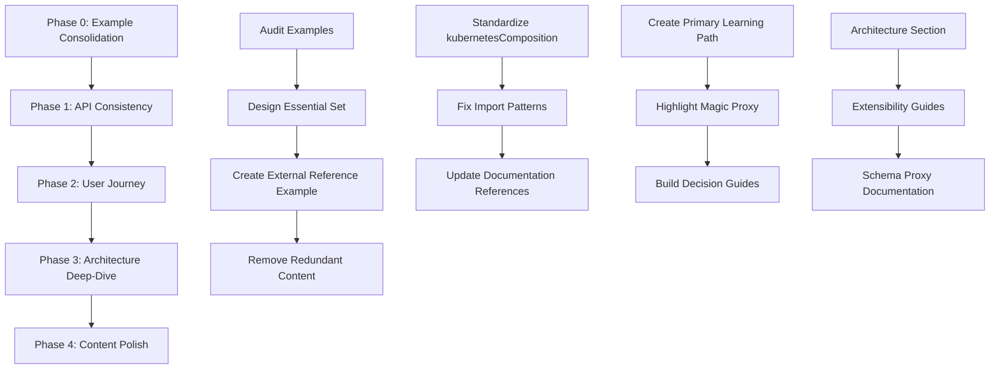
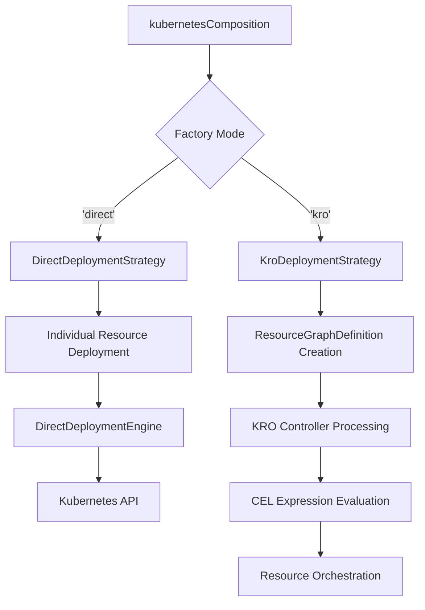

# Design Document

## Overview

This design outlines the systematic transformation of TypeKro's documentation from comprehensive but confusing to cohesive, compelling, and simple. The design prioritizes API consistency, example focus, user journey clarity, and prominent magic proxy system showcasing while maintaining comprehensive architecture documentation for advanced users.

Based on actual TypeKro implementation analysis, this design ensures all examples and explanations align with the real codebase.

## Current State Analysis

### Documentation Strengths ✅

- **Comprehensive Coverage**: Most core concepts documented with good depth
- **Professional Infrastructure**: VitePress setup with proper navigation and search
- **Quality Examples**: Multiple working code samples demonstrate functionality
- **Technical Depth**: Advanced concepts covered for experienced users

### Critical Problems ❌

- **API Confusion**: Mixed `kubernetesComposition` vs `toResourceGraph` presentation
- **Import Inconsistency**: Scattered patterns between `'typekro'` and `'typekro/simple'`
- **Example Bloat**: Too many similar examples dilute key concepts
- **Fragmented Journey**: Users get lost between different approaches and patterns
- **Hidden Differentiators**: Magic proxy and external references not prominently featured

## Architecture Design

### Phase-Based Implementation Strategy



## Implementation Strategy

### Phase 0: Essential Example Consolidation (Week 1)

#### 0.1 Example Set Design
Create focused, high-impact example progression:

1. **Basic Factory Usage** (`basic-factories.ts`)
   - `kubernetesComposition` with simple.Deployment + simple.Service
   - Introduces core API patterns and magic proxy basics

2. **CRD Integration** (`crd-integration.ts`)
   - Creating and consuming custom resources
   - Shows TypeKro's CRD intelligence and type safety

3. **Helm Chart Integration** (`helm-integration.ts`)
   - Leveraging helmRelease() to deploy Helm charts with TypeKro
   - Schema references in Helm values using the magic proxy system
   - Integration with Flux CD HelmRelease CRDs

4. **YAML Integration** (`yaml-integration.ts`)
   - Using yamlFile() and yamlDirectory() deployment closures
   - Consuming existing YAML manifests alongside TypeKro resources
   - Git repository and local file system integration

5. **Cross-Resource References** (`cross-references.ts`)
   - Magic proxy system within single composition
   - Resource field references and CEL expressions using Cel.expr and Cel.template

6. **External References** (`external-references.ts`) ⭐ **NEW KEY FEATURE**
   - Using `externalRef()` function between different resource compositions
   - Demonstrates cross-composition dependency resolution

#### 0.2 Comprehensive Example Architecture

**External Reference Example:**
```typescript
// Database composition
const database = kubernetesComposition(
  {
    name: 'postgres-db',
    apiVersion: 'db.example.com/v1',
    kind: 'Database',
    spec: DatabaseSpec,
    status: DatabaseStatus
  },
  (spec) => {
    const postgres = Deployment({
      name: spec.name,
      image: 'postgres:15'
    });
    
    const service = Service({
      name: Cel.template('%s-service', spec.name),  // Use actual Cel.template
      selector: { app: spec.name }
    });
    
    return {
      ready: Cel.expr<boolean>(postgres.status.readyReplicas, ' > 0'),
      endpoint: service.status.clusterIP
    };
  }
);

// Application composition that references external database
const application = kubernetesComposition(
  {
    name: 'web-app',
    apiVersion: 'app.example.com/v1',
    kind: 'WebApp', 
    spec: AppSpec,
    status: AppStatus
  },
  (spec) => {
    // Use externalRef to reference the database composition
    const db = externalRef<DatabaseSpec, DatabaseStatus>(
      'db.example.com/v1',
      'Database',
      'production-db'
    );
    
    const app = Deployment({
      name: spec.name,
      image: spec.image,
      env: {
        // External reference using proxy system
        DATABASE_URL: Cel.template('postgres://user:pass@%s:5432/app', db.status.endpoint)
      }
    });
    
    return {
      ready: Cel.expr<boolean>(app.status.readyReplicas, ' > 0'),
      databaseConnected: db.status.ready  // External reference
    };
  }
);
```

**Helm Chart Integration Example:**
```typescript
import { kubernetesComposition, type } from 'typekro';
import { helmRelease } from 'typekro';

const infraComposition = kubernetesComposition(
  {
    name: 'nginx-infrastructure',
    apiVersion: 'infra.example.com/v1',
    kind: 'NginxInfra',
    spec: type({ replicas: 'number', hostname: 'string' }),
    status: type({ ready: 'boolean', ingressIP: 'string' })
  },
  (spec) => {
    // Deploy Helm chart with schema references
    const nginxChart = helmRelease({
      name: 'nginx-controller',
      chart: {
        repository: 'https://kubernetes.github.io/ingress-nginx',
        name: 'ingress-nginx',
        version: '4.8.3'
      },
      values: {
        controller: {
          replicaCount: spec.replicas,  // Schema reference in Helm values
          service: {
            type: 'LoadBalancer'
          }
        }
      }
    });
    
    return {
      ready: Cel.expr<boolean>(nginxChart.status.phase, ' == "Ready"'),
      ingressIP: 'pending'  // HelmRelease doesn't expose loadBalancer status directly
    };
  }
);
```

**YAML Deployment Closure Example:**
```typescript
import { kubernetesComposition, type } from 'typekro';
import { yamlFile, yamlDirectory } from 'typekro';
import { Deployment } from 'typekro/simple';

const bootstrapComposition = kubernetesComposition(
  {
    name: 'cluster-bootstrap',
    apiVersion: 'bootstrap.example.com/v1',
    kind: 'ClusterBootstrap',
    spec: type({ namespace: 'string' }),
    status: type({ crdReady: 'boolean', appsDeployed: 'boolean' })
  },
  (spec) => {
    // Deploy CRDs from YAML files (returns DeploymentClosure)
    const crds = yamlFile({
      name: 'flux-crds',
      path: 'https://github.com/fluxcd/flux2/releases/latest/download/install.yaml'
    });
    
    // Deploy controllers from directory (returns DeploymentClosure)  
    const controllers = yamlDirectory({
      name: 'monitoring-stack',
      path: './k8s/monitoring/',
      recursive: true,
      namespace: spec.namespace
    });
    
    // TypeKro resources alongside YAML closures
    const app = Deployment({
      name: 'bootstrap-app',
      image: 'nginx:latest'
    });
    
    return {
      crdReady: true,  // Static boolean - YAML closures execute at deployment time
      appsDeployed: Cel.expr<boolean>(app.status.readyReplicas, ' > 0')
    };
  }
);
```

### Phase 1: API Consistency Implementation (Week 2)

#### 1.1 Primary API Standardization
```typescript
// BEFORE: Inconsistent API presentation
const example1 = toResourceGraph(definition, resourceBuilder, statusBuilder);
const example2 = kubernetesComposition(definition, compositionFn);

// AFTER: Consistent primary API
const example1 = kubernetesComposition(definition, compositionFn);
const example2 = kubernetesComposition(definition, compositionFn);
// Note: toResourceGraph only in dedicated API reference page
```

#### 1.2 Import Pattern Standardization
```typescript
// BEFORE: Mixed import patterns
import { kubernetesComposition, simple } from 'typekro';
import { Deployment } from 'typekro/simple';
import * as simple from 'typekro/simple';

// AFTER: Consistent pattern everywhere
import { kubernetesComposition, Cel, externalRef } from 'typekro';
import { Deployment, Service, ConfigMap } from 'typekro/simple';
```

#### 1.3 Content Update Strategy
```bash
# Systematic content updates
1. Replace toResourceGraph with kubernetesComposition in:
   - All guide/* pages
   - All examples/* pages  
   - README.md primary examples
   - API docs (except dedicated declarative page)

2. Standardize imports in all code examples:
   - Use 'typekro/simple' for factory imports
   - Use 'typekro' for core functionality
   - Remove mixed import patterns

3. Update documentation cross-references:
   - Link to essential examples only
   - Remove references to deprecated examples
   - Ensure navigation consistency
```

### Phase 2: Streamlined User Journey (Week 3-4)

#### 2.1 Primary Learning Path Design
```
Installation (2 min)
    ↓
Bootstrap TypeKro Runtime (5 min)
    ↓  
Your First App with kubernetesComposition (10 min)
    ↓
Working with Factory Functions from 'typekro/simple' (15 min)
    ↓
Magic Proxy: Schema References & CEL Expressions (15 min)
    ↓
External References: Cross-Composition Dependencies (20 min) ← KEY FEATURE
    ↓
Understanding Schema Proxy Architecture (15 min)
    ↓
Next Steps → Advanced Architecture Deep-Dive
```

#### 2.2 Magic Proxy System Showcase
```typescript
// Progressive Magic Proxy Demonstration

// 1. Static Values (Compilation Time)
const deployment = Deployment({
  name: 'my-app',        // Static string
  replicas: 3            // Static number
});

// 2. Schema References (Runtime CEL) - using actual schema proxy
const deployment = Deployment({
  name: spec.name,       // Schema reference via createSchemaProxy
  replicas: spec.replicas
});

// 3. CEL Expressions (Runtime Templates)
const deployment = Deployment({
  name: Cel.template('%s-app', spec.name),  // Actual Cel.template usage
  env: {
    NODE_ENV: Cel.expr<string>(spec.environment, ' == "prod" ? "production" : "development"')
  }
});

// 4. External References (Cross-Composition) ⭐ NEW
const deployment = Deployment({
  env: {
    DATABASE_URL: Cel.template('postgres://user:pass@%s:5432/app', 
      externalDB.status.endpoint)  // Using externalRef()
  }
});
```

#### 2.3 Decision Guide Architecture
```typescript
interface DecisionGuide {
  question: string;
  options: {
    choice: string;
    description: string;
    redirect: string;
  }[];
}

const primaryDecisionGuide: DecisionGuide = {
  question: "What do you want to build with TypeKro?",
  options: [
    {
      choice: "Simple web application",
      description: "Single service with basic resources",
      redirect: "/examples/basic-factories"
    },
    {
      choice: "Complex microservices with dependencies",
      description: "Multi-service architecture with external references", 
      redirect: "/examples/external-references"
    },
    {
      choice: "Leverage existing Helm charts",
      description: "Deploy Helm charts with TypeKro's type safety",
      redirect: "/examples/helm-integration"
    },
    {
      choice: "Multi-cloud infrastructure",
      description: "Kubernetes + cloud resources",
      redirect: "/guide/deployment/alchemy"
    }
  ]
};
```

### Phase 3: Architecture Deep-Dive Documentation (Week 5-6)

#### 3.1 Schema Proxy System Architecture
```markdown
# Schema Proxy System Design

## Core Implementation

### Schema Reference Creation
```typescript
// Actual TypeKro implementation uses createSchemaProxy
function createSchemaProxy<TSpec, TStatus>(): SchemaProxy<TSpec, TStatus> {
  return {
    spec: createSchemaMagicProxy<TSpec>('spec'),
    status: createSchemaMagicProxy<TStatus>('status'),
  };
}

// Schema references marked with __schema__ resourceId
function createSchemaRefFactory<T>(fieldPath: string): T {
  // Returns KubernetesRef with resourceId: '__schema__'
  // fieldPath: 'spec.name', 'status.ready', etc.
}
```

### CEL Integration Pipeline
```typescript
interface CelIntegration {
  // Template function for string interpolation
  template(templateString: string, ...values: RefOrValue<any>[]): CelExpression<string>;
  
  // Expression function for CEL evaluation
  expr<T>(...parts: RefOrValue<unknown>[]): CelExpression<T>;
  
  // Conditional expressions
  conditional<T>(condition: RefOrValue<any>, trueValue: RefOrValue<any>, 
                falseValue: RefOrValue<any>): CelExpression<T>;
}
```

#### 3.2 Deployment Strategy Architecture


#### 3.3 Extensibility Pattern Documentation
```typescript
// Actual Factory Creation Pattern (based on codebase analysis)
interface FactoryPattern {
  // Use createResource from factories/shared.ts
  createResource(resource: KubernetesResource): Enhanced<TSpec, TStatus>;
  
  // Enhanced types via proxy system
  Enhanced<TSpec, TStatus>: {
    spec: TSpec;
    status: TStatus;
    metadata: V1ObjectMeta;
    // Plus magic proxy capabilities
  };
}

// External Reference Pattern (actual implementation)
function externalRef<TSpec, TStatus>(
  apiVersion: string,
  kind: string, 
  instanceName: string,
  namespace?: string
): Enhanced<TSpec, TStatus>;
```

### Phase 4: Content Quality and Polish (Week 7)

#### 4.1 Technical Accuracy Verification
```typescript
interface ContentValidation {
  // Verify all examples compile and run
  validateExamples(examples: Example[]): Promise<ValidationResult[]>;
  
  // Check API consistency across documentation
  validateApiConsistency(docs: Documentation[]): ConsistencyReport;
  
  // Ensure deployment guidance alignment with actual strategies
  validateDeploymentGuidance(guides: DeploymentGuide[]): AlignmentReport;
}
```

#### 4.2 Deployment Strategy Clarity
```markdown
# Deployment Strategy Decision Matrix

| **Use Case** | **Recommended Mode** | **Implementation** | **Why** |
|--------------|---------------------|-------------------|---------|
| Local development | Direct Mode | DirectDeploymentStrategy | Immediate Kubernetes API calls, fast iteration |
| Complex dependencies | KRO Mode | KroDeploymentStrategy | ResourceGraphDefinition + CEL evaluation |
| GitOps workflows | YAML Generation | factory.toYaml() | Deterministic output, version control |
| External references | Either Mode | externalRef() function | Cross-composition dependency resolution |
| Multi-cloud setup | Direct + Alchemy | DirectDeploymentEngine + Alchemy | Unified cloud + K8s management |
```

## Success Metrics and Validation

### API Consistency Metrics
- [ ] 100% of primary documentation uses `kubernetesComposition`
- [ ] Consistent `from 'typekro/simple'` imports throughout
- [ ] `toResourceGraph` limited to dedicated API page only
- [ ] All examples compile and run with current implementation

### Example Effectiveness Metrics  
- [ ] 5-6 essential examples maximum (reduced from current bloat)
- [ ] External reference example demonstrates `externalRef()` function usage
- [ ] Progressive complexity from basic to advanced concepts
- [ ] Each example has clear learning objective and builds on previous

### User Journey Metrics
- [ ] Linear primary path from installation to advanced architecture
- [ ] Magic proxy system prominently featured with CEL integration
- [ ] Clear decision guides route users to appropriate content
- [ ] Advanced architecture comprehensive but separate from basic path

### Magic Proxy Showcase Metrics
- [ ] External reference capabilities highlighted as key differentiator
- [ ] Progressive demonstration: static → schema → CEL → external
- [ ] Architecture documentation explains schema proxy design
- [ ] Cross-composition orchestration patterns documented with `externalRef()`

This design creates a cohesive, compelling documentation experience that guides users effectively while showcasing TypeKro's unique advantages based on the actual implementation, maintaining comprehensive technical depth for advanced users.