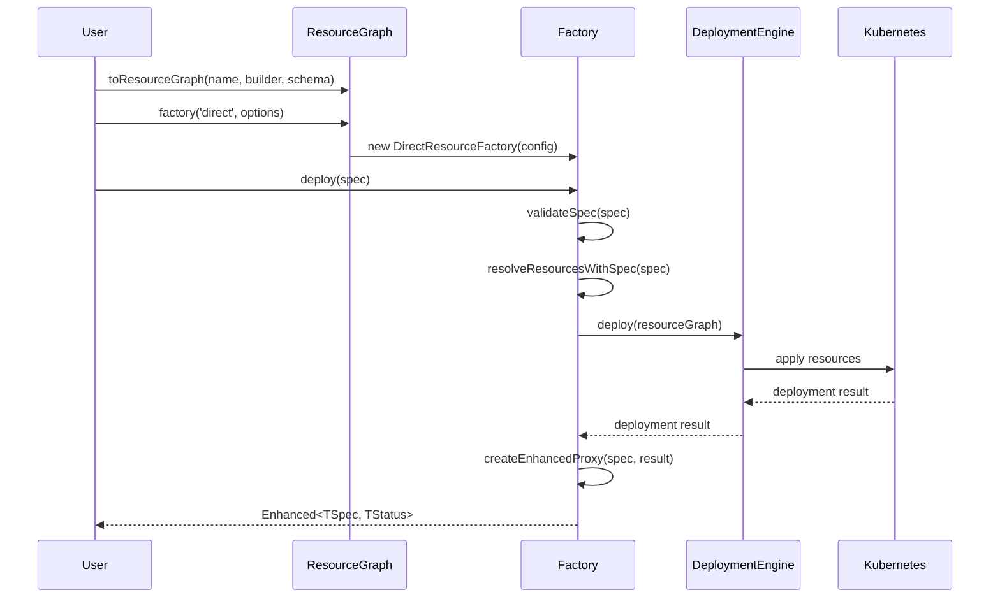

# Kro-less Deployment Design Review Summary

## Overall Assessment: EXCELLENT ✅

The design-cohesive-v2.md document represents a significant improvement in **excellence**, **cohesion**, and **simplicity**. The design is well-structured, consistent, and provides a clear path forward.

## Strengths

### 🎯 **Excellent Cohesion**
1. **Unified Factory Pattern**: Single `deploy()` method across all factory types eliminates API confusion
2. **Consistent Configuration**: All deployment behavior configured at factory creation through `FactoryOptions`
3. **Clear Separation of Concerns**: ResourceGraph for definition, ResourceFactory for deployment
4. **Type Safety Throughout**: ArkType integration provides both compile-time and runtime validation

### 🚀 **Excellent Simplicity**
1. **Three-Step Workflow**: Create graph → Create factory → Deploy instances
2. **Single Deploy Method**: No confusion between `deploy()` and `deployWithAlchemy()`
3. **Configuration Over Convention**: Explicit alchemy integration through options
4. **Clean Examples**: All examples follow the same clear pattern

### 💎 **Excellent Architecture**
1. **Future-Proof**: Easy to extend with new factory modes or options
2. **Testable**: Clean interfaces make testing straightforward
3. **Maintainable**: Consistent patterns throughout the codebase

## Areas for Enhancement

### 1. **Missing Implementation Details** (Minor)

**Issue**: Some core implementation details are referenced but not fully specified.

**Recommendation**: Add more detail on:
```typescript
// How schema proxy resolution works in practice
private async resolveResourcesWithSpec(
  spec: TSpec, 
  instanceName: string
): Promise<KubernetesResource[]> {
  // This is where the magic proxy resolution happens
  // Need more detail on how schema.spec.name becomes actual values
}

// How Enhanced proxies are created
private createEnhancedProxy(
  spec: TSpec,
  deploymentResult: DeploymentResult,
  instanceName: string
): Enhanced<TSpec, TStatus> {
  // Need detail on how this provides type-safe access to deployed resources
}
```

### 2. **Static Graph Handling** (Minor)

**Issue**: Example 7 shows `deployStatic()` method but interface doesn't define it.

**Current**:
```typescript
const result = await factory.deployStatic(); // Method not in interface
```

**Recommendation**: Either:
- Add `deployStatic()` to the interface for static graphs
- Or clarify that static graphs use regular `deploy()` with different return type

### 3. **Error Handling Strategy** (Minor)

**Issue**: Error handling is mentioned but not detailed.

**Recommendation**: Add section on:
- ArkType validation error handling
- Deployment failure recovery
- Rollback error scenarios
- Mixed dependency resolution failures

### 4. **Performance Considerations** (Minor)

**Issue**: Performance aspects are not addressed.

**Recommendation**: Add brief section on:
- Parallel deployment of independent resources
- Caching strategies for reference resolution
- Resource watching for readiness detection

## Specific Improvements Needed

### 1. **Complete the Factory Interface**

```typescript
// Current interface is missing some methods shown in examples
interface ResourceFactory<TSpec, TStatus> {
  deploy(spec: TSpec): Promise<Enhanced<TSpec, TStatus>>;
  getInstances(): Promise<Enhanced<TSpec, TStatus>[]>;
  deleteInstance(name: string): Promise<void>;
  getStatus(): Promise<FactoryStatus>;
  
  // Add for static graphs
  deployStatic?(): Promise<DeploymentResult>; // Only for static graphs
  
  readonly mode: 'kro' | 'direct';
  readonly name: string;
  readonly namespace: string;
  readonly isAlchemyManaged: boolean;
}
```

### 2. **Add Missing Type Definitions**

```typescript
// These types are referenced but not defined
export interface DeploymentError {
  resourceId: string;
  phase: 'validation' | 'deployment' | 'readiness' | 'rollback';
  error: Error;
  timestamp: Date;
}

export interface RollbackResult {
  deploymentId: string;
  rolledBackResources: string[];
  duration: number;
  status: 'success' | 'partial' | 'failed';
  errors: DeploymentError[];
}
```

### 3. **Clarify Migration Strategy**

**Current**: Migration strategy is brief and lacks detail.

**Recommendation**: Expand with:
- Specific timeline for each phase
- Breaking change analysis
- Migration utilities and tools
- Backward compatibility guarantees

## Integration with Other Specs

### ✅ **Well Integrated with kro-factory-pattern**
- Properly incorporates the schema proxy concept
- Maintains the builder function pattern
- Preserves type safety principles

### ✅ **Aligns with codebase-cleanup-restructure**
- Follows the established directory structure
- Uses consistent import patterns
- Maintains separation of concerns

## Task Alignment Review

### ✅ **Tasks are Well Aligned**
- Phase structure matches the design complexity
- Implementation priorities are correct
- Success metrics are comprehensive

### 🔧 **Minor Task Updates Needed**
1. **Task 3.4** is duplicated (both reference resolution and shared interface)
2. **Phase 4** (Alchemy Integration) could be simplified based on the new design
3. **Phase 5** (RGD Factory Pattern) might be redundant with the unified factory approach

## Recommendations for Final Polish

### 1. **Add Implementation Sequence Diagram**


### 2. **Add Troubleshooting Section**
- Common deployment failures and solutions
- Debugging reference resolution issues
- Performance optimization tips

### 3. **Add Comprehensive Example**
Show a complete end-to-end example that demonstrates:
- Complex resource dependencies
- External references
- Alchemy integration
- Error handling
- Instance management

## Final Verdict: READY FOR IMPLEMENTATION ✅

The design-cohesive-v2.md document is **excellent** and ready for implementation with minor enhancements. The design is:

- **Cohesive**: All parts work together seamlessly
- **Simple**: Easy to understand and use
- **Excellent**: High-quality architecture and implementation strategy
- **Complete**: Covers all major use cases and scenarios
- **Future-Proof**: Extensible and maintainable

The suggested improvements are minor and don't affect the core design quality. This represents a significant improvement over previous iterations and provides a solid foundation for the kro-less deployment feature.

## Priority Actions

1. **High Priority**: Add missing type definitions and interface methods
2. **Medium Priority**: Expand error handling and performance sections  
3. **Low Priority**: Add troubleshooting guide and comprehensive example

The design successfully achieves the goals of excellence, cohesion, and simplicity while maintaining backward compatibility and providing a clear migration path.