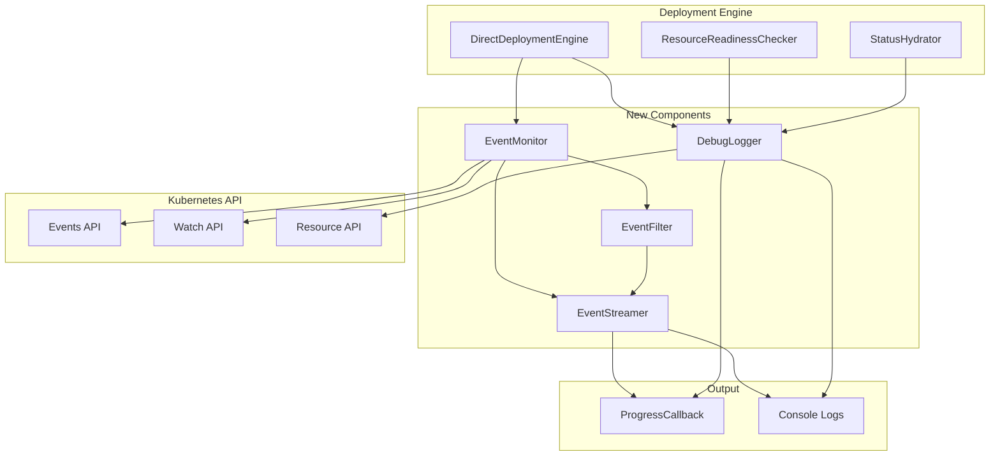

# Design Document

## Overview

This design implements real-time Kubernetes events streaming and enhanced debug logging for TypeKro deployments. The solution integrates with the existing deployment engine and progress callback system to provide developers with comprehensive visibility into deployment progress and troubleshooting information.

## Architecture

### High-Level Architecture



### Component Responsibilities

#### EventMonitor
- Manages Kubernetes event watching for deployed resources
- Discovers child resources created by parent resources
- Handles watch connection lifecycle and error recovery
- Coordinates with EventFilter for relevance filtering

#### EventFilter
- Filters events based on resource ownership and relevance
- Implements deduplication logic for repeated events
- Categorizes events by severity and importance
- Maintains resource relationship mapping

#### DebugLogger
- Enhances status polling with detailed debug information
- Formats complex status structures for readability
- Integrates with existing readiness checking logic
- Provides structured debug data for progress callbacks

#### EventStreamer
- Delivers events and debug information via progress callbacks
- Handles console logging when callbacks are not available
- Implements rate limiting and batching for high-volume scenarios
- Manages event formatting for different output targets

## Components and Interfaces

### EventMonitor Interface

```typescript
interface EventMonitor {
  /**
   * Start monitoring events for a set of deployed resources
   */
  startMonitoring(
    deployedResources: DeployedResource[],
    options: EventMonitoringOptions
  ): Promise<void>;

  /**
   * Stop monitoring and clean up watchers
   */
  stopMonitoring(): Promise<void>;

  /**
   * Add additional resources to monitor (for child resource discovery)
   */
  addResources(resources: DeployedResource[]): Promise<void>;
}

interface EventMonitoringOptions {
  namespace?: string;
  eventTypes?: ('Normal' | 'Warning' | 'Error')[];
  includeChildResources?: boolean;
  startTime?: Date;
  progressCallback?: (event: DeploymentEvent) => void;
}
```

### EventFilter Interface

```typescript
interface EventFilter {
  /**
   * Determine if an event is relevant to the current deployment
   */
  isRelevant(event: k8s.CoreV1Event, deployedResources: DeployedResource[]): boolean;

  /**
   * Check if an event should be deduplicated
   */
  shouldDeduplicate(event: k8s.CoreV1Event): boolean;

  /**
   * Get the priority/importance of an event
   */
  getEventPriority(event: k8s.CoreV1Event): 'high' | 'medium' | 'low';
}
```

### DebugLogger Interface

```typescript
interface DebugLogger {
  /**
   * Log detailed status information during readiness polling
   */
  logResourceStatus(
    resource: DeployedResource,
    currentStatus: unknown,
    readinessResult: boolean | ReadinessResult,
    context: StatusLoggingContext
  ): void;

  /**
   * Log readiness evaluation details
   */
  logReadinessEvaluation(
    resource: DeployedResource,
    evaluator: ReadinessEvaluator,
    result: ReadinessResult
  ): void;
}

interface StatusLoggingContext {
  attempt: number;
  elapsedTime: number;
  isTimeout: boolean;
  progressCallback?: (event: DeploymentEvent) => void;
}
```

### Enhanced DeploymentEvent Types

```typescript
// Extend existing DeploymentEvent with new event types
interface KubernetesEvent extends DeploymentEvent {
  type: 'kubernetes-event';
  eventType: 'Normal' | 'Warning' | 'Error';
  reason: string;
  source: {
    component: string;
    host?: string;
  };
  involvedObject: {
    kind: string;
    name: string;
    namespace?: string;
    uid?: string;
  };
  count?: number;
  firstTimestamp?: Date;
  lastTimestamp?: Date;
}

interface StatusDebugEvent extends DeploymentEvent {
  type: 'status-debug';
  resourceId: string;
  currentStatus: Record<string, unknown>;
  readinessResult: boolean | ReadinessResult;
  context: {
    attempt: number;
    elapsedTime: number;
    isTimeout: boolean;
  };
}

interface ChildResourceDiscoveredEvent extends DeploymentEvent {
  type: 'child-resource-discovered';
  parentResource: string;
  childResource: {
    kind: string;
    name: string;
    namespace?: string;
  };
}
```

## Data Models

### Resource Relationship Tracking

```typescript
interface ResourceRelationship {
  parent: ResourceIdentifier;
  children: ResourceIdentifier[];
  discoveredAt: Date;
  relationshipType: 'owns' | 'creates' | 'manages';
}

interface ResourceIdentifier {
  kind: string;
  name: string;
  namespace?: string;
  uid?: string;
}
```

### Event Deduplication

```typescript
interface EventDeduplicationKey {
  involvedObjectUid: string;
  reason: string;
  message: string;
}

interface DeduplicationEntry {
  key: EventDeduplicationKey;
  firstSeen: Date;
  lastSeen: Date;
  count: number;
  lastEvent: k8s.CoreV1Event;
}
```

## Error Handling

### Event Monitoring Errors

1. **Watch Connection Failures**
   - Implement exponential backoff retry logic
   - Fall back to periodic polling if watch fails repeatedly
   - Log connection issues at appropriate levels
   - Continue deployment progress even if event monitoring fails

2. **API Permission Errors**
   - Gracefully handle insufficient RBAC permissions
   - Provide clear error messages about required permissions
   - Allow deployment to continue without event monitoring
   - Log permission issues for cluster administrator attention

3. **Resource Discovery Errors**
   - Handle cases where child resources cannot be discovered
   - Continue monitoring parent resources even if children fail
   - Log discovery failures for debugging
   - Implement timeout for resource discovery operations

### Debug Logging Errors

1. **Status Query Failures**
   - Continue readiness polling even if debug logging fails
   - Log status query errors without blocking deployment
   - Implement retry logic for transient API errors
   - Provide fallback status information when detailed queries fail

2. **Large Status Objects**
   - Implement size limits for logged status objects
   - Truncate large status structures with indication
   - Provide summary information for complex nested objects
   - Allow configuration of maximum log payload size

## Testing Strategy

### Unit Tests

1. **EventMonitor Tests**
   - Mock Kubernetes watch API responses
   - Test event filtering and deduplication logic
   - Verify proper cleanup of watch connections
   - Test error handling and retry mechanisms

2. **EventFilter Tests**
   - Test relevance filtering with various resource relationships
   - Verify deduplication logic with repeated events
   - Test event priority classification
   - Validate child resource discovery logic

3. **DebugLogger Tests**
   - Test status formatting for various resource types
   - Verify readiness evaluation logging
   - Test integration with progress callbacks
   - Validate log level and verbosity controls

### Integration Tests

1. **End-to-End Event Streaming**
   - Deploy resources and verify events are captured
   - Test event streaming during resource failures
   - Verify proper event attribution to resources
   - Test cleanup when deployments complete

2. **Status Debug Integration**
   - Test debug logging during actual readiness polling
   - Verify integration with custom readiness evaluators
   - Test debug information in progress callbacks
   - Validate performance impact measurements

3. **Error Scenario Testing**
   - Test behavior with insufficient RBAC permissions
   - Verify graceful degradation when event API is unavailable
   - Test handling of malformed or unexpected events
   - Validate timeout and cleanup behavior

### Performance Tests

1. **Event Volume Testing**
   - Test with high-volume event scenarios
   - Verify rate limiting and batching effectiveness
   - Measure memory usage with long-running deployments
   - Test cleanup efficiency with many resources

2. **API Efficiency Testing**
   - Measure API call overhead for event monitoring
   - Test watch connection efficiency vs. polling
   - Verify minimal impact on deployment performance
   - Test resource usage with concurrent deployments

## Implementation Phases

### Phase 1: Core Event Monitoring
- Implement EventMonitor with basic Kubernetes event watching
- Add EventFilter with relevance filtering
- Integrate with existing DirectDeploymentEngine
- Basic console logging of events

### Phase 2: Debug Logging Enhancement
- Implement DebugLogger for status polling
- Enhance ResourceReadinessChecker with debug output
- Add structured debug events to progress callbacks
- Implement configurable verbosity levels

### Phase 3: Advanced Features
- Add child resource discovery
- Implement event deduplication and rate limiting
- Add EventStreamer with batching capabilities
- Enhance error handling and recovery

### Phase 4: Performance and Polish
- Optimize API usage and watch efficiency
- Add comprehensive configuration options
- Implement performance monitoring and metrics
- Add advanced filtering and customization options

## Configuration Options

### DeploymentOptions Extensions

```typescript
interface DeploymentOptions {
  // Existing options...
  
  // Event monitoring configuration
  eventMonitoring?: {
    enabled?: boolean;
    eventTypes?: ('Normal' | 'Warning' | 'Error')[];
    includeChildResources?: boolean;
    deduplicationWindow?: number; // seconds
    maxEventsPerSecond?: number;
  };
  
  // Debug logging configuration
  debugLogging?: {
    enabled?: boolean;
    statusPolling?: boolean;
    readinessEvaluation?: boolean;
    maxStatusObjectSize?: number; // bytes
    verboseMode?: boolean;
  };
  
  // Output configuration
  outputOptions?: {
    consoleLogging?: boolean;
    logLevel?: 'error' | 'warn' | 'info' | 'debug';
    progressCallbackEvents?: ('kubernetes-event' | 'status-debug' | 'child-resource-discovered')[];
  };
}
```

### Environment Variable Configuration

```bash
# Event monitoring
TYPEKRO_EVENT_MONITORING_ENABLED=true
TYPEKRO_EVENT_TYPES=Warning,Error
TYPEKRO_INCLUDE_CHILD_RESOURCES=true

# Debug logging
TYPEKRO_DEBUG_LOGGING_ENABLED=true
TYPEKRO_DEBUG_STATUS_POLLING=true
TYPEKRO_DEBUG_VERBOSE_MODE=false

# Output options
TYPEKRO_CONSOLE_LOGGING=true
TYPEKRO_LOG_LEVEL=info
```

## Security Considerations

### RBAC Requirements

The enhanced monitoring requires additional Kubernetes permissions:

```yaml
apiVersion: rbac.authorization.k8s.io/v1
kind: ClusterRole
metadata:
  name: typekro-event-monitoring
rules:
- apiGroups: [""]
  resources: ["events"]
  verbs: ["get", "list", "watch"]
- apiGroups: [""]
  resources: ["pods", "services", "configmaps", "secrets"]
  verbs: ["get", "list", "watch"]
- apiGroups: ["apps"]
  resources: ["deployments", "replicasets", "daemonsets", "statefulsets"]
  verbs: ["get", "list", "watch"]
```

### Data Privacy

1. **Event Content Filtering**
   - Avoid logging sensitive information from events
   - Implement content filtering for known sensitive patterns
   - Provide options to exclude certain event types or sources
   - Log security-related filtering decisions

2. **Status Information Security**
   - Filter sensitive fields from status debug logs
   - Implement configurable field exclusion lists
   - Avoid logging secrets or credentials in status information
   - Provide options for sanitizing debug output

## Backward Compatibility

### Existing API Compatibility

1. **DeploymentOptions**
   - All new options are optional with sensible defaults
   - Existing deployments continue to work unchanged
   - New event types are additive to existing progress events
   - No breaking changes to existing progress callback signatures

2. **Logging Integration**
   - New debug logging integrates with existing logging system
   - Existing log levels and configuration continue to work
   - New log entries use consistent formatting with existing logs
   - No changes to existing log output unless new features are enabled

### Migration Path

1. **Gradual Adoption**
   - Features can be enabled incrementally
   - Default configuration provides basic functionality
   - Advanced features require explicit configuration
   - Clear documentation for migration from existing setups

2. **Feature Flags**
   - All new functionality behind feature flags
   - Easy rollback if issues are discovered
   - A/B testing capabilities for performance validation
   - Gradual rollout in production environments