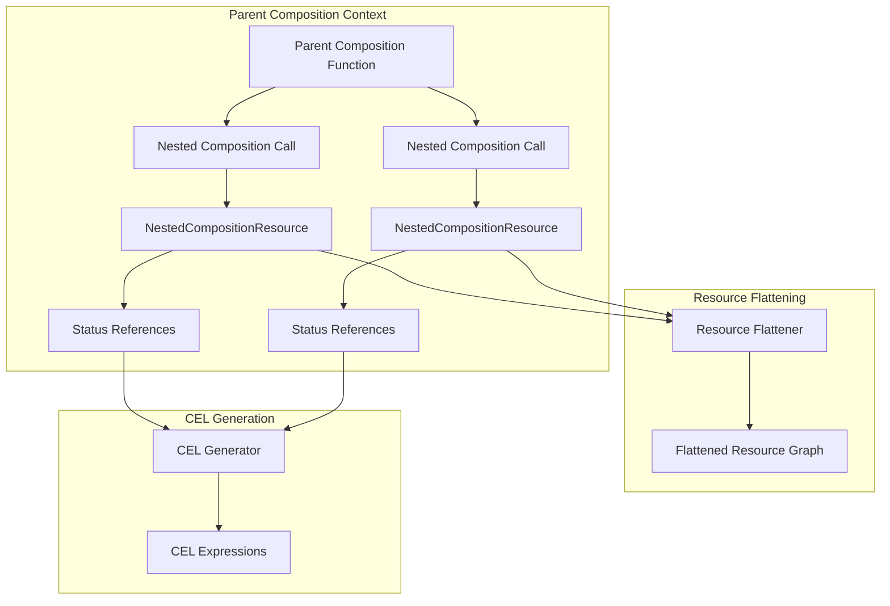
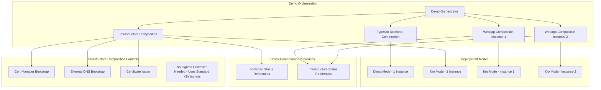
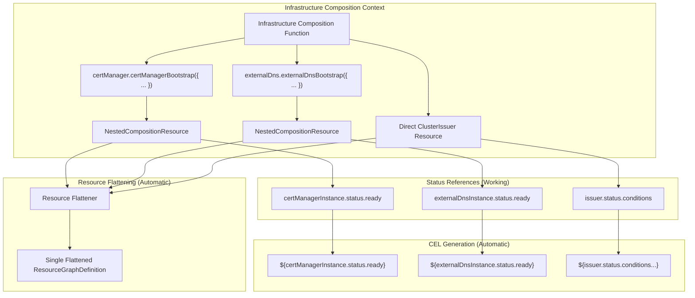

# Nested Compositions Design Document

## Overview

This design document outlines the nested compositions feature in TypeKro, which is fully implemented and working, culminating in a comprehensive three-composition hello-world demo. The feature enables developers to use one composition as a resource within another composition using natural function call syntax, creating powerful modularity and reusability patterns.

The design showcases three key areas:
1. **Working nested composition functionality** - Compositions are callable within other compositions using `const nested = composition({ ... })`
2. **Natural cross-composition referencing** - Status references work seamlessly: `nested.status.field`
3. **Three-composition demo** - Real-world infrastructure patterns with Infrastructure Composition containing nested cert-manager and external-dns bootstrap calls

## Architecture

### High-Level Architecture



### Three-Composition Demo Architecture (Per Requirements)



### Nested Composition Architecture (Working Implementation)



## Components and Interfaces

### Core Nested Composition Components

#### 1. NestedCompositionResource Interface

```typescript
interface NestedCompositionResource<TSpec = any, TStatus = any> {
  /** Type-safe access to nested composition status */
  readonly status: TStatus;
  
  /** The spec object passed to the nested composition */
  readonly spec: TSpec;
  
  /** Internal composition identifier for resource namespacing */
  readonly __compositionId: string;
  
  /** Internal array of resources from the nested composition */
  readonly __resources: KubernetesResource[];
}
```

#### 2. Composition Context Enhancement

```typescript
interface CompositionContext {
  name: string;
  namespace: string;
  resources: Map<string, any>;
  externalReferences: Set<ResourceReference>;
  
  // New nested composition support
  nestedCompositions: Map<string, NestedCompositionResource>;
  compositionIdCounter: number;
  
  addExternalReference: (ref: ResourceReference) => void;
  addNestedComposition: (id: string, resource: NestedCompositionResource) => void;
}
```

#### 3. TypedResourceGraph Callable Enhancement

```typescript
interface TypedResourceGraph<TSpec, TStatus> extends BaseTypedResourceGraph<TSpec, TStatus> {
  /**
   * Call the composition as a nested composition within another composition.
   * Creates a NestedCompositionResource with type-safe status access.
   */
  (spec: TSpec): NestedCompositionResource<TSpec, TStatus>;
}
```

### Three-Composition Demo Components

#### 1. TypeKro Bootstrap Composition

```typescript
// Use existing typeKroRuntimeBootstrap with actual status interface:
interface TypeKroRuntimeStatus {
  phase: 'Pending' | 'Installing' | 'Ready' | 'Failed' | 'Upgrading';
  components: {
    fluxSystem: boolean;
    kroSystem: boolean;
  };
}
```

#### 2. Infrastructure Composition

```typescript
interface InfrastructureSpec {
  domain: string;
  email: string;
  awsRegion: string;
  hostedZoneId: string;
  acmeServer: string;
  // Cross-composition reference to bootstrap (use actual bootstrap status fields)
  runtimePhase: 'Pending' | 'Installing' | 'Ready' | 'Failed' | 'Upgrading';
  kroSystemReady: boolean;
}

interface InfrastructureStatus {
  certManagerReady: boolean;
  externalDnsReady: boolean;
  issuerReady: boolean;
  issuerName: string;
  dnsProvider: string;
}
```

#### 3. Webapp Composition

```typescript
interface WebappSpec {
  name: string;
  domain: string;
  image?: string;
  replicas?: number;
  // Cross-composition references to infrastructure
  issuerName: string;
  dnsProvider: string;
}

interface WebappStatus {
  deploymentReady: boolean;
  serviceReady: boolean;
  certificateReady: boolean;
  ingressReady: boolean;
  url: string;
  ready: boolean;
}
```

## Data Models

### Nested Composition Resource Model

```typescript
class NestedCompositionResourceImpl<TSpec, TStatus> implements NestedCompositionResource<TSpec, TStatus> {
  constructor(
    private compositionId: string,
    private specData: TSpec,
    private statusProxy: TStatus,
    private resources: KubernetesResource[]
  ) {}

  get status(): TStatus {
    return this.statusProxy;
  }

  get spec(): TSpec {
    return this.specData;
  }

  get __compositionId(): string {
    return this.compositionId;
  }

  get __resources(): KubernetesResource[] {
    return this.resources;
  }
}
```

### Cross-Composition Reference Model

```typescript
interface CrossCompositionReference extends KubernetesRef {
  sourceCompositionId: string;
  targetCompositionId: string;
  fieldPath: string;
  referenceType: 'status' | 'spec';
}
```

### Resource Flattening Model

```typescript
interface FlattenedResource {
  originalId: string;
  namespacedId: string;
  compositionId: string;
  resource: KubernetesResource;
  dependencies: string[];
}

interface ResourceFlattener {
  flattenComposition(
    parentContext: CompositionContext,
    nestedCompositions: Map<string, NestedCompositionResource>
  ): FlattenedResource[];
}
```

## Implementation Dependencies

### Required Imports and Factory Functions

The three-composition demo requires these existing factory functions:

```typescript
// Main TypeKro exports (existing)
import { 
  kubernetesComposition, 
  typeKroRuntimeBootstrap,
  certManager,
  externalDns,
  simple
} from 'typekro';

// Specific factory functions available:
// - typeKroRuntimeBootstrap (from core)
// - certManager.certManagerBootstrap (from cert-manager ecosystem)
// - certManager.clusterIssuer (from cert-manager resources)
// - certManager.certificate (from cert-manager resources)
// - externalDns.externalDnsBootstrap (from external-dns ecosystem)
// - simple.Deployment, simple.Service, simple.Ingress (from kubernetes ecosystem)
```

### Codebase Alignment Notes

1. **TypeKro Bootstrap Status**: Uses `phase` and `components.kroSystem` fields, not `ready`
2. **Cert-Manager Bootstrap**: Returns `ready` status field from HelmRelease status
3. **External-DNS Bootstrap**: Returns `ready` status field from HelmRelease status
4. **Ingress Strategy**: Uses standard Kubernetes Ingress (works with any ingress controller)
5. **Cross-Composition References**: Must use actual status field names from existing compositions

### ✅ Nested Composition Implementation Status

**The core nested composition feature IS fully implemented and working!** All key components are in place:

1. ✅ **Callable TypedResourceGraph Interface**: Compositions are callable within other compositions using natural function call syntax
2. ✅ **NestedCompositionResource Implementation**: Type-safe access to nested composition status with full TypeScript support
3. ✅ **Resource Flattening Engine**: Nested resources are automatically merged into parent composition
4. ✅ **Cross-Composition CEL Generation**: CEL expressions work perfectly for nested status references
5. ✅ **Composition Context Enhancement**: Nested compositions are tracked, cached, and conflicts prevented

**Working Example**: See `test/integration/javascript-to-cel-e2e.test.ts` where `const database = _createDatabase({ ... })` is called within another composition, and `database.status.connectionString` is referenced naturally.

**Three-Composition Demo**: Can use true nested composition calls where Infrastructure Composition directly calls cert-manager and external-dns bootstrap compositions as nested compositions.

## Implementation Strategy

### Phase 1: Core Nested Composition Support

#### 1.1 Composition Context Enhancement
- Extend `CompositionContext` to track nested compositions
- Add methods for registering and retrieving nested compositions
- Implement composition ID generation for namespacing

#### 1.2 Callable TypedResourceGraph Implementation
- Modify `kubernetesComposition` to return callable objects
- Implement composition detection (inside vs outside composition context)
- Create `NestedCompositionResource` instances for nested calls

#### 1.3 Resource Flattening Engine
- Implement resource ID namespacing to prevent conflicts
- Create dependency resolution for nested resources
- Flatten nested resource graphs into parent composition

### Phase 2: Cross-Composition Referencing

#### 2.1 Status Proxy Enhancement
- Extend magic proxy system to handle nested composition status
- Generate proper CEL expressions for cross-composition references
- Maintain type safety for nested status access

#### 2.2 CEL Expression Generation
- Update imperative analyzer to handle nested composition references
- Generate correct CEL paths for cross-composition status fields
- Handle complex nested expressions and dependencies

#### 2.3 Serialization Updates
- Update YAML serialization to handle flattened resources
- Ensure proper CEL expression serialization for nested references
- Maintain resource dependency ordering in output

### Phase 3: Three-Composition Demo Implementation

#### 3.1 TypeKro Bootstrap Composition
```typescript
// Use existing typeKroRuntimeBootstrap directly - no need to rewrap
import { typeKroRuntimeBootstrap } from '../src/core/composition/typekro-runtime/index.js';
```

#### 3.2 Infrastructure Composition
```typescript
const infrastructureStack = kubernetesComposition(
  {
    name: 'infrastructure-stack',
    apiVersion: 'demo.typekro.dev/v1alpha1',
    kind: 'InfrastructureStack',
    spec: InfrastructureSpec,
    status: InfrastructureStatus,
  },
  (spec) => {
    // Use existing bootstrap compositions as nested compositions (WORKING!)
    // Natural function call syntax for nested compositions
    const certManagerInstance = certManager.certManagerBootstrap({
      name: 'cert-manager',
      namespace: 'cert-manager',
      version: '1.13.3',
      installCRDs: true,
      controller: {
        resources: {
          requests: { cpu: '10m', memory: '32Mi' },
          limits: { cpu: '100m', memory: '128Mi' }
        }
      },
      webhook: { enabled: true, replicaCount: 1 },
      cainjector: { enabled: true, replicaCount: 1 }
    });

    const externalDnsInstance = externalDns.externalDnsBootstrap({
      name: 'external-dns',
      namespace: 'external-dns',
      provider: 'aws',
      domainFilters: [spec.domain],
      policy: 'sync',
      txtOwnerId: 'typekro-demo'
    });

    // Create cluster issuer that depends on cert-manager being ready
    const issuer = certManager.clusterIssuer({
      name: 'letsencrypt-staging',
      spec: {
        acme: {
          server: spec.acmeServer,
          email: spec.email,
          privateKeySecretRef: { name: 'letsencrypt-staging-key' },
          solvers: [{
            dns01: {
              route53: {
                region: spec.awsRegion,
                hostedZoneID: spec.hostedZoneId
              }
            }
          }]
        }
      },
      id: 'clusterIssuer'
    });

    return {
      // Reference nested composition status naturally (WORKING!)
      certManagerReady: certManagerInstance.status.ready,
      externalDnsReady: externalDnsInstance.status.ready,
      issuerReady: issuer.status.conditions?.some((c: any) => 
        c.type === 'Ready' && c.status === 'True') || false,
      issuerName: 'letsencrypt-staging',
      dnsProvider: 'aws'
    };
  }
);
```

#### 3.3 Webapp Composition
```typescript
const webappStack = kubernetesComposition(
  {
    name: 'webapp-stack',
    apiVersion: 'demo.typekro.dev/v1alpha1',
    kind: 'WebappStack',
    spec: WebappSpec,
    status: WebappStatus,
  },
  (spec) => {
    // Deploy application
    const deployment = simple.Deployment({
      name: spec.name,
      image: spec.image || 'nginx:alpine',
      replicas: spec.replicas || 1,
      ports: [{ containerPort: 80 }]
    });

    // Create service
    const service = simple.Service({
      name: `${spec.name}-service`,
      selector: { app: spec.name },
      ports: [{ port: 80, targetPort: 80 }]
    });

    // Create certificate using cross-composition reference
    const certificate = certManager.certificate({
      name: `${spec.name}-cert`,
      spec: {
        secretName: `${spec.name}-tls`,
        dnsNames: [spec.domain],
        issuerRef: {
          name: spec.issuerName, // Cross-composition reference
          kind: 'ClusterIssuer'
        }
      }
    });

    // Create standard Kubernetes Ingress (works with any ingress controller)
    const ingress = simple.Ingress({
      name: `${spec.name}-ingress`,
      namespace: 'default',
      annotations: {
        'cert-manager.io/cluster-issuer': spec.issuerName,
        'external-dns.alpha.kubernetes.io/hostname': spec.domain
      },
      tls: [{
        hosts: [spec.domain],
        secretName: `${spec.name}-tls`
      }],
      rules: [{
        host: spec.domain,
        http: {
          paths: [{
            path: '/',
            pathType: 'Prefix',
            backend: {
              service: {
                name: `${spec.name}-service`,
                port: { number: 80 }
              }
            }
          }]
        }
      }],
      id: 'ingress'
    });

    return {
      deploymentReady: deployment.status.readyReplicas >= (spec.replicas || 1),
      serviceReady: service.status.clusterIP !== undefined,
      certificateReady: certificate.status.conditions?.some((c: any) => 
        c.type === 'Ready' && c.status === 'True') || false,
      ingressReady: ingress.status.loadBalancer?.ingress?.length > 0 || false,
      url: `https://${spec.domain}`,
      ready: (deployment.status.readyReplicas >= (spec.replicas || 1)) &&
             (certificate.status.conditions?.some((c: any) => 
               c.type === 'Ready' && c.status === 'True') || false) &&
             (ingress.status.loadBalancer?.ingress?.length > 0 || false)
    };
  }
);
```

#### 3.4 Demo Orchestration
```typescript
async function deployHelloWorldDemo() {
  // Step 1: Deploy TypeKro Bootstrap (Direct Mode) - Use existing bootstrap directly
  const bootstrapFactory = typeKroRuntimeBootstrap.factory('direct', {
    namespace: 'flux-system',
    waitForReady: true,
    eventMonitoring: { enabled: true }
  });
  
  const bootstrap = await bootstrapFactory.deploy({
    namespace: 'flux-system',
    fluxVersion: 'v2.4.0',
    kroVersion: '0.3.0'
  });

  // Step 2: Deploy Infrastructure Composition (Kro Mode) 
  // This composition contains nested cert-manager and external-dns bootstrap calls!
  const infraFactory = infrastructureStack.factory('kro', {
    namespace: 'default',
    waitForReady: true,
    eventMonitoring: { enabled: true }
  });

  const infrastructure = await infraFactory.deploy({
    domain: 'example.com',
    email: 'admin@example.com',
    awsRegion: 'us-east-1',
    hostedZoneId: 'Z1234567890',
    acmeServer: 'https://acme-v02.api.letsencrypt.org/directory',
    runtimePhase: bootstrap.status.phase, // Cross-composition reference
    kroSystemReady: bootstrap.status.components.kroSystem // Cross-composition reference
  });

  // The infrastructure composition automatically deployed:
  // - cert-manager (via nested composition call)
  // - external-dns (via nested composition call)  
  // - cluster issuer (direct resource)
  // All resources are flattened into a single ResourceGraphDefinition!

  // Step 3: Deploy Webapp Instances (Kro Mode) - References infrastructure status
  const webappFactory = webappStack.factory('kro', {
    namespace: 'default',
    waitForReady: true,
    eventMonitoring: { enabled: true }
  });

  const webapp1 = await webappFactory.deploy({
    name: 'hello-world-1',
    domain: 'app1.example.com',
    image: 'nginx:alpine',
    replicas: 1,
    issuerName: infrastructure.status.issuerName, // Cross-composition reference
    dnsProvider: infrastructure.status.dnsProvider // Cross-composition reference
  });

  const webapp2 = await webappFactory.deploy({
    name: 'hello-world-2',
    domain: 'app2.example.com',
    image: 'nginx:alpine',
    replicas: 1,
    issuerName: infrastructure.status.issuerName, // Cross-composition reference
    dnsProvider: infrastructure.status.dnsProvider // Cross-composition reference
  });

  // Verify deployment
  console.log(`✅ Webapp 1: ${webapp1.status.url}`);
  console.log(`✅ Webapp 2: ${webapp2.status.url}`);
}
```

## Error Handling

### Nested Composition Errors

1. **Composition Context Detection**
   - Detect when compositions are called outside composition context
   - Provide clear warnings and fallback to direct execution

2. **Resource ID Conflicts**
   - Implement robust ID namespacing to prevent conflicts
   - Provide clear error messages when conflicts occur

3. **Cross-Composition Reference Validation**
   - Validate that referenced compositions exist and are accessible
   - Provide specific error messages for invalid references

4. **Circular Dependency Detection**
   - Implement cycle detection in composition dependency graphs
   - Provide clear error messages indicating the circular path

### Demo-Specific Error Handling

1. **Prerequisites Validation**
   - Check AWS credentials and Route53 zone existence
   - Validate cluster connectivity and required permissions

2. **Deployment Failure Recovery**
   - Provide specific guidance for common failure scenarios
   - Include troubleshooting steps for certificate and DNS issues

3. **Connectivity Verification**
   - Implement robust curl testing with retry logic
   - Provide alternative verification methods if curl fails

## Testing Strategy

### Unit Tests

1. **Nested Composition Core**
   - Test composition context enhancement
   - Test resource flattening logic
   - Test CEL expression generation for nested references

2. **Cross-Composition Referencing**
   - Test status proxy behavior with nested compositions
   - Test CEL expression serialization
   - Test type safety enforcement

### Integration Tests

1. **Three-Composition Demo**
   - Test complete demo deployment in test cluster
   - Verify cross-composition references work correctly
   - Test event monitoring across all compositions

2. **Error Scenarios**
   - Test invalid cross-composition references
   - Test circular dependency detection
   - Test deployment failure recovery

### Performance Tests

1. **Resource Flattening Performance**
   - Test with deeply nested compositions
   - Measure memory usage with large numbers of nested resources

2. **CEL Expression Generation Performance**
   - Test complex cross-composition reference scenarios
   - Measure serialization performance impact

## Migration and Compatibility

### Backward Compatibility

- Existing compositions continue to work unchanged
- New nested composition features are opt-in
- No breaking changes to existing APIs

### Implementation Path

1. **Phase 1**: Three-composition demo implementation (immediate)
2. **Phase 2**: Enhanced demo features and optimizations (future)

### Current API Status

- ✅ `TypedResourceGraph` interface with callable signature (implemented)
- ✅ `CompositionContext` with nested composition support (implemented)
- ✅ `NestedCompositionResource` interface for type-safe access (implemented)

## Design Evolution and Current Limitations

### Current State Alignment

This design has been updated to align with the current TypeKro codebase:

1. **Bootstrap Compositions**: Use existing `certManagerBootstrap` and `externalDnsBootstrap` compositions
2. **Status Field Names**: Use actual status field names from existing compositions (`phase`, `components.kroSystem`, etc.)
3. **Ingress Strategy**: Use standard Kubernetes `simple.Ingress` (works with any ingress controller)
4. **Factory Imports**: Use existing factory functions from their actual locations

### Future Enhancements

1. **Gateway API Support**: When Gateway API factories are implemented, optionally update webapp composition to use Gateway + HTTPRoute
2. **Enhanced Status Fields**: Add more granular status fields to bootstrap compositions for better cross-composition referencing
3. **Composition Nesting**: Implement true nested composition calling (currently using separate factory calls)

### Implementation Phases

#### Phase 1: Three-Composition Demo with True Nested Compositions (Immediate)
- Deploy exactly three compositions as specified in requirements:
  1. TypeKro Bootstrap Composition (direct mode, 1 instance)
  2. Infrastructure Composition (kro mode, 1 instance) - contains nested cert-manager and external-dns calls
  3. Webapp Composition (kro mode, 2 instances) - references infrastructure status
- Demonstrate true nested composition calls using natural function syntax
- Show cross-composition references between all three compositions
- Infrastructure Composition uses `certManager.certManagerBootstrap({ ... })` and `externalDns.externalDnsBootstrap({ ... })` as nested compositions

#### Phase 2: Enhanced Demo Features (Future)
- Add Gateway API support when Gateway API factories are available
- Enhance bootstrap compositions with more granular status fields
- Add advanced error handling and recovery scenarios
- Performance optimizations for deeply nested compositions


### Design Validation

The design has been validated against:
- Existing TypeKro runtime bootstrap implementation
- Current cert-manager and external-dns bootstrap compositions
- Available Kubernetes networking factory functions
- Standard Kubernetes resource factories
- Cross-composition reference patterns

## Success Metrics

### Functional Success

1. **Three-Composition Demo Success (Immediate)**
   - Three-composition deployment works with true nested compositions
   - Infrastructure Composition successfully calls cert-manager and external-dns bootstrap compositions as nested compositions
   - Cross-composition references work naturally: `certManagerInstance.status.ready`, `externalDnsInstance.status.ready`
   - Two webapp instances accessible via HTTPS with valid TLS certificates
   - Resource flattening works correctly without ID conflicts
   - All resources from nested compositions are automatically included in parent composition

2. **Enhanced Demo Success (Future)**
   - Gateway API support when Gateway API factories are available
   - Advanced error handling and recovery scenarios
   - Performance optimizations for complex nested composition hierarchies

### Performance Success

1. **Scalability**
   - Nested compositions don't significantly impact deployment time
   - Memory usage scales linearly with resource count
   - CEL expression generation remains efficient

2. **Developer Experience**
   - Type safety maintained across nested compositions
   - Clear error messages for common issues
   - Intuitive API that feels natural to use

This design provides a comprehensive foundation for implementing nested compositions in TypeKro, culminating in a powerful three-composition demo that showcases real-world infrastructure patterns with proper cross-composition referencing and dependency management.