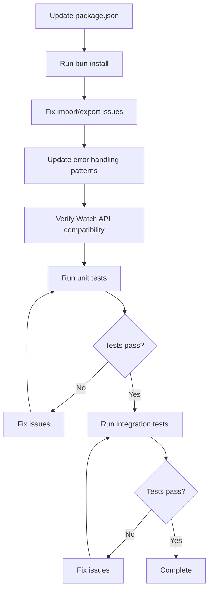

# Design Document: Upgrade @kubernetes/client-node

## Overview

This document describes the design for upgrading the `@kubernetes/client-node` package from version 0.20.0 to the latest `main` branch (post-1.4.0 with fix for #2670). This is a major version upgrade that involves significant changes to the HTTP backend (from `request` to `fetch`), error handling patterns, and module system (ESM support).

**Version Strategy:** We are installing from the `main` branch because:
- Version 1.4.0 has a regression bug (#2670) where `loadYaml` incorrectly parses custom resources
- PR #2688 (merged Nov 8, 2025) fixes this issue but hasn't been released yet
- TypeKro uses `loadYaml` in `src/core/kubernetes/api.ts` and `loadAllYaml` in `src/core/deployment/kro-factory.ts`
- When 1.5.0 is released, we can switch to the npm package

The upgrade will be performed incrementally, ensuring backward compatibility and maintaining all existing functionality while adapting to the new API patterns.

## Architecture

### Current State

The TypeKro project currently uses `@kubernetes/client-node` version 0.20.0 with the following key integration points:

1. **KubernetesClientProvider** (`src/core/kubernetes/client-provider.ts`) - Central singleton for managing Kubernetes API clients
2. **Event Monitor** (`src/core/deployment/event-monitor.ts`) - Uses Watch API for real-time resource monitoring
3. **Factory Functions** (`src/factories/kubernetes/`) - Import V1* types for resource definitions
4. **Deployment Engine** - Uses KubernetesObjectApi for CRUD operations

### Target State

After the upgrade to main branch (post-1.4.0):

1. All existing functionality remains intact
2. Error handling adapts to new fetch-based error patterns
3. Watch API continues to work with the new implementation
4. All type imports remain compatible (V1* types are unchanged)
5. ESM imports work correctly with the project's module configuration

### Migration Strategy



## Components and Interfaces

### KubernetesClientProvider Changes

The `KubernetesClientProvider` class will require minimal changes as the core API (`makeApiClient`, `KubeConfig`) remains compatible. The main changes are:

1. **Error handling** - The new version uses fetch-based errors instead of `HttpError`
2. **Response handling** - Response structure may differ slightly

```typescript
// Current error handling pattern (0.20.0)
try {
  await api.read(resource);
} catch (error: any) {
  if (error.statusCode === 404) {
    // Handle not found
  }
}

// New error handling pattern (main branch, post-1.4.0)
try {
  await api.read(resource);
} catch (error: any) {
  // Error structure may be different - need to check response.statusCode or error.response
  if (error?.response?.statusCode === 404 || error?.statusCode === 404) {
    // Handle not found
  }
}
```

### Watch API Changes

The Watch API in main branch (post-1.4.0) has improvements including:
- Better timeout and keep-alive handling
- Abort signal support (new in 1.4.0 - can be used for graceful cancellation)
- Improved error callbacks (re-added in 1.4.0 via PR #2646)
- ObjectCache return type from makeInformer (PR #2645)

```typescript
// Watch usage remains similar
const watch = new k8s.Watch(kubeConfig);
const request = await watch.watch(
  path,
  options,
  (type, apiObj, watchObj) => { /* event handler */ },
  (err) => { /* error handler */ }
);
```

### Type Imports

All V1* types (V1Deployment, V1Service, V1Pod, etc.) remain compatible. The import pattern stays the same:

```typescript
import type { V1Deployment, V1Service, V1Pod } from '@kubernetes/client-node';
```

## Data Models

No changes to data models are required. The Kubernetes resource types (V1Deployment, V1Service, etc.) maintain backward compatibility.

## Correctness Properties

*A property is a characteristic or behavior that should hold true across all valid executions of a system-essentially, a formal statement about what the system should do. Properties serve as the bridge between human-readable specifications and machine-verifiable correctness guarantees.*

### Property Reflection

After analyzing the acceptance criteria, the following properties were identified as testable:

1. **Error handling properties** (2.1, 2.4) - Can be combined into a single property about error handling consistency
2. **KubeConfig configuration properties** (4.2, 6.2, 6.3, 6.4) - Can be combined into a property about configuration correctness
3. **Retry behavior properties** (7.1, 7.2, 7.3) - Can be combined into a property about retry logic

### Property 1: Error Handling Consistency

*For any* API error response with a status code, the error handling code SHALL extract the status code correctly regardless of the error structure (whether from `error.statusCode`, `error.response?.statusCode`, or `error.body?.code`).

**Validates: Requirements 2.1, 2.4**

### Property 2: KubeConfig Configuration Correctness

*For any* valid KubernetesClientConfig input, the resulting KubeConfig SHALL have the correct cluster server, user credentials, and TLS settings applied.

**Validates: Requirements 4.2, 6.2, 6.3, 6.4**

### Property 3: Retry Logic Correctness

*For any* retryable error and retry configuration, the retry mechanism SHALL attempt the operation the correct number of times with appropriate delays, and SHALL throw an error with context after exhausting retries.

**Validates: Requirements 7.1, 7.2, 7.3**

## Error Handling

### Error Structure Changes

The 1.x version of the client uses fetch-based errors. The error structure changes from:

```typescript
// 0.20.0 (request-based)
interface HttpError {
  statusCode: number;
  body: any;
  message: string;
}

// main branch (fetch-based, post-1.4.0)
// Errors may have different structures:
// - error.response?.statusCode
// - error.statusCode
// - error.body?.code
```

### Error Handling Strategy

Create a utility function to normalize error handling across both patterns:

```typescript
function getErrorStatusCode(error: unknown): number | undefined {
  if (typeof error !== 'object' || error === null) return undefined;
  
  const err = error as any;
  return err.statusCode ?? err.response?.statusCode ?? err.body?.code;
}

function isNotFoundError(error: unknown): boolean {
  return getErrorStatusCode(error) === 404;
}

function isConflictError(error: unknown): boolean {
  return getErrorStatusCode(error) === 409;
}
```

## Testing Strategy

### Dual Testing Approach

The upgrade will be validated using both unit tests and property-based tests:

#### Unit Tests

1. **Version verification** - Verify the package version is 1.4.0+
2. **Import verification** - Verify all imports work correctly
3. **API client creation** - Verify makeApiClient creates valid clients
4. **Watch instantiation** - Verify Watch can be created correctly
5. **Error handling** - Verify specific error codes are handled correctly

#### Property-Based Tests

Using `fast-check` for property-based testing:

1. **Property 1: Error Handling Consistency**
   - Generate random error objects with various structures
   - Verify status code extraction works correctly for all structures

2. **Property 2: KubeConfig Configuration Correctness**
   - Generate random valid configurations
   - Verify the resulting KubeConfig has correct settings

3. **Property 3: Retry Logic Correctness**
   - Generate random retry configurations and error sequences
   - Verify retry behavior matches specification

### Test Execution

```bash
# Run unit tests
bun run test

# Run integration tests (requires cluster)
bun run test:integration
```

### Property-Based Testing Framework

The project uses `fast-check` for property-based testing. Each property test will:
- Run a minimum of 100 iterations
- Be tagged with the property number and requirements reference
- Use smart generators that constrain to valid input spaces

## Code Structure Improvements

During this upgrade, we will also implement the following code structure improvements to make the codebase cleaner and more maintainable:

### 1. Centralize Error Handling Utilities

Create a dedicated error handling module for Kubernetes API errors:

```typescript
// src/core/kubernetes/errors.ts
export function getErrorStatusCode(error: unknown): number | undefined;
export function isNotFoundError(error: unknown): boolean;
export function isConflictError(error: unknown): boolean;
export function isRetryableError(error: unknown): boolean;
export function formatKubernetesError(error: unknown): string;
```

This centralizes error handling logic that is currently scattered across multiple files.

### 2. Consolidate Type Re-exports

The current structure has types imported directly from `@kubernetes/client-node` in ~50+ factory files. We will:

1. Keep the centralized type definitions in `src/core/types/kubernetes.ts`
2. Ensure all factory files import from the centralized location
3. This makes future upgrades easier as there's only one place to update imports

### 3. Create Kubernetes Client Utilities Module

Extract common patterns into a utilities module:

```typescript
// src/core/kubernetes/utils.ts
export function normalizeResourceResponse<T>(response: any): T;
export function extractResourceVersion(resource: any): string | undefined;
export function buildResourcePath(resource: KubernetesResource): string;
```

### 4. Improve Watch API Abstraction

Create a higher-level Watch abstraction that handles:
- Automatic reconnection
- Error recovery
- Resource version tracking

```typescript
// src/core/kubernetes/watch.ts
export class ManagedWatch {
  constructor(kubeConfig: KubeConfig, options: ManagedWatchOptions);
  watch(path: string, handler: WatchHandler): Promise<void>;
  stop(): void;
}
```

### 5. Add Response Type Guards

Create type guards to validate API response shapes:

```typescript
// src/core/kubernetes/type-guards.ts
export function isKubernetesResponse<T>(response: unknown): response is { body: T };
export function isKubernetesError(error: unknown): error is KubernetesApiError;
export function hasStatusCode(error: unknown): error is { statusCode: number };
```

### 6. Enhance Retry Logic for Fetch Errors

Update the retry logic to properly detect retryable fetch errors:

```typescript
// Enhanced retryable error detection
function isRetryableFetchError(error: unknown): boolean {
  // Network errors
  if (error instanceof TypeError && error.message.includes('fetch')) return true;
  // Timeout errors
  if (error instanceof DOMException && error.name === 'AbortError') return true;
  // HTTP status codes
  const statusCode = getErrorStatusCode(error);
  return statusCode ? [408, 429, 500, 502, 503, 504].includes(statusCode) : false;
}
```

### Benefits of These Improvements

1. **Single point of change** - Future kubernetes client upgrades only need changes in one place
2. **Better error handling** - Consistent error handling across the codebase
3. **Improved testability** - Centralized utilities are easier to test
4. **Cleaner code** - Factory files focus on resource creation, not error handling
5. **Better maintainability** - Clear separation of concerns
6. **Type safety** - Response type guards catch shape mismatches early
7. **Robust retries** - Proper detection of retryable fetch errors

### Quality Assessment

This design yields a high-quality codebase because:

1. **Separation of Concerns** - Each module has a single responsibility:
   - `errors.ts` - Error handling
   - `utils.ts` - Common utilities
   - `type-guards.ts` - Type validation
   - `watch.ts` - Watch abstraction
   - `client-provider.ts` - Client lifecycle management

2. **Testability** - Each utility function can be unit tested in isolation

3. **Extensibility** - New error types or utilities can be added without modifying existing code

4. **Consistency** - All parts of the codebase use the same patterns for error handling and API interaction

5. **Future-Proofing** - The abstraction layer means future kubernetes client upgrades will be much simpler

6. **Observability** - All error handling utilities will log unexpected error shapes at debug level, making it easier to diagnose issues in production

7. **Documentation** - All public functions will have JSDoc comments explaining their purpose, parameters, and return values
