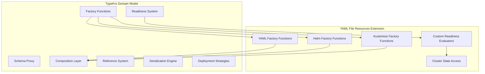

# Design Document

## Glossary

- **YAML Factory Functions**: Functions like `yamlFile()` and `yamlDirectory()` that return deployment closures
- **Deployment Closures**: Functions returned by YAML factories that execute during deployment phase
- **Enhanced Resources**: Traditional TypeKro resources created with `createResource()` that return Enhanced objects
- **Direct Mode**: Deployment strategy that applies resources directly to Kubernetes cluster
- **Kro Mode**: Deployment strategy that creates ResourceGraphDefinitions for Kro Controller to manage
- **Bootstrap Compositions**: Pre-built compositions for deploying infrastructure controllers
- **Path Resolution**: System for loading content from local files, Git repositories, or HTTP URLs

## Overview

This design adds **YAML factory functions** that return **deployment closures** for deploying YAML files and directories through both Direct and Kro factory modes. These deployment closures execute during the deployment phase and work universally across TypeKro's deployment strategies, making them perfect for bootstrap scenarios and deploying static manifests.

The design also includes proper TypeKro factories for Helm and Kustomize resources that integrate fully with TypeKro's composition patterns and reference system.

## Architecture

### Fundamental Architecture Decision

**YAML factory functions are NOT Enhanced resources**. Instead, they return **deployment closures** that execute during the deployment phase. This design choice enables:

1. **Pre-resource execution**: CRDs and controllers can be installed before Enhanced resources that depend on them
2. **Universal mode support**: Same YAML factory functions work in both Direct and Kro modes
3. **Future extensibility**: Closure pattern supports non-YAML deployment operations (Terraform, Pulumi, etc.)

### Enhanced Resources vs Deployment Closures

| Aspect | Enhanced Resources | Deployment Closures |
|--------|-------------------|-------------------|
| **Created by** | `createResource()` | YAML factory functions |
| **Returns** | `Enhanced<TSpec, TStatus>` | `DeploymentClosure<AppliedResource[]>` |
| **When executed** | During resource deployment phase | Before resource deployment phase |
| **Status hydration** | Yes, live cluster data | No, fire-and-forget |
| **Dependency graph** | Full participation | Input dependencies only |
| **Readiness evaluation** | Built-in support | External monitoring only |
| **Use cases** | Application resources | Infrastructure bootstrap |

### Integration with Existing Domain Model

YAML resources integrate into TypeKro's existing architecture as simple deployment primitives:



### Core Principles

1. **Simple Static Manifests**: YAML factory functions apply static manifests with minimal configuration - no complex templating
2. **Closure-Based Architecture**: Return deployment closures during composition, execute during deployment phase - enables future closure types
3. **Universal Mode Support**: Work in both Direct and Kro factory modes with appropriate validation
4. **Dynamic Namespace Support**: Support references to dynamically generated namespaces (Direct mode only)
5. **Alchemy Integration**: Respect alchemy scope when deployment factory has it configured
6. **Bootstrap-Friendly**: Perfect for installing CRDs, controllers, and infrastructure components
7. **Level-Based Execution**: Execute deployment closures when their dependencies become available
8. **Consistent Failure Behavior**: Deployment closures participate in the same failure and rollback semantics as Enhanced resources
9. **Unified Path Handling**: Support local files, directories, and Git repositories
10. **Future Extensibility**: Closure pattern supports future non-YAML deployment operations

## Components and Interfaces

### 1. YAML Factory Functions

YAML factory functions that return deployment closures during composition, executed during deployment based on dependency levels:

```typescript
// src/factories/kubernetes/yaml/yaml-file.ts
export interface YamlFileConfig {
  name: string;
  path: string; // Supports: "./local/file.yaml", "git:github.com/owner/repo/path/file.yaml@ref"
  namespace?: string | KubernetesRef<string>; // Can reference dynamically generated namespace
  deploymentStrategy?: 'replace' | 'skipIfExists' | 'fail'; // Default: 'replace'
}

/**
 * Deploy a YAML file during deployment phase
 * 
 * This YAML factory function returns a deployment closure that executes during
 * deployment. The closure receives deployment context (including alchemy scope)
 * and applies manifests directly to Kubernetes before Enhanced resources are deployed.
 * 
 * @example
 * ```typescript
 * const graph = toResourceGraph(
 *   {
 *     name: 'my-app',
 *     apiVersion: 'example.com/v1alpha1',
 *     kind: 'MyApp',
 *     spec: type({ replicas: 'number' }),
 *     status: type({ ready: 'boolean' })
 *   },
 *   (schema) => ({
  *     // This returns a deployment closure, stored in composition context
  *     crds: yamlFile({
  *       name: 'flux-crds',
  *       path: 'git:github.com/fluxcd/flux2/manifests/crds@main'
  *     }),
  *     
  *     // This is a normal Enhanced resource
  *     webapp: helmRelease({
 *       name: 'nginx',
 *       chart: { repository: 'https://charts.bitnami.com/bitnami', name: 'nginx' },
 *       values: { replicas: schema.spec.replicas }
 *     })
 *   }),
 *   (_schema, resources) => ({ ready: true })
 * );
 * ```
 */
export function yamlFile(config: YamlFileConfig): DeploymentClosure<AppliedResource[]> {
  // Return a deployment closure that will be executed during deployment when dependencies are ready
  return async (deploymentContext: DeploymentContext): Promise<AppliedResource[]> => {
    const pathResolver = new PathResolver();
    
    // Resolve any references in the config (e.g., namespace could reference another resource)
    const resolvedNamespace = config.namespace && isKubernetesRef(config.namespace) 
      ? await deploymentContext.resolveReference(config.namespace)
      : config.namespace;
    
    const resolvedContent = await pathResolver.resolveContent(config.path, config.name);
    const manifests = parseYamlManifests(resolvedContent.content);
    
    const results: AppliedResource[] = [];
    const strategy = config.deploymentStrategy || 'replace';
    
    for (const manifest of manifests) {
      if (resolvedNamespace && !manifest.metadata?.namespace) {
        manifest.metadata = { ...manifest.metadata, namespace: resolvedNamespace as string };
      }
      
      // Apply via alchemy if scope is configured, otherwise direct to Kubernetes
      if (deploymentContext.kubernetesApi) {
        await deploymentContext.kubernetesApi.create(manifest);
      } else {
        throw new Error('No Kubernetes API available for YAML deployment');
      }
      
      results.push({
        kind: manifest.kind || 'Unknown',
        name: manifest.metadata?.name || 'unknown',
        namespace: manifest.metadata?.namespace || undefined,
        apiVersion: manifest.apiVersion || 'v1'
      });
    }
    
    return results;
  };
}

export interface YamlDirectoryConfig {
  name: string;
  path: string; // Supports: "./local/dir", "git:github.com/owner/repo/path/dir@ref"
  recursive?: boolean;
  include?: string[]; // Glob patterns
  exclude?: string[]; // Glob patterns
  namespace?: string | KubernetesRef<string>; // Can reference dynamically generated namespace
  deploymentStrategy?: 'replace' | 'skipIfExists' | 'fail'; // Default: 'replace'
}

/**
 * Deploy YAML files from a directory during deployment phase
 * 
 * This YAML factory function returns a deployment closure that processes all YAML files
 * in a directory and executes during deployment before Enhanced resources are deployed.
 * @example
 * ```typescript
 * const graph = toResourceGraph(
 *   {
 *     name: 'bootstrap',
 *     apiVersion: 'example.com/v1alpha1',
 *     kind: 'Bootstrap',
 *     spec: type({ namespace: 'string' }),
 *     status: type({ ready: 'boolean' })
 *   },
 *   (schema) => ({
  *     // Returns deployment closure for deployment-time execution
  *     controllers: yamlDirectory({
  *       name: 'flux-controllers',
  *       path: 'git:github.com/fluxcd/flux2/manifests/install@main',
  *       namespace: 'flux-system'
  *     }),
  *     
  *     // Enhanced resources deploy after closures
  *     app: helmRelease({
 *       name: 'my-app',
 *       chart: { repository: 'https://charts.example.com', name: 'app' }
 *     })
 *   }),
 *   (_schema, resources) => ({ ready: true })
 * );
 * ```
 */
export function yamlDirectory(config: YamlDirectoryConfig): DeploymentClosure<AppliedResource[]> {
  // Return deployment closure that will be executed during deployment
  return async (deploymentContext: DeploymentContext): Promise<AppliedResource[]> => {
    const pathResolver = new PathResolver();
    const yamlFiles = await pathResolver.discoverYamlFiles(config.path, {
      recursive: config.recursive ?? true,
      include: config.include ?? ['**/*.yaml', '**/*.yml'],
      exclude: config.exclude ?? []
    }, config.name);
    
    const allResults: AppliedResource[] = [];
    const strategy = config.deploymentStrategy || 'replace';
    
    for (const discoveredFile of yamlFiles) {
      // Use the pre-fetched content from the discovered file
      const manifests = parseYamlManifests(discoveredFile.content);
      
      for (const manifest of manifests) {
        // Resolve namespace references
        const resolvedNamespace = config.namespace && isKubernetesRef(config.namespace)
          ? await deploymentContext.resolveReference(config.namespace)
          : config.namespace;
          
        if (resolvedNamespace && !manifest.metadata?.namespace) {
          manifest.metadata = { ...manifest.metadata, namespace: resolvedNamespace as string };
        }
        
        // Apply via Kubernetes API
        if (deploymentContext.kubernetesApi) {
          await deploymentContext.kubernetesApi.create(manifest);
        } else {
          throw new Error('No Kubernetes API available for YAML deployment');
        }
        
        allResults.push({
          kind: manifest.kind || 'Unknown',
          name: manifest.metadata?.name || 'unknown',
          namespace: manifest.metadata?.namespace || undefined,
          apiVersion: manifest.apiVersion || 'v1'
        });
      }
    }
    
    return allResults;
  };
}
```


/**
 * Common Git repository paths for popular controllers
 */
export const GitPaths = {
  fluxHelm: (version = 'main') => `git:github.com/fluxcd/helm-controller/config/default@${version}`,
  fluxKustomize: (version = 'main') => `git:github.com/fluxcd/kustomize-controller/config/default@${version}`,
  fluxSource: (version = 'main') => `git:github.com/fluxcd/source-controller/config/default@${version}`,
  kro: (version = 'main') => `git:github.com/Azure/kro/config/default@${version}`,
  argoCD: (version = 'stable') => `git:github.com/argoproj/argo-cd/manifests/install.yaml@${version}`,
  istio: (version = 'master') => `git:github.com/istio/istio/manifests/charts/base@${version}`,
} as const;
```

### 2. Helm and Kustomize Factory Functions

Proper factories with full TypeKro integration:

```typescript
// src/factories/kubernetes/helm/helm-release.ts
export interface HelmReleaseConfig {
  name: string;
  namespace?: string;
  chart: {
    repository: string;
    name: string;
    version?: string;
  };
  values?: Record<string, any>;
  id?: string;
}

/**
 * Deploy a Helm chart using Flux CD's HelmRelease
 * @example
 * ```typescript
 * helmRelease({
 *   name: 'nginx',
 *   chart: {
 *     repository: 'https://charts.bitnami.com/bitnami',
 *     name: 'nginx',
 *     version: '13.2.23'
 *   },
 *   values: {
 *     service: { type: 'LoadBalancer' },
 *     replicas: schema.spec.replicas
 *   }
 * })
 * ```
 */
export function helmRelease(config: HelmReleaseConfig): Enhanced<HelmReleaseSpec, HelmReleaseStatus> {
  return createResource({
    ...(config.id && { id: config.id }),
    apiVersion: 'helm.toolkit.fluxcd.io/v2beta1',
    kind: 'HelmRelease',
    metadata: {
      name: config.name,
      ...(config.namespace && { namespace: config.namespace }),
    },
    spec: {
      chart: config.chart,
      values: config.values,
    },
  });
}

/**
 * Simplified Helm chart factory for common use cases
 * @example
 * ```typescript
 * simpleHelmChart('nginx', 'https://charts.bitnami.com/bitnami', 'nginx', {
 *   service: { type: 'LoadBalancer' }
 * })
 * ```
 */
export function simpleHelmChart(
  name: string, 
  repository: string, 
  chart: string, 
  values?: Record<string, any>
): Enhanced<HelmReleaseSpec, HelmReleaseStatus> {
  return helmRelease({
    name,
    chart: { repository, name: chart },
    values,
  });
}
```

```typescript
// src/factories/kubernetes/kustomize/kustomization.ts
export interface KustomizationConfig {
  name: string;
  namespace?: string;
  source: {
    path: string; // Supports git: URLs
    ref?: string;
  };
  patches?: Array<{
    target: {
      kind: string;
      name?: string;
    };
    patch: string;
  }>;
  id?: string;
}

/**
 * Deploy resources using Flux CD's Kustomization
 * @example
 * ```typescript
 * kustomization({
 *   name: 'my-app',
 *   source: {
 *     path: 'git:github.com/my-org/my-app/k8s/overlays/prod@main'
 *   },
 *   patches: [{
 *     target: { kind: 'Deployment', name: 'app' },
 *     patch: `
 *       - op: replace
 *         path: /spec/replicas
 *         value: ${schema.spec.replicas}
 *     `
 *   }]
 * })
 * ```
 */
export function kustomization(config: KustomizationConfig): Enhanced<KustomizationSpec, KustomizationStatus> {
  return createResource({
    ...(config.id && { id: config.id }),
    apiVersion: 'kustomize.toolkit.fluxcd.io/v1beta2',
    kind: 'Kustomization',
    metadata: {
      name: config.name,
      ...(config.namespace && { namespace: config.namespace }),
    },
    spec: {
      source: config.source,
      patches: config.patches,
    },
  });
}
```

### 3. Deployment Execution Timeline

**Deployment closures execute before Enhanced resources** to ensure proper dependency ordering:

```
Deployment Timeline:
┌─────────────────────────────────────────────────────────────┐
│ Phase 1: Deployment Closure Execution (Level -1)           │
│ ┌─────────────┐ ┌─────────────┐ ┌─────────────┐           │
│ │ YAML CRDs   │ │ Controllers │ │ Bootstrap   │           │
│ │ yamlFile()  │ │ yamlDir()   │ │ Components  │           │
│ └─────────────┘ └─────────────┘ └─────────────┘           │
│                                                             │
│ Phase 2: CRD Establishment Wait                            │
│ ┌─────────────────────────────────────────────────────────┐ │
│ │ TypeKro waits for custom resource CRDs to be ready     │ │
│ └─────────────────────────────────────────────────────────┘ │
│                                                             │
│ Phase 3: Enhanced Resource Deployment (Level 0+)          │
│ ┌─────────────┐ ┌─────────────┐ ┌─────────────┐           │
│ │ HelmRelease │ │ Application │ │ Custom      │           │
│ │ Resources   │ │ Deployments │ │ Resources   │           │
│ └─────────────┘ └─────────────┘ └─────────────┘           │
└─────────────────────────────────────────────────────────────┘
```

### Level-Based Closure Execution with CRD Establishment

Deployment closures integrate with the existing level-based deployment architecture with a critical enhancement: **deployment closures execute at level -1 (before all resources)** to ensure CRD-installing closures run before custom resources that depend on those CRDs.

#### Key Design Principles

1. **Pre-Resource Execution**: All closures execute before any Enhanced resources to ensure CRDs are established first
2. **CRD Establishment**: Custom resources automatically wait for their CRDs to be established before deployment
3. **Parallel Closure Execution**: Multiple closures execute in parallel at the pre-resource level
4. **Dependency-Aware**: Future enhancement will support closure dependency analysis for more sophisticated ordering

#### CRD Establishment Logic

The deployment engine includes sophisticated CRD establishment logic that automatically handles the timing between CRD installation and custom resource deployment:

```typescript
// Automatic CRD establishment waiting
private async waitForCRDIfCustomResource(
  resource: any,
  options: DeploymentOptions,
  logger: any
): Promise<void> {
  // 1. Detect if resource is a custom resource (not built-in Kubernetes API)
  if (!this.isCustomResource(resource)) {
    return; // Skip built-in resources
  }

  // 2. Generate CRD name from resource (e.g., HelmRelease -> helmreleases.helm.toolkit.fluxcd.io)
  const crdName = this.getCRDNameForResource(resource);
  if (!crdName) {
    logger.warn('Could not determine CRD name for custom resource');
    return;
  }

  // 3. Wait for CRD to be established in the cluster
  await this.waitForCRDEstablishment({ metadata: { name: crdName } }, options, logger);
  
  logger.debug('CRD established, proceeding with custom resource deployment');
}

private isCustomResource(resource: any): boolean {
  // Built-in Kubernetes API groups that are NOT custom resources
  const builtInApiGroups = [
    'v1', 'apps/v1', 'networking.k8s.io/v1', 'policy/v1',
    'rbac.authorization.k8s.io/v1', 'storage.k8s.io/v1',
    // ... other built-in API groups
  ];

  return !builtInApiGroups.includes(resource.apiVersion);
}

private getCRDNameForResource(resource: any): string | null {
  // Extract group from apiVersion (e.g., "helm.toolkit.fluxcd.io/v2" -> "helm.toolkit.fluxcd.io")
  const apiVersionParts = resource.apiVersion.split('/');
  const group = apiVersionParts.length > 1 ? apiVersionParts[0] : '';

  if (!group) {
    return null; // Core API resources don't have CRDs
  }

  // Convert Kind to plural lowercase (e.g., HelmRelease -> helmreleases)
  const kind = resource.kind.toLowerCase();
  const plural = kind.endsWith('s') ? kind : `${kind}s`;

  return `${plural}.${group}`;
}
```

This ensures that:
- **Flux CRDs** are installed by `yamlFile()` closures before `HelmRelease` and `HelmRepository` resources
- **Kro CRDs** are installed before `ResourceGraphDefinition` resources  
- **Custom CRDs** are installed before any custom resources that depend on them
- **Built-in resources** (Deployments, Services, etc.) deploy immediately without waiting

```typescript
// Enhanced DirectDeploymentEngine with closure support and CRD establishment
export class DirectDeploymentEngine {
  async deployWithClosures<TSpec>(
    graph: ResourceGraph,
    closures: Record<string, DeploymentClosure>,
    options: DeploymentOptions,
    spec: TSpec
  ): Promise<DeploymentResult> {
    // 1. Analyze deployment plan for Enhanced resources
    const deploymentPlan = this.dependencyResolver.analyzeDeploymentOrder(graph.dependencyGraph);
    
    // 2. Analyze closure dependencies (currently assigns all to level -1)
    const closureDependencies = this.analyzeClosureDependencies(closures, spec, graph.dependencyGraph);
    
    // 3. Integrate closures into deployment plan with pre-resource level
    const enhancedPlan = this.integrateClosuresIntoPlan(deploymentPlan, closureDependencies);
    
    // 4. Execute level-by-level with closures-first approach
    for (let levelIndex = 0; levelIndex < enhancedPlan.levels.length; levelIndex++) {
      const currentLevel = enhancedPlan.levels[levelIndex];
      
      // Level 0: Execute all closures in parallel (CRD installation, etc.)
      // Level 1+: Execute Enhanced resources with automatic CRD establishment waiting
      const levelPromises = [
        ...currentLevel.resources.map(resourceId => this.deployResourceWithCRDWait(resourceId)),
        ...currentLevel.closures.map(closureInfo => this.executeClosure(closureInfo, deploymentContext))
      ];
      
      await Promise.allSettled(levelPromises);
    }
  }
  
  private async deployResourceWithCRDWait(resourceId: string): Promise<DeployedResource> {
    const resource = this.getResource(resourceId);
    
    // Automatically wait for CRD establishment if this is a custom resource
    await this.waitForCRDIfCustomResource(resource.manifest, options, logger);
    
    // Deploy the resource normally
    return this.deploySingleResource(resource, context, options);
  }
  
  private integrateClosuresIntoPlan(
    deploymentPlan: DeploymentPlan, 
    closureDependencies: ClosureDependencyInfo[]
  ): EnhancedDeploymentPlan {
    // Create enhanced levels with pre-resource closure level
    const enhancedLevels = [];
    
    // Level 0: Pre-resource closures (CRD installation, etc.)
    const preResourceClosures = closureDependencies.filter(c => c.level === -1);
    if (preResourceClosures.length > 0) {
      enhancedLevels.push({
        resources: [],
        closures: preResourceClosures,
      });
    }
    
    // Level 1+: Enhanced resources (shifted if pre-resource level exists)
    for (let i = 0; i < deploymentPlan.levels.length; i++) {
      enhancedLevels.push({
        resources: deploymentPlan.levels[i] || [],
        closures: [], // Future: closures with resource dependencies
      });
    }
    
    return { levels: enhancedLevels, ... };
  }
}
```

### 3. Integration with DirectDeploymentStrategy

YAML closures integrate with the existing deployment strategy architecture:

```typescript
// src/core/deployment/strategies/direct-strategy.ts - Enhanced to support YAML closures
export class DirectDeploymentStrategy<TSpec, TStatus> {
  protected async executeDeployment(spec: TSpec, instanceName: string): Promise<DeploymentResult> {
    try {
      // 1. Resolve Enhanced<> resources normally
      const resources = this.resourceResolver.resolveResourcesForSpec(spec);
      
      // 2. Collect deployment closures from composition
      const deploymentClosures = this.collectDeploymentClosures();
      
      // 3. Create deployment context
      const deploymentContext: DeploymentContext = {
        kubernetesApi: this.getKubernetesApi(),
        alchemyScope: this.getAlchemyScope(),
        namespace: this.namespace,
        deployedResources: new Map(),
        resolveReference: (ref) => this.resolveReference(ref)
      };
      
      // 4. Execute deployment closures before Enhanced resource deployment
      const closurePromises = deploymentClosures.map(closure => closure(deploymentContext));
      
      // 5. Create resource graph from Enhanced<> resources
      const resourceGraph = this.createResourceGraph(resources);
      
      // 6. Execute deployment closures first, then deploy Enhanced resources
      const closureResults = await Promise.all(closurePromises);
      const deploymentResult = await this.deploymentEngine.deploy(resourceGraph, deploymentOptions);
      
      // 7. Combine results
      return {
        ...deploymentResult,
        closureResults: closureResults.flat()
      };
    } catch (error) {
      throw new ResourceDeploymentError(
        `Deployment failed for ${this.factoryName}`,
        error as Error
      );
    }
  }

  private collectDeploymentClosures(): DeploymentClosure[] {
    // Collect deployment closures from the composition context
    // This would be implemented based on how closures are stored during composition
    return this.compositionContext.deploymentClosures || [];
  }
}
```

```typescript
// src/core/deployment/strategies/direct-strategy.ts - Enhanced to execute YAML closures
export class DirectDeploymentStrategy<TSpec, TStatus> {
  protected async executeDeployment(spec: TSpec, instanceName: string): Promise<DeploymentResult> {
    try {
      // 1. Resolve resources and collect deployment closures
      const { resources, deploymentClosures } = this.resourceResolver.resolveResourcesForSpec(spec);
      
      // 2. Execute deployment closures first
      const deploymentContext: DeploymentContext = {
        kubernetesApi: this.getKubernetesApi(),
        alchemyScope: this.getAlchemyScope(),
        namespace: this.namespace,
        deployedResources: new Map(),
        resolveReference: (ref) => this.resolveReference(ref)
      };
      
      const closurePromises = deploymentClosures.map(closure => closure(deploymentContext));
      
      // 3. Create resource graph from Enhanced<> resources
      const resourceGraph = this.createResourceGraph(resources);
      
      // 4. Execute closures first, then deploy Enhanced resources
      const closureResults = await Promise.all(closurePromises);
      const deploymentResult = await this.deploymentEngine.deploy(resourceGraph, deploymentOptions);
      
      // 5. Combine results
      return {
        ...deploymentResult,
        closureResults: closureResults.flat()
      };
    } catch (error) {
      throw new ResourceDeploymentError(
        `Deployment failed for ${this.factoryName}`,
        error as Error
      );
    }
  }
}
```

### 4. Type Definitions

Types for YAML factory functions that return deployment closures:

```typescript
// Already defined in src/core/types/deployment.ts

export type DeploymentClosure<T = AppliedResource[]> = (deploymentContext: DeploymentContext) => Promise<T>;

export interface AppliedResource {
  kind: string;
  name: string;
  namespace?: string;
  apiVersion: string;
}

export interface DeploymentContext {
  kubernetesApi?: k8s.KubernetesObjectApi;
  alchemyScope?: Scope;
  namespace?: string;
  // Level-based execution context - enables future closure extensibility
  deployedResources: Map<string, DeployedResource>; // Resources available at this level
  resolveReference: (ref: KubernetesRef) => Promise<unknown>; // Resolve cross-resource references
}
```

For Helm and Kustomize (which ARE TypeKro resources), the types are defined in the existing Helm factory implementation.

### 5. Path Resolution System

Unified system for handling local files, directories, and Git repositories:


```typescript
// src/core/yaml/path-resolver.ts
export class PathResolver {
  async resolveContent(path: string): Promise<string> {
    if (path.startsWith('git:')) {
      return this.resolveGitContent(path);
    } else {
      return this.resolveLocalContent(path);
    }
  }

  private async resolveGitContent(gitPath: string): Promise<string> {
    // Parse: git:github.com/org/repo/path/file.yaml[@ref]
    const parsed = this.parseGitPath(gitPath);
    
    // Use GitHub API or git clone to fetch content
    return this.fetchFromGit(parsed);
  }

  private async resolveLocalContent(localPath: string): Promise<string> {
    // Read from local filesystem
    return fs.readFileSync(localPath, 'utf-8');
  }

  private parseGitPath(gitPath: string): GitPathInfo {
    // Implementation to parse git: URLs
    const match = gitPath.match(/^git:([^\/]+)\/([^\/]+)\/([^\/]+)\/(.+?)(?:@(.+))?$/);
    if (!match) {
      throw new Error(`Invalid git path: ${gitPath}`);
    }
    
    return {
      host: match[1],
      owner: match[2],
      repo: match[3],
      path: match[4],
      ref: match[5] || 'main',
    };
  }
}
```

### 6. Bootstrap Utilities

Utility functions for common bootstrap scenarios:

#### Bootstrap Failure Scenarios

Bootstrap workflows involve multiple dependent components and can fail at various stages:

**Common Failure Points:**
1. **Git Repository Access**: Network issues or authentication failures
2. **CRD Installation**: Invalid YAML manifests or Kubernetes API errors  
3. **Controller Readiness**: Controllers fail to start or become ready
4. **Resource Dependencies**: Circular dependencies or missing prerequisites

**Failure Handling Strategy:**
- **Fail Fast**: If any deployment closure fails, stop the entire bootstrap process
- **Clear Error Messages**: Include component name, failure reason, and recovery suggestions
- **Partial State Recovery**: Allow retry of failed components without redeploying successful ones
- **Dependency Validation**: Pre-validate Git URLs and manifest syntax before deployment

**Recovery Procedures:**
- **Network Issues**: Retry with exponential backoff, suggest local file alternatives
- **Authentication**: Provide clear guidance on Git credentials and permissions
- **Invalid Manifests**: Show YAML validation errors with line numbers and suggestions
- **Controller Failures**: Include pod logs and status information in error messages

*Note: Detailed failure handling will be implemented in bootstrap compositions (Tasks 6.1-6.5)*

Pre-built compositions for common infrastructure patterns:

```typescript
// src/compositions/bootstrap/typekro-runtime.ts
import { type } from 'arktype';
import { toResourceGraph } from '../../core/factory.js';
import { namespace } from '../../factories/kubernetes/core/namespace.js';
import { yamlFile } from '../../factories/kubernetes/yaml/yaml-file.js';
import { helmResource } from '../../factories/helm/helm-resource.js';

export function typeKroRuntimeBootstrap(config: {
  namespace?: string;
  fluxVersion?: string;
  kroVersion?: string;
} = {}) {
  return toResourceGraph(
    {
      name: 'typekro-runtime-bootstrap',
      apiVersion: 'typekro.dev/v1alpha1',
      kind: 'TypeKroRuntime',
      spec: type({
        namespace: 'string',
      }),
      status: type({
        phase: '"Pending" | "Installing" | "Ready" | "Failed"',
        components: {
          fluxControllers: 'boolean',
          kroController: 'boolean',
        },
      }),
    },
    (schema) => ({
      // Namespace for all components
      namespace: namespace({
        metadata: {
          name: schema.spec.namespace,
        },
      }),

      // Flux Controllers using yamlFile (similar to integration test approach)
      fluxSystem: yamlFile({
        name: 'flux-system',
        path: `git:github.com/fluxcd/flux2/manifests/install@${config.fluxVersion ?? 'v2.4.0'}`,
        namespace: schema.spec.namespace,
      }),

      // Kro Controller using helmResource in Direct factory mode
      kroController: helmResource({
        name: 'kro',
        namespace: schema.spec.namespace,
        chart: {
          repository: 'https://charts.kro.run',
          name: 'kro',
          version: config.kroVersion ?? '0.1.0',
        },
        values: {
          controller: {
            replicas: 1,
          },
          webhook: {
            enabled: true,
          },
        },
      }),

      // Status mapping showing readiness of all components
      status: {
        phase: 'Ready',
        components: {
          fluxControllers: true,
          kroController: true,
        },
      },
    })
  );
}
        name: 'kro-controller',
        path: `git:github.com/Azure/kro/config/default@${config.kroController?.version ?? 'main'}`,
        namespace: schema.spec.namespace,
      }),
    }),
    (_schema, resources) => ({
      phase: 'Ready' as const,
      components: {
        helmController: true,
        kustomizeController: true,
        kroController: true,
      },
    })
  );
}

// Example usage with Helm after bootstrap
export function webAppWithHelm(config: {
  namespace?: string;
  appName: string;
  chartVersion?: string;
}) {
  return toResourceGraph(
    {
      name: 'webapp-with-helm',
      apiVersion: 'example.com/v1alpha1',
      kind: 'WebAppHelm',
      spec: type({
        namespace: 'string',
        appName: 'string',
        hostname: 'string',
      }),
      status: type({
        phase: '"Pending" | "Installing" | "Ready" | "Failed"',
        url: 'string',
      }),
    },
    (schema) => ({
      // Deploy the app using Helm
      webapp: helmRelease({
        name: schema.spec.appName,
        namespace: schema.spec.namespace,
        chart: {
          repository: 'https://charts.bitnami.com/bitnami',
          name: 'nginx',
          version: config.chartVersion ?? '13.2.23',
        },
        values: {
          service: {
            type: 'LoadBalancer',
          },
          ingress: {
            enabled: true,
            hostname: schema.spec.hostname,
          },
        },
      }),
    }),
    (_schema, resources) => ({
      phase: 'Ready' as const,
      url: `https://${schema.spec.hostname}`,
    })
  );
}

// Usage in e2e bootstrap script replacement
// scripts/e2e-setup.ts
export async function bootstrapE2EEnvironment() {
  // Create bootstrap composition
  const bootstrap = typeKroRuntimeBootstrap({
    namespace: 'flux-system',
    fluxVersion: 'v2.4.0',
    kroVersion: '0.1.0',
  });

  // Deploy using Direct factory (replaces kubectl commands)
  const factory = await bootstrap.factory('direct', {
    namespace: 'flux-system',
    waitForReady: true,
    timeout: 300000, // 5 minutes
  });

  const instance = await factory.deploy({
    namespace: 'flux-system',
  });

  console.log('TypeKro runtime bootstrap complete:', instance.status);
  return instance;
}
```

### 7. Integration with Resource Graphs

YAML factory functions can be used seamlessly within resource graphs:

```typescript
// Bootstrap scenario - YAML functions execute immediately during composition
const bootstrapGraph = toResourceGraph(
  {
    name: 'bootstrap',
    apiVersion: 'example.com/v1alpha1',
    kind: 'Bootstrap',
    spec: type({ replicas: 'number' }),
    status: type({ ready: 'boolean' })
  },
  (schema) => ({
    // These register for pre-deployment execution
    namespace: yamlFile({
      name: 'kro-namespace',
      path: './manifests/namespace.yaml'
    }),
    
    kroController: yamlDirectory({
      name: 'kro-controller',
      path: 'git:github.com/Azure/kro/config/default@main',
      namespace: 'kro-system'
    }),
    
    helmController: yamlDirectory({
      name: 'helm-controller', 
      path: 'git:github.com/fluxcd/helm-controller/config/default@main',
      namespace: 'kro-system'
    }),
    
    // This is a real TypeKro resource that deploys after YAML functions
    testApp: helmRelease({
      name: 'test-app',
      namespace: 'default',
      chart: {
        repository: 'https://charts.bitnami.com/bitnami',
        name: 'nginx'
      },
      values: {
        replicas: schema.spec.replicas
      }
    })
  }),
  (_schema, resources) => ({
    ready: true // Status builder - YAML functions don't participate in status
  })
);

// Usage - the YAML functions execute during composition, before factory creation
const factory = await bootstrapGraph.factory('kro', { namespace: 'default' });
await factory.deploy({ replicas: 3 });
```

#### Kro Mode Support

YAML closures work in Kro mode with static values only:

```typescript
// Kro mode - static values only
const graph = toResourceGraph('bootstrap', (schema) => ({
  // This works - static namespace
  crds: yamlFile({
    name: 'flux-crds',
    path: 'git:github.com/fluxcd/flux2/manifests/crds@main',
    namespace: 'flux-system' // Static string - OK
  }),
  
  // This would error - dynamic reference
  controllers: yamlDirectory({
    name: 'flux-controllers',
    path: 'git:github.com/fluxcd/flux2/manifests/install@main',
    namespace: schema.spec.namespace // KubernetesRef - ERROR in Kro mode
  })
}));

// Kro factory validates closures and raises clear errors
const kroFactory = await graph.factory('kro', { namespace: 'default' });
// Error: "Kro mode does not support dynamic references in YAML closures. 
//         Found KubernetesRef in yamlDirectory 'controllers' namespace field.
//         Use static values or switch to Direct mode."
```

#### Alchemy Integration

YAML functions automatically integrate with alchemy scope when configured:

```typescript
// When factory has alchemy scope configured
const factory = await graph.factory('direct', { 
  namespace: 'default',
  alchemyScope: myAlchemyScope  // YAML functions will use this scope
});

// YAML functions in the composition will automatically use the alchemy scope
const graph = toResourceGraph('bootstrap', (schema) => ({
  // This will be deployed via alchemy scope if configured
  crds: yamlFile({
    name: 'flux-crds',
    path: 'git:github.com/fluxcd/flux2/manifests/crds@main'
  }),
  
  // Regular TypeKro resources work normally
  app: helmRelease({
    name: 'nginx',
    chart: { repository: 'https://charts.bitnami.com/bitnami', name: 'nginx' }
  })
}), { /* schema */ });
```

#### Reconciliation-Based Dependencies

No manual sequencing needed - Kubernetes handles dependencies:

```typescript
const graph = toResourceGraph(
  {
    name: 'bootstrap',
    apiVersion: 'example.com/v1alpha1', 
    kind: 'Bootstrap',
    spec: type({ appName: 'string' }),
    status: type({ ready: 'boolean' })
  },
  (schema) => ({
    // Install CRDs - returns closure, executes during deployment
    crds: yamlFile({
      name: 'flux-crds',
      path: 'git:github.com/fluxcd/flux2/manifests/crds@main'
    }),
    
    // Install controllers - returns closure, executes during deployment
    controllers: yamlDirectory({
      name: 'flux-controllers',
      path: 'git:github.com/fluxcd/flux2/manifests/install@main',
      namespace: 'flux-system'
    }),
    
    // Deploy app - Enhanced<> resource deployed normally
    app: helmRelease({
      name: schema.spec.appName,
      chart: { repository: 'https://charts.example.com', name: 'app' }
    })
  }),
  (_schema, resources) => ({
    ready: true // YAML functions don't contribute to status
  })
);

// Key benefits of this approach:
// 1. YAML closures execute in parallel with Enhanced<> resources during deployment
// 2. Closures receive deployment context with alchemy scope and Kubernetes API
// 3. Kubernetes reconciliation handles all timing and dependencies
// 4. If anything fails, standard TypeKro rollback applies to everything
// 5. Maximum parallelism - everything happens simultaneously
```

## Data Models

### Universal Mode Support

Deployment closures work in both Direct and Kro factory modes with different capabilities:

#### Mode Compatibility Matrix

| Feature | Direct Mode | Kro Mode | Notes |
|---------|-------------|----------|-------|
| **Static values** | ✅ Full support | ✅ Full support | Works identically |
| **KubernetesRef inputs** | ✅ Full support | ❌ Validation error | Dynamic references not supported |
| **Git URLs** | ✅ Full support | ✅ Full support | Works identically |
| **Local files** | ✅ Full support | ⚠️ Limited | Must be available at RGD creation time |
| **Namespace references** | ✅ Dynamic resolution | ❌ Static only | `schema.spec.namespace` won't work |
| **Cross-resource refs** | ✅ Full support | ❌ Validation error | Cannot reference other Enhanced resources |
| **Execution timing** | During deployment | Before RGD creation | Different execution context |

#### Direct Mode (Recommended for Bootstrap)
- **Full Feature Support**: All deployment closure features work including dynamic references
- **Deployment Context**: Closures receive full deployment context with alchemy scope and Kubernetes API
- **Reference Resolution**: KubernetesRef inputs are resolved at deployment time
- **Sequential Execution**: Closures execute before Enhanced resource deployment

#### Kro Mode (Limited Support)
- **Static Values Only**: Deployment closures work with static configuration values
- **Validation**: KubernetesRef inputs are detected and cause clear validation errors
- **Pre-RGD Execution**: Closures execute before ResourceGraphDefinition creation
- **Bootstrap Support**: Good for installing static controllers before RGD deployment

#### Mode Selection Logic
```typescript
// This works in both modes - static namespace
yamlFile({
  name: 'crds',
  path: 'git:github.com/fluxcd/flux2/manifests/crds@main',
  namespace: 'flux-system' // Static string
});

// This only works in Direct mode - dynamic reference
yamlFile({
  name: 'app-config',
  path: './config.yaml',
  namespace: schema.spec.namespace // KubernetesRef - Direct mode only
});
```

### YAML Factory Lifecycle

YAML factory functions return closures during composition, executed during deployment:

1. **Closure Creation**: Function returns closure during composition evaluation
2. **Closure Collection**: DirectResourceFactory collects closures during resource resolution
3. **Deployment Execution**: DirectDeploymentStrategy executes closures during deployment phase
4. **Path Resolution**: Load YAML content from local files or Git repositories  
5. **Direct Application**: Apply manifests directly to Kubernetes API via deployment context
6. **Parallel Execution**: Executes in parallel with Enhanced<> resource deployment
7. **Consistent Failure Handling**: Failed YAML deployments cause overall deployment failure and rollback

#### Key Characteristics

- **Factory-Style API**: Looks and feels like other TypeKro factory functions
- **Closure-Based Execution**: Returns closures during composition, executes during deployment
- **Deployment Context Integration**: Receives deployment context with alchemy scope and Kubernetes API
- **Bootstrap-Safe**: Perfect for installing CRDs and controllers alongside TypeKro resources
- **Parallel Deployment**: Executes in parallel with Enhanced<> resources for maximum speed

#### Important Distinctions

- **Not Enhanced<> Resources**: YAML functions do not return Enhanced<> objects and cannot use `.withReadinessEvaluator()`
- **Simple Configuration**: YAML functions only support basic namespace override - no complex templating or variable substitution
- **Closure vs Resource**: YAML functions return closures during composition, Enhanced<> resources return Enhanced<> objects
- **Level-Based Execution**: Closures execute when their input dependencies (like namespace references) become available
- **Future Extensibility**: The closure pattern enables future deployment operations beyond YAML (e.g., Terraform, Pulumi, custom APIs)
- **Consistent Failure Behavior**: YAML function failures cause deployment failure just like Enhanced<> resource failures
- **Unified Rollback**: Failed deployments trigger rollback of both YAML-deployed and Enhanced<> resources

#### Future Closure Types

The closure architecture enables future deployment operations:

```typescript
// Future examples - not part of this spec
terraformModule({ source: 'terraform-aws-modules/vpc/aws', variables: { ... } })
pulumiStack({ stack: 'my-org/my-stack', config: { ... } })
customApiCall({ endpoint: 'https://api.example.com/deploy', payload: { ... } })
```

### Helm/Kustomize Resource Integration

Helm and Kustomize resources integrate fully with TypeKro's reference system:

```typescript
// In a composition function
const database = simpleDeployment({
  name: 'postgres',
  image: 'postgres:13',
});

const webapp = helmRelease({
  name: 'webapp',
  namespace: schema.spec.namespace,
  chart: {
    repository: 'https://charts.bitnami.com/bitnami',
    name: 'nginx',
    version: '13.2.23',
  },
  values: {
    // These can use TypeKro references and CEL expressions
    database: {
      host: database.status.podIP,
      port: 5432,
    },
    replicas: schema.spec.replicas,
    image: {
      tag: Cel.expr(schema.spec.version, ' + "-alpine"'),
    },
  },
});
```

### Dependency Resolution

All resources participate in TypeKro's dependency graph:

- **YAML Dependencies**: YAML resources can depend on namespaces, secrets, etc.
- **Controller Dependencies**: Helm/Kustomize resources depend on their respective controllers being ready
- **Cross-references**: Helm values and Kustomize patches can reference other resource properties
- **Readiness Chain**: Custom readiness evaluators can check complex dependency chains

## Error Handling

### YAML Resource Errors

Following TypeKro's error handling patterns:

```typescript
// src/core/errors.ts additions

export class YamlPathResolutionError extends TypeKroError {
  constructor(
    message: string,
    public readonly resourceName: string,
    public readonly path: string,
    public readonly suggestions?: string[]
  ) {
    super(message, 'YAML_PATH_RESOLUTION_ERROR', {
      resourceName,
      path,
      suggestions,
    });
    this.name = 'YamlPathResolutionError';
  }

  static invalidGitUrl(resourceName: string, userInput: string): YamlPathResolutionError {
    return new YamlPathResolutionError(
      `Invalid git URL format for resource '${resourceName}'. Expected: git:github.com/owner/repo/path@ref\nGot: ${userInput}`,
      resourceName,
      userInput,
      [
        'Use format: git:github.com/owner/repo/path@ref',
        'Example: git:github.com/fluxcd/helm-controller/config/default@main',
        'Use GitPaths.fluxHelm() for common controllers',
      ]
    );
  }
}

export class GitContentError extends TypeKroError {
  constructor(
    message: string,
    public readonly resourceName: string,
    public readonly gitPath: string,
    public readonly suggestions?: string[]
  ) {
    super(message, 'GIT_CONTENT_ERROR', {
      resourceName,
      gitPath,
      suggestions,
    });
    this.name = 'GitContentError';
  }

  static repositoryNotFound(resourceName: string, gitPath: string): GitContentError {
    return new GitContentError(
      `Git repository not found for resource '${resourceName}': ${gitPath}`,
      resourceName,
      gitPath,
      [
        'Check that the repository exists and is accessible',
        'Verify the repository URL and path are correct',
        'For private repositories, ensure authentication is configured',
        'Try using a specific branch or tag: @main, @v1.0.0',
      ]
    );
  }
}

export class YamlProcessingError extends TypeKroError {
  constructor(
    message: string,
    public readonly resourceName: string,
    public readonly filePath: string,
    public readonly line?: number,
    public readonly suggestions?: string[]
  ) {
    super(message, 'YAML_PROCESSING_ERROR', {
      resourceName,
      filePath,
      line,
      suggestions,
    });
    this.name = 'YamlProcessingError';
  }

  static invalidYaml(resourceName: string, filePath: string, line?: number): YamlProcessingError {
    const lineInfo = line ? ` at line ${line}` : '';
    return new YamlProcessingError(
      `Invalid YAML syntax in resource '${resourceName}' file '${filePath}'${lineInfo}`,
      resourceName,
      filePath,
      line,
      [
        'Check YAML syntax for proper indentation and structure',
        'Ensure all strings are properly quoted',
        'Validate YAML using a linter or online validator',
        'Check for tabs vs spaces consistency',
      ]
    );
  }
}
```

## Testing Strategy

### Unit Tests

- **Factory Functions**: Test YAML, Helm, and Kustomize resource creation
- **Path Resolution**: Test local file, directory, and Git path resolution
- **Readiness Evaluators**: Test default and custom readiness evaluation logic
- **Cluster State Access**: Test cluster state accessor functionality
- **Error Handling**: Test error scenarios and error message quality

### Integration Tests

- **End-to-End**: Deploy YAML resources using DirectResourceFactory
- **Bootstrap**: Test complete TypeKro runtime bootstrap process
- **Helm Integration**: Test Helm release deployment with TypeKro references
- **Kustomize Integration**: Test Kustomization deployment with patches
- **Git Integration**: Test fetching and processing Git repositories

### Type Safety Tests

Following TypeKro's type safety testing guidelines:

```typescript
describe('YAML Factory Type Safety', () => {
  it('should return deployment closures with proper types', () => {
    const yamlClosure = yamlFile({
      name: 'test-yaml',
      path: './test-manifests/configmap.yaml',
    });

    // Should return a function (deployment closure)
    expect(typeof yamlClosure).toBe('function');
    
    // Closure should be properly typed to return Promise<AppliedResource[]>
    const mockContext: DeploymentContext = {
      kubernetesApi: mockKubernetesApi,
      deployedResources: new Map(),
      resolveReference: jest.fn()
    };
    
    // This should be properly typed without assertions
    const result = yamlClosure(mockContext);
    expect(result).toBeInstanceOf(Promise);
  });

  it('should support Helm releases with TypeKro references', () => {
    const database = simpleDeployment({
      name: 'postgres',
      image: 'postgres:13',
    });

    const webapp = helmRelease({
      name: 'webapp',
      chart: {
        repository: 'https://charts.bitnami.com/bitnami',
        name: 'nginx',
        version: '13.2.23',
      },
      values: {
        database: {
          host: database.status.podIP, // Should be properly typed
        },
      },
    });

    // No type assertions needed
    expect(webapp.spec?.chart.name).toBe('nginx');
    expect(isResourceReference(webapp.spec?.values?.database?.host)).toBe(true);
  });
});
```

## Implementation Phases

### Phase 1: Core YAML Processing
- YAML factory functions (yamlFile, yamlDirectory)
- Path resolution system (local files and Git URLs)
- Integration with existing factory system
- Default readiness evaluators

### Phase 2: Cluster State Access
- ClusterStateAccessor interface and implementation
- Custom readiness evaluator support
- Integration with TypeKro's deployment strategies

### Phase 3: Helm Factory Functions
- HelmRelease factory with full TypeKro integration
- Helm Controller deployment via YAML resources
- Reference resolution in Helm values
- Helm-specific readiness evaluators

### Phase 4: Kustomize Factory Functions
- Kustomization factory with patch support
- Kustomize Controller deployment via YAML resources
- Reference resolution in patches
- Kustomize-specific readiness evaluators

### Phase 5: Bootstrap Compositions
- Pre-built bootstrap compositions
- Complete TypeKro runtime bootstrap
- Example compositions using Helm and Kustomize

### Phase 6: Documentation and Examples
- Comprehensive documentation
- Bootstrap tutorial
- GitOps patterns guide
- Migration examples

This design maintains TypeKro's philosophy of simplicity and type safety while enabling powerful GitOps patterns through proper separation of concerns between unsafe YAML resources and fully-integrated Helm/Kustomize factories.
## Simpl
e Usage Example

```typescript
const graph = toResourceGraph(
  {
    name: 'bootstrap-app',
    apiVersion: 'example.com/v1alpha1',
    kind: 'BootstrapApp',
    spec: type({ appName: 'string' }),
    status: type({ ready: 'boolean' })
  },
  (schema) => ({
    // Level 0: Create namespace first
    appNamespace: namespace({
      metadata: { name: 'my-app-system' }
    }),
    
    // Level 1: Deploy CRDs (depends on namespace reference)
    crds: yamlFile({
      name: 'flux-crds',
      path: 'git:github.com/fluxcd/flux2/manifests/crds@main',
      namespace: appNamespace.metadata.name // Simple namespace reference - no templating
    }),
    
    // Level 2: Deploy controllers (also depends on namespace)
    controllers: yamlDirectory({
      name: 'flux-controllers',
      path: 'git:github.com/fluxcd/flux2/manifests/install@main',
      namespace: appNamespace.metadata.name // Same simple reference
    }),
    
    // Level 3: Deploy app using Enhanced<> resource
    app: simpleDeployment({
      name: schema.spec.appName,
      image: 'nginx',
      namespace: appNamespace.metadata.name
    })
  }),
  (_schema, resources) => ({ ready: true })
);
```

**Key Simplicity Features:**
- YAML functions only support basic namespace override
- No complex templating or variable substitution in YAML content
- Namespace can reference dynamically created Enhanced<> resources
- Closure pattern enables future non-YAML deployment operations
- Level-based execution ensures proper dependency ordering

## Implementation Summary

The key implementation work:
1. **Create closure-based YAML functions** that return deployment closures instead of Enhanced<> resources
2. **Enhance DependencyResolver** to analyze closure dependencies on Enhanced<> resources
3. **Update DirectDeploymentEngine** to execute closures within dependency levels
4. **Extend DeploymentContext** to support reference resolution for namespace overrides
5. **Maintain simplicity** - no complex templating, just basic namespace references

This approach provides a clean foundation for YAML deployment while establishing the closure pattern for future extensibility beyond YAML resources.