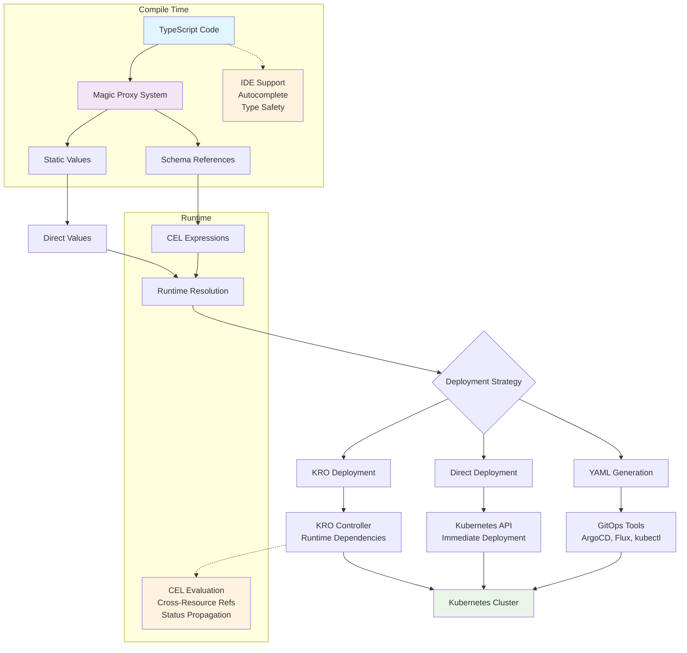

# typekro

<div align="center">
  
</div>

[](https://www.npmjs.com/package/typekro)
[](LICENSE)
[](https://github.com/yehudacohen/typekro)
[](https://github.com/yehudacohen/typekro/actions)
[](https://codecov.io/gh/yehudacohen/typekro)

📚 **[Documentation](https://typekro.run)** • 💬 **[Discord Community](https://discord.gg/kKNSDDjW)** • 🚀 **[Getting Started](https://typekro.run/guide/getting-started)**
## **TypeKro: IaC for Kubernetes Done Right - Statically Typed, Declarative Kubernetes Configuration with TypeScript**

TypeKro combines the type safety of TypeScript, the GitOps-friendly output of declarative YAML, and the runtime intelligence of **Kubernetes Resource Orchestrator (KRO)** - an open-source project that enables advanced resource orchestration with runtime dependencies and CEL expressions. Write infrastructure in pure TypeScript with full IDE support, then deploy directly to clusters or generate deterministic YAML for GitOps workflows.

## Table of Contents

- [Quick Start](#quick-start) - See TypeKro in action with a 30-line web app example
- [Deployment Flexibility](#deployment-flexibility) - Write once, deploy everywhere (YAML/Direct/Kro modes)
- [Core Architecture](#core-architecture) - Magic proxy system, enhanced types, and CRD intelligence
- [Comparison Grid](#comparison-grid) - How TypeKro compares to Pulumi, CDK8s, Helm, etc.
- [GitOps Workflows](#gitops-workflows) - Deterministic YAML generation and Flux HelmRelease integration
- [Complete Factory Reference](#complete-factory-reference) - All 50+ available resource factories
- [Which Pattern Should I Use?](#which-pattern-should-i-use) - Decision guide based on your team and workflow
- [Enhanced Type System](#enhanced-type-system) - Deep dive into schema references and type safety
- [Multi-Cloud Integration with Alchemy](#multi-cloud-integration-with-alchemy) - Unified cloud + Kubernetes management
- [Contributing](#contributing) - How to contribute to TypeKro development

---

## Quick Start

Write Kubernetes infrastructure in pure TypeScript with full IDE support and type safety:

```typescript
import { type } from 'arktype';
import { toResourceGraph, simpleDeployment, simpleService, Cel } from 'typekro';

// Build your infrastructure with full type safety
const deploymentService = toResourceGraph(
  {
    name: 'deployment-service',
    apiVersion: 'example.com/v1alpha1',
    kind: 'DeploymentService',
    spec: type({ name: 'string', environment: '"dev" | "staging" | "prod"' }),
    status: type({ ready: 'boolean', url: 'string' })
  },
  (schema) => ({
    deployment: simpleDeployment({
      name: schema.spec.name,                    // ← Full IDE autocomplete
      image: 'nginx',
      replicas: schema.spec.environment === 'prod' ? 3 : 1,  // ← Type-safe logic
      labels: { 
        app: 'deployment',
        env: schema.spec.environment             // ← Validated enum
      },
      ports: [{ containerPort: 80 }]
    }),
    
    service: simpleService({
      name: schema.spec.name,
      selector: { app: 'deployment' },           // ← Cross-resource reference
      ports: [{ port: 80, targetPort: 80 }]
    })
  }),
  (schema, resources) => ({
    ready: Cel.expr(resources.deployment.status.readyReplicas, ' > 0'),
    url: Cel.template('http://%s.%s.svc', schema.spec.name, schema.spec.environment)
  })
);

// Deploy instantly with full type checking
await deploymentService.factory('direct').deploy({
  name: 'my-app',           // ← IDE validates this exists
  environment: 'staging'    // ← Only accepts: "dev" | "staging" | "prod"
});
```

**Key Features Demonstrated:**
- **Full IDE autocomplete** - IntelliSense for all properties
- **Compile-time type checking** - Catch errors before deployment
- **Runtime validation** - ArkType validates deployment specs
- **Zero YAML required** - Pure TypeScript infrastructure
- **Instant deployment** - No kubectl, no YAML files

**Deploy anywhere:** Generate KRO YAML for GitOps with `factory.toYaml()` or integrate with multi-cloud using Alchemy.

---

## Comparison Grid

| Feature | TypeKro | Pulumi | CDK8s | Helm | Kustomize | Crossplane |
|---------|---------|---------|--------|------|-----------|------------|
| **Type Safety** | ✅ Full TypeScript | ✅ Multi-language | ✅ TypeScript | ❌ Templates | ❌ YAML | ❌ YAML |
| **GitOps Ready** | ✅ Deterministic YAML | ❌ State backend | ✅ YAML output | ✅ Charts | ✅ YAML | ✅ YAML |
| **Runtime Dependencies** | ✅ KRO + CEL expressions | ❌ Deploy-time only | ❌ Static | ❌ Templates | ❌ Static | ✅ Compositions |
| **IDE Support** | ✅ Full autocomplete | ✅ Language support | ✅ TypeScript | ❌ Limited | ❌ Limited | ❌ Limited |
| **Learning Curve** | 🟢 Just TypeScript | 🔴 New concepts | 🟡 TypeScript + K8s | 🔴 Templates | 🔴 YAML hell | 🔴 Complex |
| **Kubernetes Native** | ✅ Pure K8s resources | ❌ Abstraction layer | ✅ Pure K8s | ✅ K8s resources | ✅ K8s resources | ✅ K8s + CRDs |
| **Cross-Resource Refs** | ✅ Runtime resolution | ❌ Deploy-time | ❌ Manual | ❌ Manual | ❌ Manual | ✅ Built-in |
| **Multi-Cloud** | 🟡 Via Alchemy | ✅ Native | ❌ K8s only | ❌ K8s only | ❌ K8s only | ✅ Native |
| **State Management** | ✅ Stateless | ❌ State backend | ✅ Stateless | ✅ Stateless | ✅ Stateless | ✅ Controller |
| **CRD Timing** | ✅ Automatic | ❌ Manual | ❌ Manual | ❌ Manual | ❌ Manual | ✅ Built-in |

---

## Deployment Flexibility

### Deploy the Same Resource Graph using GitOps, Direct Kubernetes API Integration, or using KRO

TypeKro offers deployment flexibility.

> **What is KRO?** [Kubernetes Resource Orchestrator](https://kro.run/) is an open-source project by AWS Labs that enables resources to reference each other's runtime state using CEL expressions. TypeKro works in Direct Mode (no KRO required) for simple deployments, or KRO Mode for advanced orchestration.

 The same TypeScript code can be deployed in multiple ways without modification:

```typescript
// Define your infrastructure once  
const webappGraph = toResourceGraph(
  {
    name: 'my-webapp',
    apiVersion: 'example.com/v1',
    kind: 'WebApp', 
    spec: WebAppSpec,
    status: WebAppStatus
  },
  (schema) => ({
    // ... your resources
  }),
  (schema, resources) => ({
    // ... status builder
  })
);

const spec = { name: 'my-app', image: 'nginx:1.21', replicas: 3 };

// Deploy the SAME code in different ways:

// 1. Generate YAML for GitOps (no cluster interaction)
const kroFactory = webappGraph.factory('kro', { namespace: 'dev' });
const yaml = kroFactory.toYaml();
writeFileSync('k8s/webapp.yaml', yaml);

// 2. Deploy directly to cluster (immediate)
const directFactory = webappGraph.factory('direct', { namespace: 'dev' });
const directInstance = await directFactory.deploy(spec);

// 3. Integrate with Alchemy for multi-cloud coordination
await alchemyScope.run(async () => {
  const alchemyFactory = webappGraph.factory('direct', { 
    namespace: 'dev',
    alchemyScope: alchemyScope 
  });
  await alchemyFactory.deploy(spec);
});
```

This flexibility eliminates the need to rewrite infrastructure code when changing deployment strategies or environments.

### Core Deployment Strategies

#### 1. YAML Generation (GitOps)

Generate deterministic Kubernetes YAML that integrates with any GitOps workflow:

```typescript
// Generate ResourceGraphDefinition YAML
const kroFactory = webappGraph.factory('kro', { namespace: 'default' });
const yaml = kroFactory.toYaml();

// Save for GitOps deployment
writeFileSync('manifests/webapp.yaml', yaml);

// Or pipe directly to kubectl
console.log(yaml); // bun run generate.ts | kubectl apply -f -
```

**When to use:**
- GitOps workflows (ArgoCD, Flux)
- Audit requirements
- Multi-environment promotion
- CI/CD integration

**Benefits:**
- No cluster access needed during build
- Git-friendly deterministic output
- Works with existing GitOps tools
- Version control for infrastructure changes

#### 2. Direct Deployment (Imperative)

Deploy directly to your cluster for rapid iteration:

```typescript
// Create factory and deploy immediately
const factory = webappGraph.factory('direct', { namespace: 'development' });

// Deploy with specific configuration
const instance = await factory.deploy({
  name: 'webapp-dev',
  image: 'nginx:latest',
  replicas: 1
});

// Get the generated ResourceGraphDefinition
console.log('Generated RGD:', factory.toYaml());
```

**When to use:**
- Local development
- Testing and experimentation
- Rapid prototyping
- Direct cluster management

**Benefits:**
- Immediate feedback
- No Git workflow overhead
- Live iteration on infrastructure
- Integrated with development workflow

#### 3. Kro Deployment (Recommended for Production)

Leverage Kubernetes Resource Orchestrator for advanced runtime capabilities:

```typescript
// Deploy as ResourceGraphDefinition with runtime resolution
const kroFactory = webappGraph.factory('kro', { namespace: 'production' });

// Apply the ResourceGraphDefinition to cluster
await kroFactory.deploy({ 
  name: 'webapp-prod',
  image: 'nginx:1.21', 
  replicas: 3 
});

// Kro handles:
// - Runtime CEL expression evaluation
// - Cross-resource dependency resolution  
// - Automatic reconciliation and drift correction
// - Status propagation and health monitoring
```

**When to use:**
- Production environments
- Complex resource dependencies
- Self-healing infrastructure requirements
- Advanced orchestration needs

**Benefits:**
- Runtime dependency resolution
- Automatic reconciliation
- Built-in health monitoring
- Kubernetes-native operation

### Advanced Deployment Patterns

#### Environment-Specific Deployments

Deploy the same graph to different environments with environment-specific configurations:

```typescript
// Development: Direct deployment for fast iteration
const factory = webappGraph.factory('direct', { namespace: 'dev' });
await devFactory.deploy({
  name: 'webapp-dev',
  image: 'nginx:latest',
  replicas: 1
});

// Staging: Kro deployment for testing runtime dependencies  
const factory = webappGraph.factory('kro', { namespace: 'staging' });
await stagingFactory.deploy({
  name: 'webapp-staging',
  image: 'nginx:1.21-rc',
  replicas: 2,
});

// Production: GitOps deployment
const factory = webappGraph.factory('kro', { namespace: 'production' });
const prodYaml = prodFactory.toYaml();
writeFileSync('k8s/production/webapp.yaml', prodYaml);
// Deployed via ArgoCD/Flux
```


### Deployment Strategy Decision Matrix

| **Scenario** | **Recommended Strategy** | **Why** |
|--------------|-------------------------|---------|
| Local development | Direct Deployment | Fast feedback, no GitOps overhead |
| CI/CD pipeline testing | Direct Deployment | Immediate validation, isolated environments |
| Production deployment | Kro + GitOps | Runtime intelligence + audit trail |
| Multi-environment promotion | YAML Generation | Consistent artifacts across environments |
| Complex runtime dependencies | Kro Deployment | Advanced orchestration capabilities |
| Multi-cloud infrastructure | [Alchemy Integration](#multi-cloud-integration-with-alchemy) | Unified cloud + Kubernetes management |
| Rapid prototyping | Direct Deployment | Minimal setup, immediate results |
| Regulated environments | YAML Generation + GitOps | Audit trail, approval workflows |

---

## GitOps Workflows

### Deterministic YAML Generation

TypeKro generates stable, deterministic YAML output perfect for GitOps workflows:

```typescript
// generate-manifests.ts
import { writeFileSync } from 'fs';

const graph = toResourceGraph(/* ... */);

// Same input always generates identical YAML
const factory = await graph.factory('kro', { namespace: 'default' });
const yaml = factory.toYaml();

// Write to file for GitOps
writeFileSync('k8s/my-app.yaml', yaml);
console.log('Generated k8s/my-app.yaml for GitOps deployment');
```

**Multi-Environment GitOps Workflow:**

```typescript
// scripts/generate-all-environments.ts
const environments = ['development', 'staging', 'production'];

for (const env of environments) {
  // Generate ResourceGraphDefinition YAML for this environment
  const factory = await webappGraph.factory('kro', { namespace: env });
  const rgdYaml = factory.toYaml();
  writeFileSync(`k8s/${env}/webapp-rgd.yaml`, rgdYaml);
  
  // Generate instance YAML with environment-specific spec
  const instanceSpec = {
    name: `webapp-${env}`,
    image: env === 'production' ? 'nginx:1.21' : 'nginx:latest',
    replicas: env === 'production' ? 3 : 1,
  };
  
  const instanceYaml = factory.toYaml(instanceSpec);
  writeFileSync(`k8s/${env}/webapp-instance.yaml`, instanceYaml);
}
```

**Benefits for GitOps:**
- **Deterministic Output** - Same input always generates identical YAML
- **Git-Friendly** - Clean, readable YAML that diffs well  
- **Stable Resource IDs** - Consistent resource identifiers across deployments
- **No External State** - Pure functions, no external dependencies

### Flux HelmRelease Integration

Deploy Helm charts with full TypeScript type safety and schema references:

```typescript
import { helmRelease, helmRepository } from 'typekro';

const InfraSpec = type({
  name: 'string',
  replicas: 'number', 
  loadBalancerIP: 'string',
  environment: 'string'
});

const infraGraph = toResourceGraph(
  {
    name: 'ingress-infrastructure',
    apiVersion: 'infrastructure.example.com/v1',
    kind: 'IngressInfra',
    spec: InfraSpec,
    status: type({ ready: 'boolean' })
  },
  (schema) => {
    // Create Helm repository first
    const repository = helmRepository({
      name: 'nginx-repo',
      url: 'https://kubernetes.github.io/ingress-nginx'
    });
    
    // Create Helm release using simple factory
    const controller = simpleHelmChart(
      Cel.template('%s-ingress', schema.spec.name),
      repository.spec.url,  // Reference repository URL by field
      'ingress-nginx',
      {
        controller: {
          replicaCount: schema.spec.replicas,                    // Schema reference
          service: {
            loadBalancerIP: schema.spec.loadBalancerIP           // Schema reference
          },
          config: {
            'custom-config': Cel.template('env-%s', schema.spec.environment)  // CEL expression
          }
        }
      }
    );

    return { repository, controller };
  },
  (schema, resources) => ({
    ready: Cel.expr(resources.controller.status.conditions, '[?@.type=="Ready"].status == "True"')
  })
);

// Deploy via Flux
const factory = await infraGraph.factory('kro', { namespace: 'flux-system' });
const yaml = factory.toYaml();
writeFileSync('k8s/ingress-controller.yaml', yaml);
```

**Key Benefits:**
- **Type-safe Helm values** - Full TypeScript validation for chart values
- **Schema references in values** - Connect Helm charts to your resource graph schema
- **Runtime value resolution** - CEL expressions evaluate at deployment time
- **Full integration with Flux CD HelmRelease**

### External YAML Integration

Integrate existing YAML manifests and Kustomizations into TypeKro resource graphs:

```typescript
import { yamlFile, yamlDirectory } from 'typekro';

const AppSpec = type({
  name: 'string',
  image: 'string'
});

const hybridGraph = toResourceGraph(
  {
    name: 'hybrid-app',
    apiVersion: 'apps.example.com/v1',
    kind: 'HybridApp',
    spec: AppSpec,
    status: type({ ready: 'boolean' })
  },
  (schema) => ({
    // Include external YAML files
    monitoring: yamlFile({
      path: './k8s/prometheus-operator.yaml',
      namespace: schema.metadata.namespace  // Schema reference for namespace
    }),
    
    // Include entire directories with Kustomization
    monitoringStack: yamlDirectory({
      path: './k8s/monitoring/',
      recursive: true,
      kustomization: {
        namePrefix: Cel.template('%s-', schema.spec.name),     // Dynamic prefix
        namespace: schema.metadata.namespace,
        commonLabels: {
          'app.kubernetes.io/instance': schema.spec.name        // Schema reference
        }
      }
    }),
    
    // Include from Git repositories
    kubePrometheus: yamlDirectory({
      path: 'https://github.com/prometheus-operator/kube-prometheus.git//manifests',
      ref: 'v0.12.0',
      namespace: 'monitoring'
    }),
    
    // TypeKro resources that reference external resources
    app: simpleDeployment({
      name: schema.spec.name,
      image: schema.spec.image,
      env: {
        PROMETHEUS_URL: 'http://prometheus-operated.monitoring.svc.cluster.local:9090'
      }
    })
  }),
  (schema, resources) => ({
    ready: Cel.expr(resources.app.status.readyReplicas, ' > 0')
  })
);
```

**Integration Capabilities:**
- **File and directory inclusion** - Bring existing YAML into resource graphs
- **Kustomization support** - Apply transformations with schema references  
- **Git repository sources** - Include manifests directly from Git
- **Mixed TypeKro + YAML** - Combine hand-written YAML with TypeKro resources

---

## Complete Factory Reference

TypeKro provides 50+ factory functions for all major Kubernetes resources:

**Core Resources:** `simpleDeployment()`, `simpleService()`, `simpleConfigMap()`, `simpleSecret()`, `simplePvc()`

**Advanced:** `helmRelease()`, `yamlFile()`, `customResource()`, `networkPolicy()`, `serviceAccount()`, plus comprehensive RBAC, storage, networking, and workload resources.

All resources support full type safety, cross-resource references, IDE autocomplete, and CEL expression integration.

**[📖 View Complete Factory Reference →](docs/api/factories.md)**

---

## Which Pattern Should I Use?

### 🆕 "I'm new to Kubernetes"
**→ Use: Direct Deployment**
```typescript
const factory = await graph.factory('direct', { namespace: 'default' });
await factory.deploy(spec);
```
- Immediate feedback loop
- No external dependencies  
- Built-in CRD timing intelligence
- Great for learning

### 🔄 "I have existing YAML and want to migrate gradually"  
**→ Use: yamlFile() + gradual adoption**
```typescript
const hybridGraph = toResourceGraph(
  {
    name: 'legacy-app',
    apiVersion: 'apps.example.com/v1',
    kind: 'LegacyApp',
    spec: type({ name: 'string' }),
    status: type({ ready: 'boolean' })
  },
  (schema) => ({
    existing: yamlFile({ path: './existing/app.yaml' }),        // Keep existing
    newService: simpleService({                                 // Add TypeKro gradually
      name: schema.spec.name,
      selector: { app: schema.spec.name }
    })
  }),
  (schema, resources) => ({
    ready: Cel.expr(resources.newService.status.ready, ' == true')
  })
);
```
- Preserve existing workflows
- Migrate incrementally
- Zero disruption migration path

### 🚀 "I want GitOps workflows"
**→ Use: YAML Generation + Flux HelmRelease**
```typescript
const factory = await graph.factory('kro', { namespace: 'production' });
const yaml = factory.toYaml();
writeFileSync('k8s/app.yaml', yaml);
```
- Deterministic YAML output
- Git-based workflows  
- Works with ArgoCD, Flux, kubectl

### ☁️ "I need multi-cloud infrastructure"
**→ Use: [Alchemy Integration](#multi-cloud-integration-with-alchemy)**
```typescript
await alchemyScope.run(async () => {
  const factory = await graph.factory('direct', { 
    namespace: 'default',
    alchemyScope: alchemyScope 
  });
  await factory.deploy(spec);
});
```
- Unified TypeScript across cloud + K8s
- Individual resource registration
- Type-safe cloud resources

### 📦 "I want to deploy Helm charts with type safety"
**→ Use: helmRelease() patterns**
```typescript
helmRelease({
  name: 'nginx',
  chart: { /* ... */ },
  values: {
    replicaCount: schema.spec.replicas,  // Type-safe values
    service: {
      loadBalancerIP: schema.spec.ip     // Schema references
    }
  }
})
```
- Type-safe Helm values
- Schema references in chart values
- Flux CD integration

### 🔗 "I have complex runtime dependencies"
**→ Use: Kro Deployment + CEL expressions**
```typescript
simpleDeployment({
  env: {
    DB_HOST: database.service.spec.clusterIP,           // Runtime resolution
    API_URL: Cel.template('http://%s:8080', 
      webService.status.loadBalancer.ingress[0].ip)     // Status references
  }
})
```
- Runtime resource resolution
- Advanced orchestration
- Self-healing infrastructure
- Production-ready patterns

### 🎯 "I need to make the right choice for my team"

| **Team Size** | **K8s Experience** | **Deployment Model** | **Recommended Pattern** |
|---------------|-------------------|---------------------|------------------------|
| Small (1-3) | Beginner | Any | Direct Deployment |
| Small (1-3) | Expert | GitOps | YAML Generation |
| Medium (4-10) | Mixed | GitOps | Kro + GitOps |
| Large (10+) | Expert | Enterprise GitOps | Kro + GitOps + Alchemy |
| Any | Any | Multi-cloud | [Alchemy Integration](#multi-cloud-integration-with-alchemy) |
| Any | Any | Helm-heavy | HelmRelease patterns |

Choose based on your team's needs, not just technical capabilities. You can always evolve your approach as requirements change.

---

## Multi-Cloud Integration with Alchemy

TypeKro integrates seamlessly with [Alchemy](https://alchemy.run) to enable unified cloud + Kubernetes infrastructure management. Alchemy is infrastructure-as-TypeScript that lets you deploy to Cloudflare, AWS, and more with pure TypeScript.

### Why Use TypeKro + Alchemy?

- **Unified TypeScript Experience**: Write both cloud resources and Kubernetes resources in the same language
- **Cross-Platform References**: Cloud resources can reference Kubernetes resources and vice versa
- **Type-Safe Integration**: Full TypeScript validation across your entire infrastructure stack
- **Flexible Deployment**: Use any TypeKro deployment strategy (Direct, YAML, KRO) with Alchemy

### Individual Resource Registration Pattern

Register specific TypeKro resources with Alchemy for hybrid cloud-native applications:

```typescript
import alchemy from 'alchemy';
import { Bucket } from 'alchemy/aws';

// 1. Create Alchemy scope
const app = await alchemy('webapp-infrastructure');

// 2. Create cloud resources with Alchemy
const bucket = await Bucket('webapp-uploads');

// 3. Create Kubernetes resources that reference cloud resources
const webappGraph = toResourceGraph(
  {
    name: 'webapp-with-cloud',
    apiVersion: 'example.com/v1',
    kind: 'CloudWebApp',
    spec: type({ name: 'string', image: 'string', replicas: 'number' }),
    status: type({ ready: 'boolean' })
  },
  (schema) => ({
    app: simpleDeployment({
      name: schema.spec.name,
      image: schema.spec.image,
      env: {
        BUCKET_NAME: bucket.name,  // Reference to Alchemy resource
        API_URL: Cel.template('http://%s-service', schema.spec.name)
      }
    })
  }),
  (schema, resources) => ({
    ready: Cel.expr(resources.app.status.readyReplicas, ' > 0')
  })
);

// Deploy TypeKro resources with Alchemy integration
await app.run(async () => {
  const factory = await webappGraph.factory('direct', { 
    namespace: 'default',
    alchemyScope: app 
  });
  await factory.deploy({
    name: 'webapp',
    image: 'nginx:1.21',
    replicas: 3
  });
});
```

### Real-World Cloud-Native Application

Here's a complete example showing TypeKro + Alchemy for a production cloud-native application:

```typescript
import alchemy from 'alchemy';
import { Bucket, Function as LambdaFunction } from 'alchemy/aws';
import { toResourceGraph, simpleDeployment, type } from 'typekro';

// 1. Create Alchemy scope
const app = await alchemy('cloud-native-app');

// 2. Cloud resources with Alchemy
const api = await LambdaFunction('database-function', {
  code: './functions/database.js',
  environment: {
    DATABASE_URL: 'postgresql://...'
  }
});

const bucket = await Bucket('app-uploads');

// 3. Kubernetes resources with TypeKro that reference cloud resources
const AppSpec = type({
  name: 'string',
  image: 'string',
  replicas: 'number'
});

const appGraph = toResourceGraph(
  {
    name: 'cloud-native-app',
    apiVersion: 'example.com/v1',
    kind: 'CloudNativeApp',
    spec: AppSpec,
    status: type({ ready: 'boolean' })
  },
  (schema) => {
    // Create redis first
    const redis = simpleDeployment({
      name: Cel.template('%s-redis', schema.spec.name),
      image: 'redis:7',
      labels: { app: Cel.template('%s-redis', schema.spec.name), component: 'cache' }
    });
    
    // Create app that references redis
    const app = simpleDeployment({
      name: schema.spec.name,
      image: schema.spec.image,
      labels: { app: schema.spec.name, component: 'web' },
      env: {
        // Reference cloud resources
        API_URL: api.url,
        UPLOAD_BUCKET: bucket.name,
        // Reference other Kubernetes resources by field
        REDIS_HOST: redis.metadata.name
      }
    });

    return { redis, app };
  },
  (schema, resources) => ({
    ready: Cel.expr(resources.app.status.readyReplicas, ' > 0')
  })
);

// 4. Deploy as unified infrastructure
await app.run(async () => {
  const factory = await appGraph.factory('direct', { 
    namespace: 'production',
    alchemyScope: app 
  });
  await factory.deploy({
    name: 'myapp',
    image: 'myapp:v1.2.3',
    replicas: 5
  });
});
```

### Integration Patterns

TypeKro works with all Alchemy deployment patterns:

#### Pattern 1: Cloud-First with Kubernetes Extensions
```typescript
// Start with cloud infrastructure
const app = await alchemy('my-platform');
const database = await RDS('main-db');
const cache = await ElastiCache('redis-cluster');

// Add Kubernetes workloads that use cloud resources
const k8sWorkloads = await webappGraph.factory('kro', { namespace: 'apps' });
await app.run(async () => {
  const factory = await k8sWorkloads.factory('kro', { 
    namespace: 'apps',
    alchemyScope: app 
  });
  await factory.deploy({
    databaseUrl: database.endpoint,
    redisUrl: cache.endpoint
  });
});
```

#### Pattern 2: Kubernetes-First with Cloud Services
```typescript
// Start with cloud infrastructure first
const app = await alchemy('support-services');
const monitoring = await CloudWatch('webapp-metrics');
const storage = await S3('webapp-data');

// Deploy Kubernetes resources with access to cloud resources
await app.run(async () => {
  const factory = webappGraph.factory('direct', { 
    namespace: 'default',
    alchemyScope: app 
  });
  await factory.deploy({ 
    name: 'webapp',
    image: 'myapp:latest',
    // Kubernetes resources can reference cloud resources
    monitoring: monitoring.endpoint,
    storage: storage.bucketName
  });
});
```

### Benefits of TypeKro + Alchemy Integration

- **Single Language**: TypeScript for everything - no YAML, HCL, or domain-specific languages
- **Type Safety Across Platforms**: Catch configuration errors at compile time, not runtime
- **Cross-Platform References**: Natural references between cloud and Kubernetes resources
- **Deployment Flexibility**: Use any TypeKro deployment strategy with Alchemy
- **IDE Support**: Full autocomplete and refactoring across your entire infrastructure
- **GitOps Compatible**: Generate deterministic YAML while maintaining cloud resource management

---


## Core Architecture

TypeKro's architecture enables compile-time type safety with runtime intelligence through three key systems:



### Magic Proxy System

TypeKro's "magic" comes from its **proxy system** that creates different behaviors for execution-time vs runtime values:

#### Static Values (Known at Execution Time)
```typescript
const deployment = simpleDeployment({
  name: 'my-app',        // Static string
  replicas: 3,           // Static number
});

// Accessing static values returns the actual value
console.log(deployment.spec.replicas); // Returns: 3
```

#### Dynamic References (Unknown at Execution Time)
```typescript
const deployment = simpleDeployment({
  name: schema.spec.name,  // Schema reference - unknown until runtime
});

// Accessing schema or status fields creates KubernetesRef objects
const nameRef = schema.spec.name;        // Creates: KubernetesRef<string>
const statusRef = deployment.status.readyReplicas; // Creates: KubernetesRef<number>
```

#### The `$` Prefix for Explicit References
```typescript
const configMap = simpleConfigMap({
  name: 'config',
  data: { key: 'value' }  // Static value
});

const deployment = simpleDeployment({
  name: 'app',
  env: {
    // Static behavior: Uses the known value "value" at execution time
    STATIC_VALUE: configMap.data.key,
    
    // Dynamic behavior: Creates reference resolved by Kro at runtime
    DYNAMIC_VALUE: configMap.data.$key,
  }
});
```

**Key Rule**: Schema references (`schema.spec.*`) and status references (`resource.status.*`) are automatically converted to CEL expressions. For explicit runtime references to other resource properties, use the `$` prefix.

### Enhanced Types (RefOrValue Pattern)

Every factory function accepts `RefOrValue<T>`, which means any parameter can be:

```typescript
// 1. Direct value
name: "my-app"

// 2. Schema reference (becomes CEL)
name: schema.spec.name

// 3. CEL expression 
name: Cel.template("%s-service", schema.spec.name)

// 4. Reference to another resource
env: {
  DB_HOST: database.service.spec.clusterIP  // Runtime resolution
}
```

This pattern provides **compile-time type safety** while enabling **runtime flexibility**.

### CRD Installation Intelligence

TypeKro's direct deployer automatically handles Custom Resource Definition timing:

```typescript
// TypeKro automatically detects CRD dependencies
const kroResources = [
  kroDefinition,           // CRD must be installed first
  kroInstance             // Instance depends on CRD
];

const factory = await graph.factory('direct', { namespace: 'default' });
await factory.deploy(spec);  // ✅ Automatically waits for CRD readiness
```

**Benefits:**
- **No "CRD not found" errors** - Automatic timing coordination
- **Zero manual ordering** - Intelligent dependency detection  
- **Production reliability** - Handles CRD establishment properly

### Runtime vs Compile-time Behavior

| **Aspect** | **Compile-time** | **Runtime** |
|------------|------------------|-------------|
| **Type checking** | Full TypeScript validation | N/A |
| **IDE support** | Autocomplete, refactoring | N/A |
| **Schema references** | Appear as typed properties | Resolve to CEL expressions |
| **Resource references** | Type-safe property access | Runtime cluster state lookup |
| **Validation** | TypeScript + arktype schemas | Kubernetes validation + CEL |

---


## Enhanced Type System

TypeKro provides **enhanced types** through its magic proxy system, eliminating the need for optional chaining (`?.`) when working with schema and resource references.

### Schema References - Always Present

When you access schema fields in the resource builder, TypeScript treats them as always present:

```typescript
const graph = toResourceGraph(
  {
    name: 'my-app',
    spec: type({
      name: 'string',
      image: 'string',
      replicas: 'number',
      environment: 'string',
    }),
    status: type({
      ready: 'boolean',
      url: 'string',
    }),
  },
  (schema) => ({
    deployment: simpleDeployment({
      // ✅ No optional chaining needed - TypeScript knows these exist
      name: schema.spec.name,           // Type: string (not string | undefined)
      image: schema.spec.image,         // Type: string (not string | undefined)
      replicas: schema.spec.replicas,   // Type: number (not number | undefined)
      
      env: {
        NODE_ENV: schema.spec.environment,  // Type: string
      },
    }),
  }),
  (schema, resources) => ({
    // ✅ Status fields are also enhanced - no optional chaining needed
    ready: Cel.expr(resources.deployment.status.readyReplicas, ' > 0'),
    url: Cel.template('https://%s.example.com', schema.spec.name),
  })
);
```

### Resource Status References - Enhanced Types

Resource status fields are enhanced to be non-optional within the builders:

```typescript
// Without TypeKro (regular Kubernetes types)
const regularK8s = {
  // These would require optional chaining
  replicas: deployment.status?.readyReplicas,        // number | undefined
  conditions: deployment.status?.conditions?.[0],   // Condition | undefined
};

// With TypeKro (enhanced types)
const graph = toResourceGraph(
  // ... schema definition
  (schema, resources) => ({
    // ✅ No optional chaining needed - enhanced types guarantee presence
    replicas: resources.deployment.status.readyReplicas,     // Type: number
    phase: resources.deployment.status.phase,                // Type: string
    conditions: resources.deployment.status.conditions[0],   // Type: Condition
    
    // Complex expressions work naturally
    healthy: Cel.expr(
      resources.deployment.status.readyReplicas, ' == ',
      resources.deployment.spec.replicas
    ),
  })
);
```

### How Enhanced Types Work

The magic proxy system provides type enhancement while respecting the static/dynamic value distinction:

1. **Enhanced Type Safety**: Schema and resource references appear as non-optional TypeScript types
2. **Dynamic Reference Creation**: Schema and status field access creates `KubernetesRef<T>` objects
3. **Static Value Preservation**: Known values at execution time remain as actual values

```typescript
// Schema references (always dynamic - unknown until runtime)
const nameRef = schema.spec.name;                    // Creates: KubernetesRef<string>
const imageRef = schema.spec.image;                  // Creates: KubernetesRef<string>

// Resource status references (always dynamic - runtime cluster state)
const replicasRef = resources.deployment.status.readyReplicas;  // Creates: KubernetesRef<number>

// Static values (known at execution time)
const staticName = 'my-app';                         // Remains: string
const staticReplicas = 3;                            // Remains: number

// Mixed usage in factory functions
const deployment = simpleDeployment({
  name: schema.spec.name,        // Dynamic: KubernetesRef<string> → CEL expression
  replicas: 3,                   // Static: number → direct value
  image: 'nginx:latest'          // Static: string → direct value
});
```

### Benefits of Enhanced Types

- **No Optional Chaining**: Write cleaner code without `?.` operators
- **Better IntelliSense**: Full autocomplete for all schema and status fields
- **Execution-Time Safety**: Catch typos and missing fields when building resources
- **Runtime Flexibility**: References are resolved dynamically by Kro
- **Natural Syntax**: Write code that looks like direct property access

This enhanced type system makes TypeKro feel natural to use while maintaining the powerful reference resolution capabilities needed for complex Kubernetes deployments.

---

## Contributing

We welcome contributions to TypeKro! Whether you're fixing bugs, adding features, or improving documentation, your help makes TypeKro better for everyone.

### Quick Start for Contributors

```bash
# Fork and clone the repository
git clone https://github.com/your-username/typekro.git
cd typekro

# Install dependencies (we use Bun)
bun install

# Run tests to ensure everything works
bun run test

# Make your changes and run quality checks
bun run quality
```

### What Can You Contribute?

- 🐛 **Bug Fixes** - Help us squash bugs and improve reliability
- ✨ **New Features** - Add factory functions for new Kubernetes resources
- 📚 **Documentation** - Improve examples, guides, and API documentation
- 🧪 **Tests** - Add test coverage for edge cases and new functionality
- 🔧 **Tooling** - Improve development experience and CI/CD

**[📖 Read the Complete Contributing Guide →](CONTRIBUTING.md)**

The contributing guide includes:
- Detailed setup instructions
- Code structure and architectural principles
- Testing guidelines and examples
- PR submission process
- Release workflow

## License

Apache 2.0 - see [LICENSE](LICENSE) for details.
