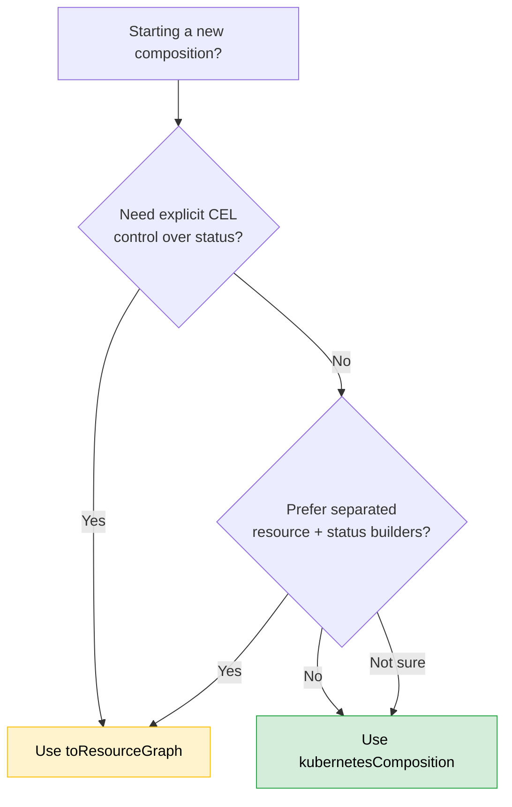

# Composition APIs

TypeKro provides two composition APIs for creating typed resource graphs. Both produce the same `TypedResourceGraph` output and support the same deployment modes.

## Choosing Your API

| | `kubernetesComposition` | `toResourceGraph` |
|--|-------------------------|-------------------|
| **Style** | Imperative — single function creates resources and returns status | Declarative — separate resource builder and status builder |
| **Status expressions** | JavaScript expressions auto-converted to CEL | Explicit `Cel.expr()` / `Cel.template()` / resource references |
| **Cross-resource refs** | Automatic via magic proxy (`deploy.status.readyReplicas`) | Explicit via `resources.deploy.status.readyReplicas` |
| **Nested compositions** | Call compositions as functions inside the composition fn | Same |
| **Best for** | Most applications — natural JS, less boilerplate | Advanced users who want full CEL control or complex status logic |

### Decision Flowchart



**Rule of thumb:** Start with `kubernetesComposition`. Switch to `toResourceGraph` if you need explicit `Cel.expr()` or find the single-function pattern limiting.

---

# kubernetesComposition API

The primary API for creating typed resource graphs with full type safety and automatic CEL generation.

## Syntax

```typescript
function kubernetesComposition<TSpec, TStatus>(
  definition: {
    name: string;
    apiVersion: string;
    kind: string;
    spec: ArkTypeSchema<TSpec>;
    status: ArkTypeSchema<TStatus>;
  },
  compositionFunction: (spec: MagicProxy<TSpec>) => TStatus
): ResourceGraph<TSpec, TStatus>
```

## Parameters

### `definition`

| Property | Type | Description |
|----------|------|-------------|
| `name` | `string` | Unique name for the resource graph |
| `apiVersion` | `string` | Kubernetes API version (e.g., `example.com/v1alpha1`) |
| `kind` | `string` | Kubernetes resource kind (e.g., `WebApp`) |
| `spec` | `ArkTypeSchema` | ArkType schema defining the spec structure |
| `status` | `ArkTypeSchema` | ArkType schema defining the status structure |

### `compositionFunction`

Function that receives a magic proxy of the spec and:
1. Creates resources (automatically registered)
2. Returns status object with JavaScript expressions (auto-converted to CEL)

## Returns

A `ResourceGraph` instance with methods:

| Method | Description |
|--------|-------------|
| `factory(mode, options)` | Create deployment factory (`'direct'` or `'kro'`) |
| `toYaml(spec?)` | Generate YAML representation |

## Basic Example

```typescript
import { type } from 'arktype';
import { kubernetesComposition } from 'typekro';
import { Deployment, Service } from 'typekro/simple';

const webApp = kubernetesComposition(
  {
    name: 'webapp',
    apiVersion: 'example.com/v1alpha1',
    kind: 'WebApp',
    spec: type({ name: 'string', image: 'string', replicas: 'number' }),
    status: type({ ready: 'boolean', url: 'string' })
  },
  (spec) => {
    const deploy = Deployment({
      id: 'deploy',
      name: spec.name,
      image: spec.image,
      replicas: spec.replicas
    });
    
    const svc = Service({
      id: 'svc',
      name: `${spec.name}-svc`,
      selector: { app: spec.name },
      ports: [{ port: 80 }]
    });

    return {
      ready: deploy.status.readyReplicas >= spec.replicas,
      url: `http://${svc.status.clusterIP}`
    };
  }
);
```

## Cross-Resource References

Resources can reference each other's fields:

```typescript
import { kubernetesComposition } from 'typekro';
import { Deployment, Service } from 'typekro/simple';

const app = kubernetesComposition(definition, (spec) => {
  const db = Deployment({ id: 'db', name: 'db', image: 'postgres' });
  const dbService = Service({
    id: 'dbSvc',
    name: 'db-svc',
    selector: { app: 'db' },
    ports: [{ port: 5432 }]
  });
  
  const api = Deployment({
    id: 'api',
    name: 'api',
    image: spec.image,
    env: {
      DATABASE_HOST: dbService.status.clusterIP,  // Reference service's status
      DATABASE_PORT: '5432'
    }
  });

  return { ready: api.status.readyReplicas > 0 };
});
```

## Status Expressions

JavaScript expressions in the return object are automatically converted to CEL:

```typescript
return {
  // Boolean expressions
  ready: deploy.status.readyReplicas >= spec.replicas,
  
  // String templates
  url: `https://${ingress.status.loadBalancer.ingress[0].hostname}`,
  
  // Conditionals
  phase: deploy.status.readyReplicas > 0 ? 'running' : 'pending',
  
  // Fallbacks
  endpoint: svc.status.loadBalancer?.ingress?.[0]?.ip || 'pending'
};
```

## Deployment

```typescript
// Direct deployment (immediate, no Kro controller)
const factory = webApp.factory('direct', { namespace: 'production' });
await factory.deploy({ name: 'my-app', image: 'nginx', replicas: 3 });

// Kro deployment (creates ResourceGraphDefinition)
const kroFactory = webApp.factory('kro', { namespace: 'production' });
await kroFactory.deploy({ name: 'my-app', image: 'nginx', replicas: 3 });

// Generate YAML for GitOps
const yaml = webApp.toYaml({ name: 'my-app', image: 'nginx', replicas: 3 });
```

## Factory Options

```typescript
interface FactoryOptions {
  namespace?: string;           // Target namespace
  timeout?: number;             // Deployment timeout (ms)
  waitForReady?: boolean;       // Wait for resources to be ready
  
  // Event monitoring - stream control plane logs
  eventMonitoring?: {
    enabled?: boolean;
    eventTypes?: ('Normal' | 'Warning' | 'Error')[];
    includeChildResources?: boolean;
  };
  
  // Debug logging
  debugLogging?: {
    enabled?: boolean;
    statusPolling?: boolean;
    readinessEvaluation?: boolean;
    verboseMode?: boolean;
  };
  
  // Progress callback for custom handling
  progressCallback?: (event: DeploymentEvent) => void;
}
```

## The `id` Parameter

Every resource needs an `id` for cross-resource references:

```typescript
import { Deployment } from 'typekro/simple';

const deploy = Deployment({
  id: 'webDeploy',  // Required for references
  name: spec.name,
  image: spec.image
});

// Now you can reference it
return { replicas: deploy.status.readyReplicas };
```

---

# toResourceGraph API

The declarative API for creating typed resource graphs with explicit CEL expressions and separated concerns.

## Syntax

```typescript
function toResourceGraph<TSpec, TStatus>(
  definition: {
    name: string;
    apiVersion: string;
    kind: string;
    spec: ArkTypeSchema<TSpec>;
    status: ArkTypeSchema<TStatus>;
  },
  resourceBuilder: (schema: SchemaProxy<TSpec, TStatus>) => Record<string, KubernetesResource>,
  statusBuilder: (
    schema: SchemaProxy<TSpec, TStatus>,
    resources: EnhancedResources
  ) => TStatus
): TypedResourceGraph<TSpec, TStatus>
```

## Parameters

### `definition`

Same as `kubernetesComposition` — name, apiVersion, kind, spec schema, status schema.

### `resourceBuilder`

Function that receives the schema proxy and returns a record of named resources. Each key becomes the resource identifier used in the status builder.

### `statusBuilder`

Function that receives both the schema proxy and the deployed resources, returning the status object. Use `Cel.expr()`, `Cel.template()`, or direct resource references.

## Basic Example

```typescript
import { type } from 'arktype';
import { toResourceGraph, Cel } from 'typekro';
import { createDeployment, createService } from 'typekro';

const webApp = toResourceGraph(
  {
    name: 'webapp',
    apiVersion: 'example.com/v1alpha1',
    kind: 'WebApp',
    spec: type({ name: 'string', image: 'string', replicas: 'number' }),
    status: type({ ready: 'boolean', url: 'string' })
  },
  // Resource builder — creates resources keyed by identifier
  (schema) => ({
    deploy: createDeployment({
      name: schema.spec.name,
      image: schema.spec.image,
      replicas: schema.spec.replicas,
    }),
    svc: createService({
      name: schema.spec.name,
      selector: { app: schema.spec.name },
      ports: [{ port: 80 }],
    }),
  }),
  // Status builder — maps resource status to composition status
  (schema, resources) => ({
    ready: Cel.expr<boolean>(resources.deploy.status.readyReplicas, ' > 0'),
    url: Cel.template('http://%s', resources.svc.status.clusterIP),
  })
);
```

## When to Use toResourceGraph

- You want **explicit CEL expressions** rather than auto-converted JavaScript
- You prefer **separated concerns** — resource creation distinct from status mapping
- You need **complex CEL patterns** that JavaScript auto-conversion doesn't support
- You're building **reusable library compositions** where explicitness aids maintainability

## Next Steps

- [CEL Expressions](./cel.md) - Advanced expression patterns
- [Factory Functions](./factories/) - All factory functions
