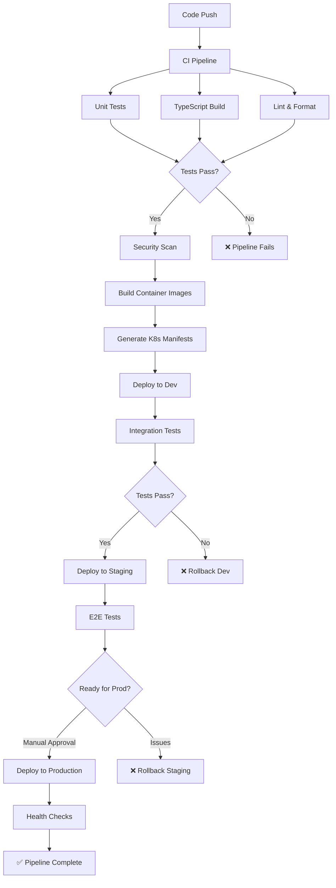

# CI/CD Integration

This example demonstrates how to integrate TypeKro with modern CI/CD pipelines, including GitHub Actions, GitLab CI, and ArgoCD for automated testing, building, and deployment of infrastructure code.

## What You'll Learn

- **Automated testing** - Unit and integration tests for infrastructure code
- **GitOps workflows** - YAML generation and automated deployment
- **Security scanning** - Container and infrastructure security validation
- **Multi-stage deployments** - Progressive deployment across environments
- **Rollback strategies** - Safe deployment practices with automated rollbacks

## Pipeline Architecture



## Complete Example

### 1. Application with CI/CD Configuration

```typescript
import { type } from 'arktype';
import { 
  toResourceGraph, 
  simpleDeployment, 
  simpleService,
  simpleConfigMap,
  simpleSecret
} from 'typekro';

// CI/CD-aware application schema
const CICDAppSpec = type({
  // Application metadata
  name: 'string',
  version: 'string',
  gitSha: 'string',
  
  // Environment configuration
  environment: '"development" | "staging" | "production"',
  
  // Build information
  build: {
    imageRegistry: 'string',
    imageName: 'string',
    buildNumber: 'string',
    buildTime: 'string'
  },
  
  // Deployment configuration
  deployment: {
    replicas: 'number',
    strategy: '"RollingUpdate" | "Recreate"',
    maxUnavailable: 'number',
    maxSurge: 'number'
  },
  
  // Feature flags for CI/CD
  features: {
    enableMetrics: 'boolean',
    enableTracing: 'boolean',
    enableCanary: 'boolean'
  }
});

const CICDAppStatus = type({
  version: 'string',
  gitSha: 'string',
  buildNumber: 'string',
  deploymentTime: 'string',
  healthStatus: '"healthy" | "degraded" | "unhealthy"',
  rolloutStatus: '"progressing" | "complete" | "failed"'
});

export const cicdApp = toResourceGraph(
  {
    name: 'cicd-app',
    schema: { spec: CICDAppSpec, status: CICDAppStatus }
  },
  (schema) => {
    const appName = schema.spec.name;
    const fullImageName = `${schema.spec.build.imageRegistry}/${schema.spec.build.imageName}:${schema.spec.version}`;
    
    return {
      // Build metadata configuration
      buildConfig: simpleConfigMap({
        name: `${appName}-build-config`,
        data: {
          VERSION: schema.spec.version,
          GIT_SHA: schema.spec.gitSha,
          BUILD_NUMBER: schema.spec.build.buildNumber,
          BUILD_TIME: schema.spec.build.buildTime,
          ENVIRONMENT: schema.spec.environment,
          
          // Feature flags
          ENABLE_METRICS: schema.spec.features.enableMetrics.toString(),
          ENABLE_TRACING: schema.spec.features.enableTracing.toString(),
          ENABLE_CANARY: schema.spec.features.enableCanary.toString(),
          
          // CI/CD metadata
          IMAGE_REGISTRY: schema.spec.build.imageRegistry,
          IMAGE_NAME: schema.spec.build.imageName
        },
        labels: {
          'app.kubernetes.io/name': appName,
          'app.kubernetes.io/version': schema.spec.version,
          'app.kubernetes.io/managed-by': 'typekro-cicd'
        }
      }),
      
      // Application secrets (managed by CI/CD)
      appSecrets: simpleSecret({
        name: `${appName}-secrets`,
        data: {
          // Secrets injected by CI/CD pipeline
          API_KEY: 'placeholder', // Replaced by CI/CD
          DB_PASSWORD: 'placeholder', // Replaced by CI/CD
          JWT_SECRET: 'placeholder' // Replaced by CI/CD
        },
        labels: {
          'app.kubernetes.io/name': appName,
          'app.kubernetes.io/managed-by': 'typekro-cicd'
        }
      }),
      
      // Main application deployment
      app: simpleDeployment({
        name: appName,
        image: fullImageName,
        replicas: schema.spec.deployment.replicas,
        ports: [{ containerPort: 3000 }],
        
        // Deployment strategy for CI/CD
        strategy: {
          type: schema.spec.deployment.strategy,
          rollingUpdate: schema.spec.deployment.strategy === 'RollingUpdate' ? {
            maxUnavailable: schema.spec.deployment.maxUnavailable,
            maxSurge: schema.spec.deployment.maxSurge
          } : undefined
        },
        
        // Environment configuration
        envFrom: [{ configMapRef: { name: `${appName}-build-config` } }],
        env: [
          { name: 'API_KEY', valueFrom: { secretKeyRef: { name: `${appName}-secrets`, key: 'API_KEY' } } },
          { name: 'DB_PASSWORD', valueFrom: { secretKeyRef: { name: `${appName}-secrets`, key: 'DB_PASSWORD' } } },
          { name: 'JWT_SECRET', valueFrom: { secretKeyRef: { name: `${appName}-secrets`, key: 'JWT_SECRET' } } }
        ],
        
        // Health checks optimized for CI/CD
        livenessProbe: {
          httpGet: { path: '/health', port: 3000 },
          initialDelaySeconds: 30,
          periodSeconds: 10,
          timeoutSeconds: 5,
          failureThreshold: 3
        },
        readinessProbe: {
          httpGet: { path: '/ready', port: 3000 },
          initialDelaySeconds: 5,
          periodSeconds: 5,
          timeoutSeconds: 5,
          failureThreshold: 3
        },
        
        // Startup probe for CI/CD deployments
        startupProbe: {
          httpGet: { path: '/startup', port: 3000 },
          initialDelaySeconds: 10,
          periodSeconds: 10,
          timeoutSeconds: 5,
          failureThreshold: 30 // Allow up to 5 minutes for startup
        },
        
        // CI/CD labels for tracking
        labels: {
          'app.kubernetes.io/name': appName,
          'app.kubernetes.io/version': schema.spec.version,
          'app.kubernetes.io/managed-by': 'typekro-cicd',
          'deployment.typekro.io/git-sha': schema.spec.gitSha,
          'deployment.typekro.io/build-number': schema.spec.build.buildNumber
        },
        
        // Annotations for CI/CD integration
        annotations: {
          'deployment.kubernetes.io/revision': schema.spec.build.buildNumber,
          'typekro.io/git-sha': schema.spec.gitSha,
          'typekro.io/build-time': schema.spec.build.buildTime,
          'typekro.io/deployed-by': 'cicd-pipeline'
        }
      }),
      
      // Service for the application
      appService: simpleService({
        name: appName,
        selector: { 
          app: appName,
          'app.kubernetes.io/name': appName
        },
        ports: [{ port: 80, targetPort: 3000 }],
        labels: {
          'app.kubernetes.io/name': appName,
          'app.kubernetes.io/version': schema.spec.version,
          'app.kubernetes.io/managed-by': 'typekro-cicd'
        }
      })
    };
  },
  
  // Status with CI/CD information
  (schema, resources) => ({
    version: schema.spec.version,
    gitSha: schema.spec.gitSha,
    buildNumber: schema.spec.build.buildNumber,
    deploymentTime: schema.spec.build.buildTime,
    healthStatus: (() => {
      const ready = resources.app.status.readyReplicas === schema.spec.deployment.replicas;
      return ready ? 'healthy' : 'unhealthy';
    })(),
    rolloutStatus: (() => {
      const deployment = resources.app;
      if (deployment.status.conditions?.some(c => 
        c.type === 'Progressing' && c.status === 'True'
      )) {
        return 'progressing';
      }
      if (deployment.status.readyReplicas === schema.spec.deployment.replicas) {
        return 'complete';
      }
      return 'failed';
    })()
  })
);
```

### 2. GitHub Actions Workflow

```yaml
# .github/workflows/deploy.yml
name: CI/CD Pipeline

on:
  push:
    branches: [main, develop]
  pull_request:
    branches: [main]

env:
  REGISTRY: ghcr.io
  IMAGE_NAME: ${{ github.repository }}

jobs:
  # Build and test phase
  build-and-test:
    runs-on: ubuntu-latest
    outputs:
      image-tag: ${{ steps.meta.outputs.tags }}
      image-digest: ${{ steps.build.outputs.digest }}
    
    steps:
      - name: Checkout code
        uses: actions/checkout@v4
        
      - name: Setup Bun
        uses: oven-sh/setup-bun@v1
        
      - name: Install dependencies
        run: bun install
        
      - name: TypeScript type check
        run: bun run typecheck
        
      - name: Lint code
        run: bun run lint
        
      - name: Format check
        run: bun run format:check
        
      - name: Unit tests
        run: bun run test
        
      - name: Build application
        run: bun run build
        
      - name: Container metadata
        id: meta
        uses: docker/metadata-action@v5
        with:
          images: ${{ env.REGISTRY }}/${{ env.IMAGE_NAME }}
          tags: |
            type=ref,event=branch
            type=ref,event=pr
            type=sha,prefix={{branch}}-
            
      - name: Build container image
        id: build
        uses: docker/build-push-action@v5
        with:
          context: .
          push: true
          tags: ${{ steps.meta.outputs.tags }}
          labels: ${{ steps.meta.outputs.labels }}

  # Security scanning
  security-scan:
    needs: build-and-test
    runs-on: ubuntu-latest
    
    steps:
      - name: Run Trivy vulnerability scanner
        uses: aquasecurity/trivy-action@master
        with:
          image-ref: ${{ needs.build-and-test.outputs.image-tag }}
          format: 'sarif'
          output: 'trivy-results.sarif'
          
      - name: Upload Trivy scan results
        uses: github/codeql-action/upload-sarif@v3
        with:
          sarif_file: 'trivy-results.sarif'

  # Deploy to development
  deploy-dev:
    if: github.ref == 'refs/heads/develop'
    needs: [build-and-test, security-scan]
    runs-on: ubuntu-latest
    environment: development
    
    steps:
      - name: Checkout code
        uses: actions/checkout@v4
        
      - name: Setup Bun
        uses: oven-sh/setup-bun@v1
        
      - name: Install dependencies
        run: bun install
        
      - name: Deploy to development
        run: |
          bun run deploy:dev
        env:
          IMAGE_TAG: ${{ needs.build-and-test.outputs.image-tag }}
          GIT_SHA: ${{ github.sha }}
          BUILD_NUMBER: ${{ github.run_number }}
          
      - name: Integration tests
        run: bun run test:integration
        
  # Deploy to staging
  deploy-staging:
    if: github.ref == 'refs/heads/main'
    needs: [build-and-test, security-scan]
    runs-on: ubuntu-latest
    environment: staging
    
    steps:
      - name: Checkout code
        uses: actions/checkout@v4
        
      - name: Setup Bun
        uses: oven-sh/setup-bun@v1
        
      - name: Install dependencies
        run: bun install
        
      - name: Generate staging manifests
        run: |
          bun run generate:staging
        env:
          IMAGE_TAG: ${{ needs.build-and-test.outputs.image-tag }}
          GIT_SHA: ${{ github.sha }}
          BUILD_NUMBER: ${{ github.run_number }}
          
      - name: Deploy to staging
        run: kubectl apply -f manifests/staging.yaml
        
      - name: Wait for rollout
        run: kubectl rollout status deployment/cicd-app-staging
        
      - name: E2E tests
        run: bun run test:e2e
        
  # Deploy to production (manual approval)
  deploy-production:
    if: github.ref == 'refs/heads/main'
    needs: [deploy-staging]
    runs-on: ubuntu-latest
    environment: production
    
    steps:
      - name: Checkout code
        uses: actions/checkout@v4
        
      - name: Setup Bun
        uses: oven-sh/setup-bun@v1
        
      - name: Install dependencies
        run: bun install
        
      - name: Generate production manifests
        run: |
          bun run generate:production
        env:
          IMAGE_TAG: ${{ needs.build-and-test.outputs.image-tag }}
          GIT_SHA: ${{ github.sha }}
          BUILD_NUMBER: ${{ github.run_number }}
          
      - name: Deploy to production
        run: kubectl apply -f manifests/production.yaml
        
      - name: Wait for rollout
        run: kubectl rollout status deployment/cicd-app-production
        
      - name: Health check
        run: |
          sleep 30
          kubectl get pods -l app=cicd-app-production
          bun run health-check:production
```

### 3. TypeKro Deployment Scripts

```typescript
// scripts/deploy.ts
import { factory } from 'typekro';
import { cicdApp } from '../src/app';

// Get environment variables from CI/CD
const environment = process.env.ENVIRONMENT || 'development';
const imageTag = process.env.IMAGE_TAG || 'latest';
const gitSha = process.env.GIT_SHA || 'unknown';
const buildNumber = process.env.BUILD_NUMBER || '0';

// Environment-specific configurations
const configs = {
  development: {
    name: 'cicd-app-dev',
    version: imageTag,
    gitSha,
    environment: 'development' as const,
    build: {
      imageRegistry: 'ghcr.io/company',
      imageName: 'cicd-app',
      buildNumber,
      buildTime: new Date().toISOString()
    },
    deployment: {
      replicas: 1,
      strategy: 'RollingUpdate' as const,
      maxUnavailable: 0,
      maxSurge: 1
    },
    features: {
      enableMetrics: true,
      enableTracing: true,
      enableCanary: false
    }
  },
  
  staging: {
    name: 'cicd-app-staging',
    version: imageTag,
    gitSha,
    environment: 'staging' as const,
    build: {
      imageRegistry: 'ghcr.io/company',
      imageName: 'cicd-app',
      buildNumber,
      buildTime: new Date().toISOString()
    },
    deployment: {
      replicas: 2,
      strategy: 'RollingUpdate' as const,
      maxUnavailable: 1,
      maxSurge: 1
    },
    features: {
      enableMetrics: true,
      enableTracing: true,
      enableCanary: true
    }
  },
  
  production: {
    name: 'cicd-app-production',
    version: imageTag,
    gitSha,
    environment: 'production' as const,
    build: {
      imageRegistry: 'ghcr.io/company',
      imageName: 'cicd-app',
      buildNumber,
      buildTime: new Date().toISOString()
    },
    deployment: {
      replicas: 5,
      strategy: 'RollingUpdate' as const,
      maxUnavailable: 1,
      maxSurge: 2
    },
    features: {
      enableMetrics: true,
      enableTracing: true,
      enableCanary: false // Production uses blue-green
    }
  }
};

async function deploy() {
  const config = configs[environment as keyof typeof configs];
  
  if (!config) {
    throw new Error(`Unknown environment: ${environment}`);
  }
  
  console.log(`Deploying ${config.name} version ${config.version} to ${environment}`);
  
  if (environment === 'development') {
    // Direct deployment for development
    await factory('direct').deploy(cicdApp, config);
  } else {
    // Generate YAML for staging/production
    const yaml = await factory('yaml').generate(cicdApp, config);
    
    // Write to manifests directory
    await writeFile(`./manifests/${environment}.yaml`, yaml);
    console.log(`Generated manifests for ${environment}`);
  }
}

deploy().catch(console.error);
```

### 4. ArgoCD GitOps Integration

```yaml
# argocd/application.yaml
apiVersion: argoproj.io/v1alpha1
kind: Application
metadata:
  name: cicd-app
  namespace: argocd
spec:
  project: default
  source:
    repoURL: https://github.com/company/cicd-app
    targetRevision: main
    path: manifests
  destination:
    server: https://kubernetes.default.svc
    namespace: default
  syncPolicy:
    automated:
      prune: true
      selfHeal: true
    syncOptions:
    - CreateNamespace=true
    retry:
      limit: 5
      backoff:
        duration: 5s
        factor: 2
        maxDuration: 3m
```

### 5. Rollback Strategy

```typescript
// scripts/rollback.ts
import { factory } from 'typekro';
import { cicdApp } from '../src/app';

async function rollback(environment: string, previousVersion: string) {
  console.log(`Rolling back ${environment} to version ${previousVersion}`);
  
  // Get previous configuration
  const config = await getPreviousConfig(environment, previousVersion);
  
  // Deploy previous version
  if (environment === 'development') {
    await factory('direct').deploy(cicdApp, config);
  } else {
    const yaml = await factory('yaml').generate(cicdApp, config);
    await writeFile(`./manifests/${environment}-rollback.yaml`, yaml);
    
    // Apply rollback
    await exec(`kubectl apply -f ./manifests/${environment}-rollback.yaml`);
    await exec(`kubectl rollout status deployment/cicd-app-${environment}`);
  }
  
  console.log(`Rollback to ${previousVersion} completed`);
}

// Usage: bun run rollback staging v1.2.0
const [environment, version] = process.argv.slice(2);
rollback(environment, version).catch(console.error);
```

## Testing Strategies

### Unit Tests
```typescript
// tests/app.test.ts
import { describe, test, expect } from 'bun:test';
import { cicdApp } from '../src/app';

describe('CI/CD Application', () => {
  test('should generate valid resource graph', () => {
    const config = {
      name: 'test-app',
      version: '1.0.0',
      gitSha: 'abc123',
      environment: 'development' as const,
      // ... rest of config
    };
    
    const resources = cicdApp.resources(config);
    
    expect(resources.app.metadata.name).toBe('test-app');
    expect(resources.app.spec.template.spec.containers[0].image)
      .toContain('1.0.0');
  });
});
```

### Integration Tests
```typescript
// tests/integration.test.ts
import { test, expect } from 'bun:test';
import { factory } from 'typekro';

test('deployment integration', async () => {
  // Deploy to test cluster
  const result = await factory('direct').deploy(cicdApp, testConfig);
  
  // Verify deployment
  expect(result.status).toBe('success');
  
  // Health check
  const health = await fetch('http://test-app/health');
  expect(health.status).toBe(200);
});
```

## Monitoring and Observability

### Deployment Metrics
```typescript
// Add Prometheus metrics to track deployments
const deploymentMetrics = {
  deployment_total: 'counter',
  deployment_duration_seconds: 'histogram',
  deployment_success_rate: 'gauge'
};
```

### Health Checks
```typescript
// Application health endpoint
app.get('/health', (req, res) => {
  res.json({
    status: 'healthy',
    version: process.env.VERSION,
    gitSha: process.env.GIT_SHA,
    buildNumber: process.env.BUILD_NUMBER,
    timestamp: new Date().toISOString()
  });
});
```

## Related Examples

- **[Multi-Environment](./multi-environment.md)** - Environment-specific deployment strategies
- **[Microservices](./microservices.md)** - CI/CD for microservices architectures
- **[Monitoring Stack](./monitoring.md)** - Observability in CI/CD pipelines

## Learn More

- **[GitOps Workflows](../guide/gitops.md)** - YAML generation and GitOps integration
- **[Direct Deployment](../guide/direct-deployment.md)** - Development and testing deployment
- **[Performance Optimization](../guide/performance.md)** - CI/CD performance best practices