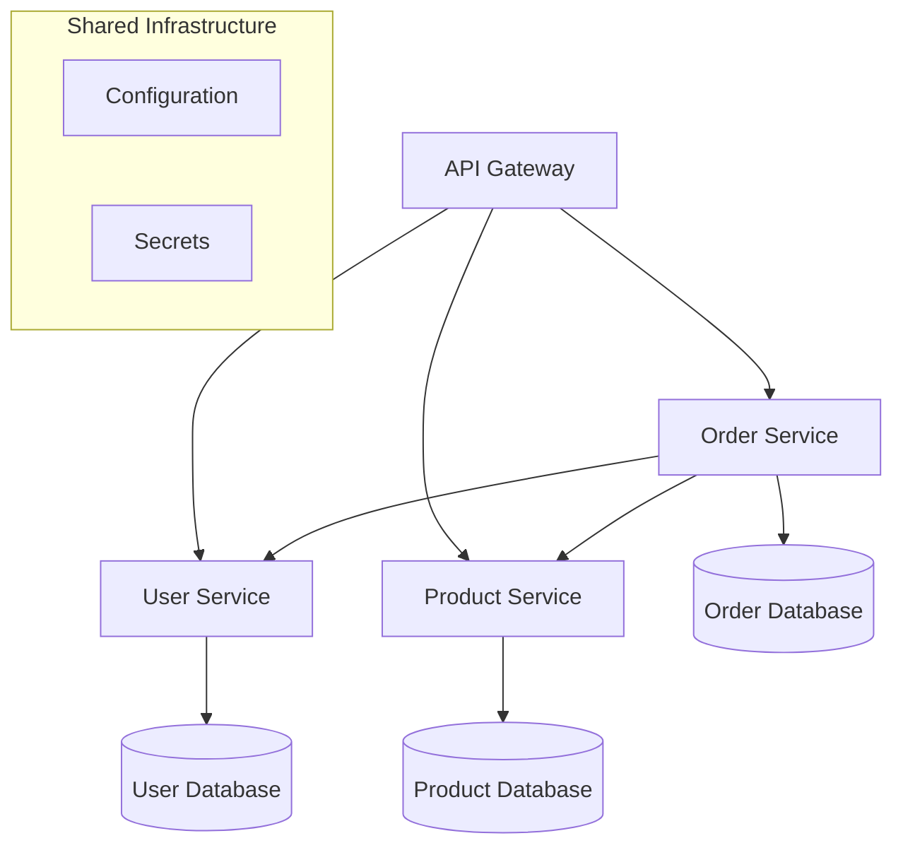

# Microservices Architecture

This example demonstrates how to build a complete microservices application using TypeKro, including service discovery, API gateway, and inter-service communication patterns.

## What You'll Build

- **API Gateway** - Routes traffic and handles authentication
- **User Service** - Manages user data and authentication
- **Product Service** - Handles product catalog and inventory
- **Order Service** - Processes orders and integrates with other services
- **Service Mesh** - Built-in service discovery and communication
- **Shared Configuration** - Environment-specific settings across services

## Architecture Overview



## Complete Example

### 1. Define the Microservices Schema

```typescript
import { type } from 'arktype';
import { 
  toResourceGraph, 
  simple, 
  simple.Service,
  simple,
  simple.Secret,
  simple.Ingress
} from 'typekro';

// Application-wide configuration schema
const MicroservicesSpec = type({
  environment: '"development" | "staging" | "production"',
  version: 'string',
  gateway: {
    domain: 'string',
    replicas: 'number'
  },
  services: {
    user: {
      image: 'string',
      replicas: 'number',
      database: {
        host: 'string',
        name: 'string'
      }
    },
    product: {
      image: 'string', 
      replicas: 'number',
      database: {
        host: 'string',
        name: 'string'
      }
    },
    order: {
      image: 'string',
      replicas: 'number',
      database: {
        host: 'string',
        name: 'string'
      }
    }
  }
});

const MicroservicesStatus = type({
  gatewayUrl: 'string',
  services: {
    user: { url: 'string', ready: 'boolean' },
    product: { url: 'string', ready: 'boolean' },
    order: { url: 'string', ready: 'boolean' }
  },
  health: '"healthy" | "degraded" | "unhealthy"'
});
```

### 2. Create the Microservices Resource Graph

```typescript
export const microservicesApp = toResourceGraph(
  {
    name: 'microservices-app',
    apiVersion: 'example.com/v1alpha1',
    kind: 'MicroservicesApp',
    spec: MicroservicesSpec,
    status: MicroservicesStatus,
  },
  // ResourceBuilder function - defines all Kubernetes resources
  (schema) => {
    // Shared configuration for all services
    const appConfig = simple({
      name: 'app-config',
      data: {
        ENVIRONMENT: schema.spec.environment,
        VERSION: schema.spec.version,
        LOG_LEVEL: schema.spec.environment === 'production' ? 'info' : 'debug',
        
        // Service discovery endpoints
        USER_SERVICE_URL: 'http://user-service:3000',
        PRODUCT_SERVICE_URL: 'http://product-service:3000', 
        ORDER_SERVICE_URL: 'http://order-service:3000'
      }
    });

    // Database connection secrets
    const dbSecrets = simple.Secret({
      name: 'db-secrets',
      data: {
        USER_DB_PASSWORD: 'dXNlcl9wYXNzd29yZA==', // base64: user_password
        PRODUCT_DB_PASSWORD: 'cHJvZHVjdF9wYXNzd29yZA==', // base64: product_password
        ORDER_DB_PASSWORD: 'b3JkZXJfcGFzc3dvcmQ=' // base64: order_password
      }
    });

    return {
      // Shared resources
      appConfig,
      dbSecrets,
      
      // User Service
      userDeployment: simple.Deployment({
        name: 'user-service',
        image: schema.spec.services.user.image,
        replicas: schema.spec.services.user.replicas,
        labels: { app: 'user-service', component: 'backend' },  // Labels for service selector
        ports: [{ containerPort: 3000 }],
        env: [
          { name: 'PORT', value: '3000' },
          { name: 'DB_HOST', value: schema.spec.services.user.database.host },
          { name: 'DB_NAME', value: schema.spec.services.user.database.name },
          { name: 'DB_PASSWORD', valueFrom: { secretKeyRef: { name: dbSecrets.metadata.name, key: 'USER_DB_PASSWORD' } } }  // Reference Secret by field
        ],
        envFrom: [{ configMapRef: { name: appConfig.metadata.name } }],  // Reference ConfigMap by field
        livenessProbe: { httpGet: { path: '/health', port: 3000 } },
        readinessProbe: { httpGet: { path: '/ready', port: 3000 } }
      }),
      
      userService: simple.Service({
        name: 'user-service',
        selector: { app: 'user-service' },  // Should match userDeployment labels
        ports: [{ port: 3000, targetPort: 3000 }]
      }),
      
      // Product Service  
      productDeployment: simple.Deployment({
        name: 'product-service',
        image: schema.spec.services.product.image,
        replicas: schema.spec.services.product.replicas,
        ports: [{ containerPort: 3000 }],
        env: [
          { name: 'PORT', value: '3000' },
          { name: 'DB_HOST', value: schema.spec.services.product.database.host },
          { name: 'DB_NAME', value: schema.spec.services.product.database.name },
          { name: 'DB_PASSWORD', valueFrom: { secretKeyRef: { name: dbSecrets.metadata.name, key: 'PRODUCT_DB_PASSWORD' } } }  // Reference Secret by field
        ],
        envFrom: [{ configMapRef: { name: appConfig.metadata.name } }],  // Reference ConfigMap by field
        livenessProbe: { httpGet: { path: '/health', port: 3000 } },
        readinessProbe: { httpGet: { path: '/ready', port: 3000 } }
      }),
      
      productService: simple.Service({
        name: 'product-service',
        selector: { app: 'product-service' },
        ports: [{ port: 3000, targetPort: 3000 }]
      }),
      
      // Order Service - depends on User and Product services
      orderDeployment: simple.Deployment({
        name: 'order-service',
        image: schema.spec.services.order.image,
        replicas: schema.spec.services.order.replicas,
        ports: [{ containerPort: 3000 }],
        env: [
          { name: 'PORT', value: '3000' },
          { name: 'DB_HOST', value: schema.spec.services.order.database.host },
          { name: 'DB_NAME', value: schema.spec.services.order.database.name },
          { name: 'DB_PASSWORD', valueFrom: { secretKeyRef: { name: dbSecrets.metadata.name, key: 'ORDER_DB_PASSWORD' } } }  // Reference Secret by field
        ],
        envFrom: [{ configMapRef: { name: appConfig.metadata.name } }],  // Reference ConfigMap by field
        livenessProbe: { httpGet: { path: '/health', port: 3000 } },
        readinessProbe: { httpGet: { path: '/ready', port: 3000 } }
      }),
      
      orderService: simple.Service({
        name: 'order-service',
        selector: { app: 'order-service' },
        ports: [{ port: 3000, targetPort: 3000 }]
      }),
      
      // API Gateway - routes to all services
      gatewayDeployment: simple.Deployment({
        name: 'api-gateway',
        image: 'nginx:alpine',
        replicas: schema.spec.gateway.replicas,
        ports: [{ containerPort: 80 }],
        configMaps: [{
          name: 'gateway-config',
          mountPath: '/etc/nginx/nginx.conf',
          subPath: 'nginx.conf'
        }]
      }),
      
      gatewayService: simple.Service({
        name: 'api-gateway',
        selector: { app: 'api-gateway' },
        ports: [{ port: 80, targetPort: 80 }],
        type: 'LoadBalancer'
      }),
      
      // Gateway configuration
      gatewayConfig: simple({
        name: 'gateway-config',
        data: {
          'nginx.conf': `
events {
    worker_connections 1024;
}

http {
    upstream user-service {
        server user-service:3000;
    }
    
    upstream product-service {
        server product-service:3000;
    }
    
    upstream order-service {
        server order-service:3000;
    }
    
    server {
        listen 80;
        
        location /api/users/ {
            proxy_pass http://user-service/;
            proxy_set_header Host $host;
            proxy_set_header X-Real-IP $remote_addr;
        }
        
        location /api/products/ {
            proxy_pass http://product-service/;
            proxy_set_header Host $host;
            proxy_set_header X-Real-IP $remote_addr;
        }
        
        location /api/orders/ {
            proxy_pass http://order-service/;
            proxy_set_header Host $host;
            proxy_set_header X-Real-IP $remote_addr;
        }
        
        location /health {
            return 200 "OK";
            add_header Content-Type text/plain;
        }
    }
}
          `
        }
      }),
      
      // Ingress for external access
      ingress: simple.Ingress({
        name: 'microservices-ingress',
        rules: [{
          host: schema.spec.gateway.domain,
          http: {
            paths: [{
              path: '/',
              pathType: 'Prefix',
              backend: {
                service: {
                  name: 'api-gateway',
                  port: { number: 80 }
                }
              }
            }]
          }
        }]
      })
    };
  },
  
  // StatusBuilder function - aggregate health from all services using CEL expressions
  (schema, resources) => ({
    gatewayUrl: Cel.template('https://%s', schema.spec.gateway.domain),
    services: {
      user: {
        url: Cel.expr<string>`'http://user-service:3000'`,
        ready: Cel.expr<boolean>(resources.userDeployment.status.readyReplicas, ' == ', resources.userDeployment.spec.replicas)
      },
      product: {
        url: Cel.expr<string>`'http://product-service:3000'`, 
        ready: Cel.expr<boolean>(resources.productDeployment.status.readyReplicas, ' == ', resources.productDeployment.spec.replicas)
      },
      order: {
        url: Cel.expr<string>`'http://order-service:3000'`,
        ready: Cel.expr<boolean>(resources.orderDeployment.status.readyReplicas, ' == ', resources.orderDeployment.spec.replicas)
      }
    },
    health: Cel.expr<'healthy' | 'degraded' | 'unhealthy'>(
      resources.userDeployment.status.readyReplicas, ' == ', resources.userDeployment.spec.replicas,
      ' && ', resources.productDeployment.status.readyReplicas, ' == ', resources.productDeployment.spec.replicas,
      ' && ', resources.orderDeployment.status.readyReplicas, ' == ', resources.orderDeployment.spec.replicas,
      ' ? "healthy" : (',
      resources.userDeployment.status.readyReplicas, ' > 0 || ', resources.productDeployment.status.readyReplicas, ' > 0',
      ' ? "degraded" : "unhealthy")'
    )
  })
);
```

### 3. Deploy the Microservices Application

```typescript
import { factory } from 'typekro';

// Development configuration
const devConfig = {
  environment: 'development' as const,
  version: '1.0.0',
  gateway: {
    domain: 'microservices-dev.local',
    replicas: 1
  },
  services: {
    user: {
      image: 'user-service:dev',
      replicas: 1,
      database: {
        host: 'user-db.dev',
        name: 'users_dev'
      }
    },
    product: {
      image: 'product-service:dev',
      replicas: 1,
      database: {
        host: 'product-db.dev',
        name: 'products_dev'
      }
    },
    order: {
      image: 'order-service:dev', 
      replicas: 1,
      database: {
        host: 'order-db.dev',
        name: 'orders_dev'
      }
    }
  }
};

// Production configuration
const prodConfig = {
  environment: 'production' as const,
  version: '1.0.0',
  gateway: {
    domain: 'api.mycompany.com',
    replicas: 3
  },
  services: {
    user: {
      image: 'user-service:1.0.0',
      replicas: 3,
      database: {
        host: 'user-db.prod',
        name: 'users'
      }
    },
    product: {
      image: 'product-service:1.0.0',
      replicas: 5,
      database: {
        host: 'product-db.prod',
        name: 'products'
      }
    },
    order: {
      image: 'order-service:1.0.0',
      replicas: 3,
      database: {
        host: 'order-db.prod',
        name: 'orders'
      }
    }
  }
};

// Deploy to development
await factory('direct').deploy(microservicesApp, devConfig);

// Deploy to production  
await factory('kro').deploy(microservicesApp, prodConfig);
```

## Key Microservices Patterns

### Service Discovery

TypeKro handles service discovery through Kubernetes Services and environment variables:

```typescript
// Services automatically discover each other
env: [
  { name: 'USER_SERVICE_URL', value: 'http://user-service:3000' },
  { name: 'PRODUCT_SERVICE_URL', value: 'http://product-service:3000' }
]
```

### Configuration Management

Shared configuration is managed centrally but can be overridden per service:

```typescript
// Global configuration
envFrom: [{ configMapRef: { name: resources.appConfig.metadata.name } }],  // Reference ConfigMap by field

// Service-specific overrides
env: [
  { name: 'DB_HOST', value: schema.spec.services.user.database.host }
]
```

### Health Checking

Each service implements health and readiness endpoints:

```typescript
livenessProbe: { httpGet: { path: '/health', port: 3000 } },
readinessProbe: { httpGet: { path: '/ready', port: 3000 } }
```

### API Gateway Pattern

The gateway routes requests and provides a single entry point:

```nginx
location /api/users/ {
    proxy_pass http://user-service/;
    proxy_set_header Host $host;
}
```

## Environment-Specific Scaling

Different environments have different resource requirements:

```typescript
const scaling = {
  development: { gateway: 1, user: 1, product: 1, order: 1 },
  staging: { gateway: 2, user: 2, product: 2, order: 2 },
  production: { gateway: 3, user: 3, product: 5, order: 3 }
};
```

## Related Examples

- **[Database Integration](./database-app.md)** - Learn about database patterns used in each service
- **[Multi-Environment](./multi-environment.md)** - Deploy this application across environments
- **[CI/CD Integration](./cicd.md)** - Automate deployment of microservices

## Learn More

- **[Cross-Resource References](../guide/cross-references.md)** - Inter-service communication patterns
- **[Factory Functions](../guide/factories.md)** - Reusable service components
- **[Direct Deployment](../guide/deployment/direct.md)** - Local development deployment
- **[KRO Integration](../guide/deployment/kro.md)** - Production orchestration