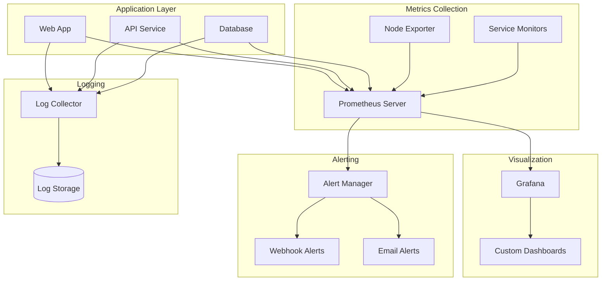

# Monitoring Stack

This example demonstrates how to build a comprehensive monitoring and observability stack using TypeKro, including Prometheus, Grafana, alerting, log aggregation, and distributed tracing.

## What You'll Build

- **Metrics Collection** - Prometheus with custom metrics and service discovery
- **Visualization** - Grafana dashboards with pre-configured panels
- **Log Aggregation** - Centralized logging with structured log collection
- **Alerting** - Alert rules with multi-channel notifications
- **Distributed Tracing** - Request tracing across microservices
- **Health Monitoring** - Automated health checks and SLA monitoring

## Architecture Overview



## Complete Example

### 1. Monitoring Stack Schema

```typescript
import { type } from 'arktype';
import { kubernetesComposition, Cel } from 'typekro';
import { Deployment, Service, Secret, Pvc } from 'typekro/simple';

// Monitoring configuration schema
const MonitoringSpec = type({
  // Stack configuration
  namespace: 'string',
  retention: 'string', // e.g., "30d"
  
  // Prometheus configuration
  prometheus: {
    image: 'string',
    storageSize: 'string',
    scrapeInterval: 'string',
    evaluationInterval: 'string',
    resources: {
      cpu: 'string',
      memory: 'string'
    }
  },
  
  // Grafana configuration
  grafana: {
    image: 'string',
    adminPassword: 'string',
    resources: {
      cpu: 'string',
      memory: 'string'
    }
  },
  
  // AlertManager configuration
  alerting: {
    image: 'string',
    webhookUrl?: 'string',
    emailConfig?: {
      smtpHost: 'string',
      smtpPort: 'number',
      from: 'string',
      to: 'string[]'
    }
  },
  
  // Log collection
  logging: {
    enabled: 'boolean',
    fluentdImage: 'string',
    storageSize: 'string'
  },
  
  // Targets to monitor
  targets: {
    name: 'string',
    namespace: 'string',
    selector: 'Record<string, string>',
    port: 'string',
    path: 'string'
  }[]
});

const MonitoringStatus = type({
  prometheusReady: 'boolean',
  grafanaReady: 'boolean',
  alertManagerReady: 'boolean',
  targetsDiscovered: 'number',
  alertsActive: 'number',
  healthStatus: '"healthy" | "degraded" | "unhealthy"'
});

export const monitoringStack = kubernetesComposition({
  {
    name: 'monitoring-stack',
    apiVersion: 'monitoring.example.com/v1alpha1',
    kind: 'MonitoringStack',
    spec: MonitoringSpec,
    status: MonitoringStatus,
  },
  // ResourceBuilder function
  (schema) => {
    return {
      // Prometheus Server
      prometheusConfig: simple({
        name: 'prometheus-config',
        data: {
          'prometheus.yml': `
global:
  scrape_interval: ${schema.spec.prometheus.scrapeInterval}
  evaluation_interval: ${schema.spec.prometheus.evaluationInterval}
  external_labels:
    cluster: 'kubernetes'
    
rule_files:
  - "/etc/prometheus/rules/*.yml"

alerting:
  alertmanagers:
    - static_configs:
        - targets:
          - alertmanager:9093

scrape_configs:
  # Prometheus self-monitoring
  - job_name: 'prometheus'
    static_configs:
      - targets: ['localhost:9090']
  
  # Kubernetes API server
  - job_name: 'kubernetes-apiservers'
    kubernetes_sd_configs:
      - role: endpoints
    scheme: https
    tls_config:
      ca_file: /var/run/secrets/kubernetes.io/serviceaccount/ca.crt
    bearer_token_file: /var/run/secrets/kubernetes.io/serviceaccount/token
    relabel_configs:
      - source_labels: [__meta_kubernetes_namespace, __meta_kubernetes_service_name, __meta_kubernetes_endpoint_port_name]
        action: keep
        regex: default;kubernetes;https
  
  # Node metrics
  - job_name: 'kubernetes-nodes'
    kubernetes_sd_configs:
      - role: node
    relabel_configs:
      - action: labelmap
        regex: __meta_kubernetes_node_label_(.+)
  
  # Application targets
${schema.spec.targets.map(target => `
  - job_name: '${target.name}'
    kubernetes_sd_configs:
      - role: endpoints
        namespaces:
          names: ['${target.namespace}']
    relabel_configs:
      - source_labels: [__meta_kubernetes_service_label_${Object.keys(target.selector)[0]}]
        action: keep
        regex: ${Object.values(target.selector)[0]}
      - source_labels: [__meta_kubernetes_endpoint_port_name]
        action: keep
        regex: ${target.port}
      - source_labels: [__address__, __meta_kubernetes_endpoint_port_number]
        action: replace
        regex: ([^:]+)(?::\\d+)?;(\\d+)
        replacement: $1:$2
        target_label: __address__
      - source_labels: [__meta_kubernetes_endpoint_address_target_name]
        target_label: instance
      - action: labelmap
        regex: __meta_kubernetes_service_label_(.+)
    metrics_path: ${target.path}
`).join('')}
          `
        }
      }),
      
      // Prometheus alert rules
      prometheusRules: simple({
        name: 'prometheus-rules',
        data: {
          'alerts.yml': `
groups:
  - name: kubernetes.rules
    rules:
      # High CPU usage
      - alert: HighCPUUsage
        expr: 100 - (avg by(instance) (rate(node_cpu_seconds_total{mode="idle"}[5m])) * 100) > 80
        for: 5m
        labels:
          severity: warning
        annotations:
          summary: "High CPU usage on {{ $labels.instance }}"
          description: "CPU usage is above 80% for more than 5 minutes"
      
      # High memory usage
      - alert: HighMemoryUsage
        expr: (1 - (node_memory_MemAvailable_bytes / node_memory_MemTotal_bytes)) * 100 > 80
        for: 5m
        labels:
          severity: warning
        annotations:
          summary: "High memory usage on {{ $labels.instance }}"
          description: "Memory usage is above 80% for more than 5 minutes"
      
      # Pod crashes
      - alert: PodCrashLooping
        expr: rate(kube_pod_container_status_restarts_total[15m]) > 0
        for: 5m
        labels:
          severity: critical
        annotations:
          summary: "Pod {{ $labels.pod }} is crash looping"
          description: "Pod {{ $labels.pod }} in namespace {{ $labels.namespace }} is restarting frequently"
      
      # Service down
      - alert: ServiceDown
        expr: up == 0
        for: 1m
        labels:
          severity: critical
        annotations:
          summary: "Service {{ $labels.job }} is down"
          description: "Service {{ $labels.job }} has been down for more than 1 minute"
          `
        }
      }),
      
      // Prometheus storage
      prometheusStorage: Pvc({
        name: 'prometheus-storage',
        accessMode: 'ReadWriteOnce',
        size: schema.spec.prometheus.storageSize,
        storageClass: 'fast-ssd'
      }),
      
      // Prometheus deployment
      prometheus: Deployment({
        name: 'prometheus',
        image: schema.spec.prometheus.image,
        replicas: 1,
        ports: [{ containerPort: 9090 }],
        
        args: [
          '--config.file=/etc/prometheus/prometheus.yml',
          '--storage.tsdb.path=/prometheus/',
          '--web.console.libraries=/etc/prometheus/console_libraries',
          '--web.console.templates=/etc/prometheus/consoles',
          '--storage.tsdb.retention.time=' + schema.spec.retention,
          '--web.enable-lifecycle'
        ],
        
        volumeMounts: [
          { name: 'prometheus-config', mountPath: '/etc/prometheus/prometheus.yml', subPath: 'prometheus.yml' },
          { name: 'prometheus-rules', mountPath: '/etc/prometheus/rules' },
          { name: 'prometheus-storage', mountPath: '/prometheus' }
        ],
        
        volumes: [
          { name: 'prometheus-config', configMap: { name: 'prometheus-config' } },
          { name: 'prometheus-rules', configMap: { name: 'prometheus-rules' } },
          { name: 'prometheus-storage', persistentVolumeClaim: { claimName: 'prometheus-storage' } }
        ],
        
        resources: {
          requests: schema.spec.prometheus.resources,
          limits: schema.spec.prometheus.resources
        },
        
        livenessProbe: { httpGet: { path: '/-/healthy', port: 9090 } },
        readinessProbe: { httpGet: { path: '/-/ready', port: 9090 } }
      }),
      
      // Prometheus service
      prometheusService: Service({
        name: 'prometheus',
        selector: { app: 'prometheus' },
        ports: [{ port: 9090, targetPort: 9090 }]
      }),
      
      // AlertManager configuration
      alertManagerConfig: simple({
        name: 'alertmanager-config',
        data: {
          'alertmanager.yml': `
global:
  smtp_smarthost: '${schema.spec.alerting.emailConfig?.smtpHost}:${schema.spec.alerting.emailConfig?.smtpPort}'
  smtp_from: '${schema.spec.alerting.emailConfig?.from}'

route:
  group_by: ['alertname']
  group_wait: 10s
  group_interval: 10s
  repeat_interval: 1h
  receiver: 'web.hook'
  routes:
    - match:
        severity: critical
      receiver: 'critical-alerts'
    - match:
        severity: warning
      receiver: 'warning-alerts'

receivers:
  - name: 'web.hook'
    webhook_configs:
      - url: '${schema.spec.alerting.webhookUrl || 'http://localhost:5001/'}'
        send_resolved: true

  - name: 'critical-alerts'
    email_configs:
      - to: '${schema.spec.alerting.emailConfig?.to.join(', ') || 'admin@company.com'}'
        subject: 'CRITICAL: {{ .GroupLabels.alertname }}'
        body: |
          {{ range .Alerts }}
          Alert: {{ .Annotations.summary }}
          Description: {{ .Annotations.description }}
          {{ end }}
    webhook_configs:
      - url: '${schema.spec.alerting.webhookUrl || 'http://localhost:5001/'}'
        send_resolved: true

  - name: 'warning-alerts'
    email_configs:
      - to: '${schema.spec.alerting.emailConfig?.to.join(', ') || 'admin@company.com'}'
        subject: 'WARNING: {{ .GroupLabels.alertname }}'
        body: |
          {{ range .Alerts }}
          Alert: {{ .Annotations.summary }}
          Description: {{ .Annotations.description }}
          {{ end }}
          `
        }
      }),
      
      // AlertManager deployment
      alertManager: Deployment({
        name: 'alertmanager',
        image: schema.spec.alerting.image,
        replicas: 1,
        ports: [{ containerPort: 9093 }],
        
        args: [
          '--config.file=/etc/alertmanager/alertmanager.yml',
          '--storage.path=/alertmanager'
        ],
        
        volumeMounts: [
          { name: 'alertmanager-config', mountPath: '/etc/alertmanager/alertmanager.yml', subPath: 'alertmanager.yml' }
        ],
        
        volumes: [
          { name: 'alertmanager-config', configMap: { name: 'alertmanager-config' } }
        ],
        
        livenessProbe: { httpGet: { path: '/-/healthy', port: 9093 } },
        readinessProbe: { httpGet: { path: '/-/ready', port: 9093 } }
      }),
      
      // AlertManager service
      alertManagerService: Service({
        name: 'alertmanager',
        selector: { app: 'alertmanager' },
        ports: [{ port: 9093, targetPort: 9093 }]
      }),
      
      // Grafana configuration
      grafanaConfig: simple({
        name: 'grafana-config',
        data: {
          'grafana.ini': `
[analytics]
check_for_updates = true

[grafana_net]
url = https://grafana.net

[log]
mode = console

[paths]
data = /var/lib/grafana/data
logs = /var/log/grafana
plugins = /var/lib/grafana/plugins
provisioning = /etc/grafana/provisioning

[server]
root_url = http://localhost:3000/
          `,
          
          'datasources.yml': `
apiVersion: 1

datasources:
  - name: Prometheus
    type: prometheus
    access: proxy
    url: http://prometheus:9090
    isDefault: true
    editable: true
          `,
          
          'dashboards.yml': `
apiVersion: 1

providers:
  - name: 'default'
    orgId: 1
    folder: ''
    type: file
    disableDeletion: false
    updateIntervalSeconds: 10
    allowUiUpdates: true
    options:
      path: /var/lib/grafana/dashboards
          `
        }
      }),
      
      // Grafana secrets
      grafanaSecrets: Secret({
        name: 'grafana-secrets',
        data: {
          admin_password: Buffer.from(schema.spec.grafana.adminPassword).toString('base64')
        }
      }),
      
      // Grafana deployment
      grafana: Deployment({
        name: 'grafana',
        image: schema.spec.grafana.image,
        replicas: 1,
        ports: [{ containerPort: 3000 }],
        
        env: [
          { name: 'GF_SECURITY_ADMIN_PASSWORD', valueFrom: { secretKeyRef: { name: 'grafana-secrets', key: 'admin_password' } } },
          { name: 'GF_INSTALL_PLUGINS', value: 'grafana-kubernetes-app' }
        ],
        
        volumeMounts: [
          { name: 'grafana-config', mountPath: '/etc/grafana/grafana.ini', subPath: 'grafana.ini' },
          { name: 'grafana-datasources', mountPath: '/etc/grafana/provisioning/datasources/datasources.yml', subPath: 'datasources.yml' },
          { name: 'grafana-dashboards', mountPath: '/etc/grafana/provisioning/dashboards/dashboards.yml', subPath: 'dashboards.yml' }
        ],
        
        volumes: [
          { name: 'grafana-config', configMap: { name: 'grafana-config' } },
          { name: 'grafana-datasources', configMap: { name: 'grafana-config' } },
          { name: 'grafana-dashboards', configMap: { name: 'grafana-config' } }
        ],
        
        resources: {
          requests: schema.spec.grafana.resources,
          limits: schema.spec.grafana.resources
        },
        
        livenessProbe: { httpGet: { path: '/api/health', port: 3000 } },
        readinessProbe: { httpGet: { path: '/api/health', port: 3000 } }
      }),
      
      // Grafana service
      grafanaService: Service({
        name: 'grafana',
        selector: { app: 'grafana' },
        ports: [{ port: 3000, targetPort: 3000 }],
        type: 'LoadBalancer'
      }),
      
      // Node Exporter (if monitoring nodes)
      nodeExporter: Deployment({
        name: 'node-exporter',
        image: 'prom/node-exporter:latest',
        replicas: 1, // In real usage, this would be a DaemonSet
        ports: [{ containerPort: 9100 }],
        
        args: [
          '--path.procfs=/host/proc',
          '--path.sysfs=/host/sys',
          '--collector.filesystem.ignored-mount-points=^/(sys|proc|dev|host|etc|rootfs/var/lib/docker/containers|rootfs/var/lib/docker/overlay2|rootfs/run/docker/netns|rootfs/var/lib/docker/aufs)($$|/)'
        ],
        
        volumeMounts: [
          { name: 'proc', mountPath: '/host/proc', readOnly: true },
          { name: 'sys', mountPath: '/host/sys', readOnly: true }
        ],
        
        volumes: [
          { name: 'proc', hostPath: { path: '/proc' } },
          { name: 'sys', hostPath: { path: '/sys' } }
        ],
        
        securityContext: {
          runAsNonRoot: false,
          runAsUser: 0
        }
      }),
      
      // Node Exporter service
      nodeExporterService: Service({
        name: 'node-exporter',
        selector: { app: 'node-exporter' },
        ports: [{ port: 9100, targetPort: 9100 }]
      })
    };
  },
  
  // StatusBuilder function - monitoring stack status using JavaScript expressions
  (schema, resources) => ({
    // ✨ Natural JavaScript expressions - automatically converted to CEL
    prometheusReady: resources.prometheus.status.readyReplicas >= 1,
    grafanaReady: resources.grafana.status.readyReplicas >= 1,
    alertManagerReady: resources.alertManager.status.readyReplicas >= 1,
    targetsDiscovered: schema.spec.targets.length,
    alertsActive: 0, // Would be populated from Prometheus API in real implementation
    healthStatus: (resources.prometheus.status.readyReplicas >= 1 && 
                   resources.grafana.status.readyReplicas >= 1 && 
                   resources.alertManager.status.readyReplicas >= 1)
      ? 'healthy' 
      : resources.prometheus.status.readyReplicas >= 1 
        ? 'degraded' 
        : 'unhealthy'
  })
);
```

### 2. Deploy Monitoring Stack

```typescript
import { factory } from 'typekro';
import { monitoringStack } from './monitoring-stack';

// Production monitoring configuration
const monitoringConfig = {
  namespace: 'monitoring',
  retention: '30d',
  
  prometheus: {
    image: 'prom/prometheus:v2.45.0',
    storageSize: '50Gi',
    scrapeInterval: '15s',
    evaluationInterval: '15s',
    resources: {
      cpu: '500m',
      memory: '2Gi'
    }
  },
  
  grafana: {
    image: 'grafana/grafana:10.0.0',
    adminPassword: 'secure-admin-password',
    resources: {
      cpu: '200m',
      memory: '512Mi'
    }
  },
  
  alerting: {
    image: 'prom/alertmanager:v0.25.0',
    webhookUrl: 'https://hooks.slack.com/services/xxx/yyy/zzz',
    emailConfig: {
      smtpHost: 'smtp.company.com',
      smtpPort: 587,
      from: 'alerts@company.com',
      to: ['ops-team@company.com', 'dev-team@company.com']
    }
  },
  
  logging: {
    enabled: true,
    fluentdImage: 'fluent/fluentd-kubernetes-daemonset:v1.16-debian-elasticsearch7-1',
    storageSize: '20Gi'
  },
  
  // Applications to monitor
  targets: [
    {
      name: 'web-app',
      namespace: 'default',
      selector: { app: 'web-app' },
      port: 'metrics',
      path: '/metrics'
    },
    {
      name: 'api-service',
      namespace: 'default', 
      selector: { app: 'api-service' },
      port: 'metrics',
      path: '/api/metrics'
    },
    {
      name: 'database',
      namespace: 'default',
      selector: { app: 'postgres' },
      port: 'exporter',
      path: '/metrics'
    }
  ]
};

// Deploy monitoring stack
await factory('kro').deploy(monitoringStack, monitoringConfig);

console.log('Monitoring stack deployed successfully!');
console.log('Access Grafana at: http://localhost:3000 (admin/secure-admin-password)');
console.log('Access Prometheus at: http://localhost:9090');
console.log('Access AlertManager at: http://localhost:9093');
```

### 3. Application Instrumentation

```typescript
// Example: Adding metrics to your application
import { Counter, Histogram, register } from 'prom-client';

// Define custom metrics
const httpRequestTotal = new Counter({
  name: 'http_requests_total',
  help: 'Total number of HTTP requests',
  labelNames: ['method', 'status_code', 'endpoint']
});

const httpRequestDuration = new Histogram({
  name: 'http_request_duration_seconds',
  help: 'Duration of HTTP requests in seconds',
  labelNames: ['method', 'endpoint'],
  buckets: [0.1, 0.5, 1, 2, 5]
});

// Middleware to collect metrics
app.use((req, res, next) => {
  const startTime = Date.now();
  
  res.on('finish', () => {
    const duration = (Date.now() - startTime) / 1000;
    
    httpRequestTotal.inc({
      method: req.method,
      status_code: res.statusCode.toString(),
      endpoint: req.route?.path || req.path
    });
    
    httpRequestDuration.observe({
      method: req.method,
      endpoint: req.route?.path || req.path
    }, duration);
  });
  
  next();
});

// Metrics endpoint
app.get('/metrics', async (req, res) => {
  res.set('Content-Type', register.contentType);
  res.end(await register.metrics());
});
```

### 4. Custom Dashboards

```json
// grafana-dashboard.json
{
  "dashboard": {
    "title": "Application Metrics",
    "panels": [
      {
        "title": "HTTP Request Rate",
        "type": "graph",
        "targets": [
          {
            "expr": "rate(http_requests_total[5m])",
            "legendFormat": "{{method}} {{endpoint}}"
          }
        ]
      },
      {
        "title": "Response Time",
        "type": "graph",
        "targets": [
          {
            "expr": "histogram_quantile(0.95, rate(http_request_duration_seconds_bucket[5m]))",
            "legendFormat": "95th percentile"
          }
        ]
      },
      {
        "title": "Error Rate",
        "type": "singlestat",
        "targets": [
          {
            "expr": "rate(http_requests_total{status_code!~\"2..\"}[5m]) / rate(http_requests_total[5m])",
            "legendFormat": "Error Rate"
          }
        ]
      }
    ]
  }
}
```

## Observability Best Practices

### Metrics Collection
- **Use standardized metrics** - Follow Prometheus naming conventions
- **Add meaningful labels** - Enable filtering and aggregation
- **Avoid high cardinality** - Prevent metric explosion
- **Monitor the monitor** - Track Prometheus performance

### Alerting Strategy
- **Alert on symptoms** - User-facing issues, not causes
- **Use runbooks** - Document resolution procedures
- **Tune thresholds** - Avoid alert fatigue
- **Test alert routes** - Verify delivery channels

### Dashboard Design
- **User-focused views** - Business metrics first
- **Hierarchical drill-down** - From overview to details
- **Consistent time ranges** - Synchronized across panels
- **Actionable information** - Link to runbooks and logs

## Performance Considerations

### Resource Sizing
```typescript
// Prometheus sizing guide
const prometheusResources = {
  small: { cpu: '200m', memory: '1Gi', storage: '10Gi' },    // <1000 series
  medium: { cpu: '500m', memory: '2Gi', storage: '50Gi' },   // <10k series
  large: { cpu: '1000m', memory: '4Gi', storage: '200Gi' }   // <100k series
};
```

### Retention Policies
```typescript
// Balance storage costs with data needs
const retentionConfig = {
  shortTerm: '7d',   // High-resolution metrics
  mediumTerm: '30d', // Standard resolution
  longTerm: '1y'     // Downsampled for trends
};
```

## Related Examples

- **[Microservices](./microservices.md)** - Monitoring distributed systems
- **[GitOps Guide](../guide/deployment/gitops.md)** - Deployment pipeline monitoring
- **[Multi-Environment](./multi-environment.md)** - Environment-specific monitoring

## Learn More

- **[Debugging Guide](../guide/debugging.md)** - Monitoring troubleshooting patterns
- **[Factory Functions](../guide/factories.md)** - Reusable monitoring components
- **[Cross-Resource References](../guide/cross-references.md)** - Service discovery patterns