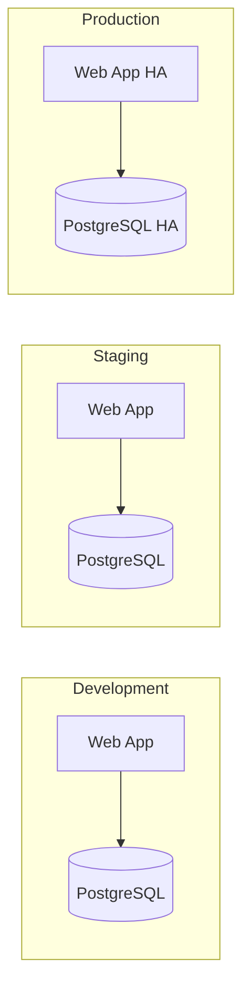

# Multi-Environment Deployment

This example demonstrates how to deploy the same TypeKro application across multiple environments (development, staging, production) with environment-specific configurations, scaling, and deployment strategies.

## What You'll Learn

- **Environment-specific configuration** - Different settings per environment
- **Resource scaling strategies** - CPU/memory allocation based on environment
- **Deployment strategies** - Direct mode for dev, KRO for production
- **GitOps workflows** - YAML generation for CD pipelines
- **Security considerations** - Environment-specific secrets and access controls

## Application Overview

We'll deploy a web application with a database across three environments:



## Complete Example

### 1. Define Environment-Aware Schema

```typescript
import { type } from 'arktype';
import { 
  toResourceGraph, 
  simpleDeployment, 
  simpleService,
  simpleConfigMap,
  simpleSecret,
  simplePvc
} from 'typekro';

// Environment configuration schema
const EnvironmentSpec = type({
  // Environment identifier
  environment: '"development" | "staging" | "production"',
  
  // Application configuration
  app: {
    name: 'string',
    image: 'string',
    version: 'string',
    replicas: 'number',
    resources: {
      cpu: 'string',
      memory: 'string'
    }
  },
  
  // Database configuration
  database: {
    image: 'string',
    storageSize: 'string',
    resources: {
      cpu: 'string', 
      memory: 'string'
    }
  },
  
  // Environment-specific settings
  settings: {
    logLevel: '"debug" | "info" | "warn" | "error"',
    enableMetrics: 'boolean',
    enableTracing: 'boolean',
    domain?: 'string'
  }
});

const EnvironmentStatus = type({
  appUrl: 'string',
  databaseReady: 'boolean',
  environment: 'string',
  version: 'string',
  healthStatus: '"healthy" | "degraded" | "unhealthy"'
});
```

### 2. Create Environment-Aware Resource Graph

```typescript
export const multiEnvApp = toResourceGraph(
  {
    name: 'multi-env-app',
    apiVersion: 'deploy.example.com/v1alpha1',
    kind: 'MultiEnvApp',
    spec: EnvironmentSpec,
    status: EnvironmentStatus,
  },
  // ResourceBuilder function
  (schema) => {
    // Environment-specific namespace prefix
    const envPrefix = schema.spec.environment;
    const appName = `${envPrefix}-${schema.spec.app.name}`;
    
    return {
      // Application configuration
      appConfig: simpleConfigMap({
        name: `${appName}-config`,
        data: {
          ENVIRONMENT: schema.spec.environment,
          LOG_LEVEL: schema.spec.settings.logLevel,
          ENABLE_METRICS: schema.spec.settings.enableMetrics.toString(),
          ENABLE_TRACING: schema.spec.settings.enableTracing.toString(),
          APP_VERSION: schema.spec.app.version,
          
          // Database connection
          DB_HOST: `${appName}-db`,
          DB_PORT: '5432',
          DB_NAME: `app_${schema.spec.environment}`,
          
          // Environment-specific URLs
          ...(schema.spec.settings.domain && {
            APP_DOMAIN: schema.spec.settings.domain
          })
        }
      }),
      
      // Database secrets (different per environment)
      dbSecret: simpleSecret({
        name: `${appName}-db-secret`,
        data: {
          // Use different passwords per environment
          DB_PASSWORD: schema.spec.environment === 'production' 
            ? 'cHJvZF9zdXBlcl9zZWN1cmVfcGFzc3dvcmQ=' // prod_super_secure_password
            : schema.spec.environment === 'staging'
            ? 'c3RnX3NlY3VyZV9wYXNzd29yZA==' // stg_secure_password  
            : 'ZGV2X3Bhc3N3b3Jk', // dev_password
          DB_USER: 'YXBwdXNlcg==' // appuser
        }
      }),
      
      // Database persistent volume
      dbStorage: simplePvc({
        name: `${appName}-db-storage`,
        accessMode: 'ReadWriteOnce',
        size: schema.spec.database.storageSize,
        // Production uses faster storage class
        storageClass: schema.spec.environment === 'production' 
          ? 'fast-ssd' 
          : 'standard'
      }),
      
      // Database deployment
      database: simpleDeployment({
        name: `${appName}-db`,
        image: schema.spec.database.image,
        replicas: 1, // Single DB instance for all environments
        ports: [{ containerPort: 5432 }],
        env: [
          { name: 'POSTGRES_DB', value: `app_${schema.spec.environment}` },
          { name: 'POSTGRES_USER', valueFrom: { secretKeyRef: { name: `${appName}-db-secret`, key: 'DB_USER' } } },
          { name: 'POSTGRES_PASSWORD', valueFrom: { secretKeyRef: { name: `${appName}-db-secret`, key: 'DB_PASSWORD' } } }
        ],
        volumeMounts: [{
          name: 'db-storage',
          mountPath: '/var/lib/postgresql/data'
        }],
        volumes: [{
          name: 'db-storage',
          persistentVolumeClaim: { claimName: `${appName}-db-storage` }
        }],
        resources: {
          requests: {
            cpu: schema.spec.database.resources.cpu,
            memory: schema.spec.database.resources.memory
          },
          limits: {
            cpu: schema.spec.database.resources.cpu,
            memory: schema.spec.database.resources.memory
          }
        },
        // Production has stricter health checks
        livenessProbe: {
          exec: { command: ['pg_isready', '-U', 'appuser'] },
          initialDelaySeconds: schema.spec.environment === 'production' ? 60 : 30,
          periodSeconds: schema.spec.environment === 'production' ? 10 : 30
        }
      }),
      
      // Database service
      dbService: simpleService({
        name: `${appName}-db`,
        selector: { app: `${appName}-db` },
        ports: [{ port: 5432, targetPort: 5432 }]
      }),
      
      // Application deployment
      app: simpleDeployment({
        name: appName,
        image: `${schema.spec.app.image}:${schema.spec.app.version}`,
        replicas: schema.spec.app.replicas,
        ports: [{ containerPort: 3000 }],
        envFrom: [{ configMapRef: { name: `${appName}-config` } }],
        env: [
          { name: 'DB_PASSWORD', valueFrom: { secretKeyRef: { name: `${appName}-db-secret`, key: 'DB_PASSWORD' } } },
          { name: 'DB_USER', valueFrom: { secretKeyRef: { name: `${appName}-db-secret`, key: 'DB_USER' } } }
        ],
        resources: {
          requests: {
            cpu: schema.spec.app.resources.cpu,
            memory: schema.spec.app.resources.memory
          },
          limits: {
            // Production gets 2x limits
            cpu: schema.spec.environment === 'production' 
              ? `${parseInt(schema.spec.app.resources.cpu) * 2}m`
              : schema.spec.app.resources.cpu,
            memory: schema.spec.environment === 'production'
              ? `${parseInt(schema.spec.app.resources.memory.replace('Mi', '')) * 2}Mi`
              : schema.spec.app.resources.memory
          }
        },
        livenessProbe: { httpGet: { path: '/health', port: 3000 } },
        readinessProbe: { httpGet: { path: '/ready', port: 3000 } },
        
        // Production has more sophisticated startup
        ...(schema.spec.environment === 'production' && {
          startupProbe: { 
            httpGet: { path: '/startup', port: 3000 },
            initialDelaySeconds: 30,
            periodSeconds: 10,
            timeoutSeconds: 5,
            failureThreshold: 10
          }
        })
      }),
      
      // Application service
      appService: simpleService({
        name: appName,
        selector: { app: appName },
        ports: [{ port: 80, targetPort: 3000 }],
        // Production and staging get LoadBalancer
        type: schema.spec.environment === 'development' ? 'ClusterIP' : 'LoadBalancer'
      })
    };
  },
  
  // Status aggregation across resources
  (schema, resources) => ({
    appUrl: schema.spec.settings.domain 
      ? `https://${schema.spec.settings.domain}`
      : `http://${schema.spec.environment}-${schema.spec.app.name}`,
    databaseReady: resources.database.status.readyReplicas === 1,
    environment: schema.spec.environment,
    version: schema.spec.app.version,
    healthStatus: (() => {
      const appReady = resources.app.status.readyReplicas === schema.spec.app.replicas;
      const dbReady = resources.database.status.readyReplicas === 1;
      
      if (appReady && dbReady) return 'healthy';
      if (appReady || dbReady) return 'degraded';
      return 'unhealthy';
    })()
  })
);
```

### 3. Environment Configurations

```typescript
// Development environment - local development
const developmentConfig = {
  environment: 'development' as const,
  app: {
    name: 'myapp',
    image: 'myapp',
    version: 'latest',
    replicas: 1,
    resources: {
      cpu: '100m',
      memory: '128Mi'
    }
  },
  database: {
    image: 'postgres:15-alpine',
    storageSize: '1Gi',
    resources: {
      cpu: '100m',
      memory: '128Mi'
    }
  },
  settings: {
    logLevel: 'debug' as const,
    enableMetrics: false,
    enableTracing: false
  }
};

// Staging environment - pre-production testing
const stagingConfig = {
  environment: 'staging' as const,
  app: {
    name: 'myapp',
    image: 'myapp',
    version: '1.2.0',
    replicas: 2,
    resources: {
      cpu: '200m',
      memory: '256Mi'
    }
  },
  database: {
    image: 'postgres:15',
    storageSize: '10Gi',
    resources: {
      cpu: '200m',
      memory: '512Mi'
    }
  },
  settings: {
    logLevel: 'info' as const,
    enableMetrics: true,
    enableTracing: true,
    domain: 'myapp-staging.company.com'
  }
};

// Production environment - high availability
const productionConfig = {
  environment: 'production' as const,
  app: {
    name: 'myapp',
    image: 'myapp',
    version: '1.2.0',
    replicas: 5,
    resources: {
      cpu: '500m',
      memory: '512Mi'
    }
  },
  database: {
    image: 'postgres:15',
    storageSize: '100Gi',
    resources: {
      cpu: '1000m',
      memory: '2Gi'
    }
  },
  settings: {
    logLevel: 'warn' as const,
    enableMetrics: true,
    enableTracing: true,
    domain: 'api.company.com'
  }
};
```

### 4. Environment-Specific Deployment

```typescript
import { factory } from 'typekro';

// Development - Direct deployment for fast iteration
console.log('Deploying to development...');
await factory('direct').deploy(multiEnvApp, developmentConfig);

// Staging - KRO deployment for testing orchestration
console.log('Deploying to staging...');
await factory('kro').deploy(multiEnvApp, stagingConfig);

// Production - Generate YAML for GitOps pipeline
console.log('Generating production YAML...');
const prodYaml = await factory('yaml').generate(multiEnvApp, productionConfig);
await writeFile('./production-deploy.yaml', prodYaml);
```

## GitOps Integration

For production deployments, generate YAML for your CI/CD pipeline:

```typescript
// scripts/generate-manifests.ts
import { writeFile, mkdir } from 'fs/promises';
import { factory } from 'typekro';
import { multiEnvApp } from './app';

async function generateManifests() {
  await mkdir('./manifests', { recursive: true });
  
  // Generate staging manifests
  const stagingYaml = await factory('yaml').generate(multiEnvApp, stagingConfig);
  await writeFile('./manifests/staging.yaml', stagingYaml);
  
  // Generate production manifests  
  const prodYaml = await factory('yaml').generate(multiEnvApp, productionConfig);
  await writeFile('./manifests/production.yaml', prodYaml);
  
  console.log('Generated manifests for GitOps deployment');
}

generateManifests();
```

## Environment Promotion Pipeline

```yaml
# .github/workflows/deploy.yml
name: Deploy Multi-Environment App

on:
  push:
    branches: [main]
  pull_request:
    branches: [main]

jobs:
  deploy-dev:
    runs-on: ubuntu-latest
    steps:
      - uses: actions/checkout@v4
      - uses: oven-sh/setup-bun@v1
      - run: bun install
      - run: bun run deploy:dev
      
  deploy-staging:
    needs: deploy-dev
    if: github.ref == 'refs/heads/main'
    runs-on: ubuntu-latest
    steps:
      - uses: actions/checkout@v4
      - uses: oven-sh/setup-bun@v1
      - run: bun install
      - run: bun run generate:staging
      - run: kubectl apply -f manifests/staging.yaml
      
  deploy-production:
    needs: deploy-staging
    if: github.ref == 'refs/heads/main'
    runs-on: ubuntu-latest
    environment: production
    steps:
      - uses: actions/checkout@v4
      - uses: oven-sh/setup-bun@v1  
      - run: bun install
      - run: bun run generate:production
      - run: kubectl apply -f manifests/production.yaml
```

## Environment-Specific Features

### Development
- **Fast iteration** - Direct deployment for immediate feedback
- **Debug logging** - Verbose output for troubleshooting
- **Minimal resources** - Cost-effective local development
- **Relaxed health checks** - Faster startup times

### Staging
- **Production parity** - Mirrors production configuration
- **Performance testing** - Load testing and optimization
- **Integration testing** - End-to-end workflow validation
- **Monitoring enabled** - Metrics and tracing for debugging

### Production
- **High availability** - Multiple replicas and health checks
- **Security hardened** - Strict access controls and secrets
- **Performance optimized** - Resource limits and fast storage
- **Comprehensive monitoring** - Full observability stack

## Configuration Management

### Environment Variables
```typescript
// Environment-specific configuration
const envConfig = {
  development: { logLevel: 'debug', replicas: 1 },
  staging: { logLevel: 'info', replicas: 2 },
  production: { logLevel: 'warn', replicas: 5 }
};
```

### Secrets Management
```typescript
// Different secret handling per environment
const secretData = {
  development: 'simple_password',
  staging: 'secure_password',
  production: 'enterprise_grade_secret'
};
```

### Resource Scaling
```typescript
// Progressive resource allocation
const resources = {
  development: { cpu: '100m', memory: '128Mi' },
  staging: { cpu: '200m', memory: '256Mi' },
  production: { cpu: '500m', memory: '512Mi' }
};
```

## Related Examples

- **[Database Integration](./database.md)** - Database patterns used across environments
- **[Microservices](./microservices.md)** - Multi-service environment deployment
- **[CI/CD Integration](./cicd.md)** - Automated environment promotion

## Learn More

- **[GitOps Workflows](../guide/gitops.md)** - YAML generation and CD integration
- **[Direct Deployment](../guide/direct-deployment.md)** - Development environment setup
- **[KRO Integration](../guide/kro-integration.md)** - Production orchestration
- **[Performance Optimization](../guide/performance.md)** - Environment-specific tuning