# Advanced Architecture

Now that you've mastered TypeKro's user-facing features, let's explore the sophisticated architecture that makes it all work. Understanding these internals will help you build better applications, debug issues, and extend TypeKro effectively.

## System Overview

TypeKro's architecture centers around three core systems working together:


## Schema Proxy System: Deep Architecture

The schema proxy system is TypeKro's foundational architecture that enables natural property access while generating CEL expressions. Here's the complete implementation architecture:

### Core Implementation: `createSchemaProxy<TSpec, TStatus>()`

```typescript
// TypeKro creates this internally inside toResourceGraph, NOT directly by kubernetesComposition
export function createSchemaProxy<TSpec, TStatus>(): SchemaProxy<TSpec, TStatus> {
  return {
    spec: createSchemaMagicProxy<TSpec>('spec'),
    status: createSchemaMagicProxy<TStatus>('status'),
  };
}
```

**Key Architecture Decision**: The schema proxy is created inside `toResourceGraph()` and passed to the composition function. Users never directly interact with the full schema proxy - they receive `schema.spec` which is a `SchemaMagicProxy<TSpec>`.

### Schema Magic Proxy Implementation

The `createSchemaMagicProxy` function creates the actual interceptor:

```typescript
function createSchemaMagicProxy<T extends object>(basePath: string): SchemaMagicProxy<T> {
  const target = {} as T;
  
  return new Proxy(target, {
    get: (obj, prop) => {
      if (typeof prop !== 'string') return obj[prop as keyof T];
      
      // Every property access creates a KubernetesRef with schema marking
      return createSchemaRefFactory(`${basePath}.${prop}`);
    }
  }) as SchemaMagicProxy<T>;
}
```

**Core Insight**: Each property access recursively creates new proxy objects, enabling deep nesting like `spec.database.config.host`.

### KubernetesRef Creation Architecture

When you access `spec.name`, TypeKro creates a special KubernetesRef:

```typescript
function createSchemaRefFactory<T = unknown>(fieldPath: string): T {
  const proxyTarget = () => {}; // Empty function as proxy base
  
  // Brand the object as a KubernetesRef
  Object.defineProperty(proxyTarget, KUBERNETES_REF_BRAND, { 
    value: true, 
    enumerable: false 
  });
  
  // Mark it as a schema reference with special resource ID
  Object.defineProperty(proxyTarget, 'resourceId', { 
    value: '__schema__',  // Special marker for schema references
    enumerable: false 
  });
  
  // Store the field path for CEL generation
  Object.defineProperty(proxyTarget, 'fieldPath', { 
    value: fieldPath,  // e.g., "spec.name"
    enumerable: false 
  });
  
  return new Proxy(proxyTarget, {
    get(target, prop) {
      // Handle special properties
      if (prop === KUBERNETES_REF_BRAND || prop === 'resourceId' || prop === 'fieldPath') {
        return target[prop];
      }
      
      // For nested access, create deeper references
      return createSchemaRefFactory(`${fieldPath}.${String(prop)}`);
    }
  }) as unknown as T;
}
```

**Architectural Brilliance**: The `__schema__` resource ID distinguishes schema references from external references, enabling different CEL generation strategies.

### Property Access Chain Example

```typescript
const composition = kubernetesComposition(definition, (spec) => {
  // spec parameter is actually schema.spec (a SchemaMagicProxy<TSpec>)
  // Each access creates a KubernetesRef with tracked path:
  
  spec.name           // → KubernetesRef { resourceId: '__schema__', fieldPath: 'spec.name' }
  spec.database.host  // → KubernetesRef { resourceId: '__schema__', fieldPath: 'spec.database.host' }  
  spec.replicas       // → KubernetesRef { resourceId: '__schema__', fieldPath: 'spec.replicas' }
});
```

**Actual Runtime Flow**:
1. `kubernetesComposition()` calls `toResourceGraph()` internally
2. `toResourceGraph()` creates `schema = createSchemaProxy<TSpec, TStatus>()`
3. Composition function receives `schema.spec` (a `SchemaMagicProxy<TSpec>`)
4. User accesses `spec.name` → `SchemaMagicProxy` proxy intercepts
5. `createSchemaMagicProxy` calls `createSchemaRefFactory('spec.name')`
6. During serialization, this becomes `${self.spec.name}` CEL expression
7. At deployment time, Kro evaluates `${self.spec.name}` against the actual spec

### Schema Reference vs External Reference Architecture

TypeKro uses different resource IDs to distinguish reference types:

```typescript
// Schema reference (created by schema proxy)
const schemaRef = {
  [KUBERNETES_REF_BRAND]: true,
  resourceId: '__schema__',      // Special marker for schema references
  fieldPath: 'spec.name'
}

// External reference (created by externalRef function)  
const externalRef = {
  [KUBERNETES_REF_BRAND]: true,
  resourceId: 'my-database',     // Actual resource instance name
  fieldPath: 'status.host'
}
```

**CEL Generation Difference**:
- Schema references → `${self.spec.name}`
- External references → `${resources.my-database.status.host}`

This architectural distinction enables TypeKro to generate different CEL expressions for different reference types.

## CEL Integration Architecture: From Proxy to Expression

TypeKro's CEL integration transforms natural TypeScript syntax into powerful Common Expression Language (CEL) expressions that run in Kubernetes. Here's the complete architecture:

### CEL Expression Creation System

TypeKro provides multiple ways to create CEL expressions, each with specific use cases:

```typescript
// The Cel utility object provides the complete CEL API
export const Cel = {
  expr,        // Build complex expressions: Cel.expr<boolean>(ref, ' > 0')
  template,    // String templates: Cel.template('http://%s', host)  
  conditional, // Ternary logic: Cel.conditional(condition, trueValue, falseValue)
  concat,      // String concatenation: Cel.concat(prefix, '-', suffix)
  math,        // Mathematical operations: Cel.math('min', val1, val2)
};
```

### CEL Expression Brand System

All CEL expressions use TypeKro's brand system for runtime identification:

```typescript
function expr<T = unknown>(...parts: RefOrValue<unknown>[]): CelExpression<T> & T {
  const celParts = parts.map(part => {
    if (isKubernetesRef(part)) {
      return getInnerCelPath(part);  // Convert KubernetesRef to CEL path
    }
    if (isCelExpression(part)) {
      return part.expression;        // Extract nested expression
    }
    return String(part);             // Convert primitives to strings
  });
  
  const expression = celParts.join('');
  
  return {
    [CEL_EXPRESSION_BRAND]: true,  // Brand for runtime identification
    expression,                    // The actual CEL expression string
  } as CelExpression<T> & T;
}
```

**Architectural Insight**: The brand system allows TypeKro to distinguish between regular values and CEL expressions during serialization.

### CEL Template Architecture

Templates handle string interpolation with embedded expressions:

```typescript
function template(templateString: string, ...values: RefOrValue<CelValue>[]): CelExpression<string> {
  let result = templateString;
  let valueIndex = 0;
  
  // Replace %s placeholders with ${...} CEL expressions
  result = result.replace(/%s/g, () => {
    if (valueIndex < values.length) {
      const value = values[valueIndex++];
      if (isKubernetesRef(value)) {
        return `\${${getInnerCelPath(value)}}`;  // Wrap in CEL interpolation
      }
      if (isCelExpression(value)) {
        return `\${${value.expression}}`;        // Wrap nested expressions
      }
      return String(value);                     // Literal values directly
    }
    return '%s';
  });
  
  return {
    [CEL_EXPRESSION_BRAND]: true,
    expression: result,
    __isTemplate: true,  // Special flag for serialization handling
  } as CelExpression<string> & string;
}
```

**Key Difference**: Templates generate strings with `${...}` interpolation, while expressions generate direct CEL logic.

### CEL Expression Serialization Flow

```typescript
// 1. User writes natural code
return {
  ready: Cel.expr<boolean>(deployment.status.readyReplicas, ' > 0'),
  endpoint: Cel.template('http://%s:8080', service.status.clusterIP)
};

// 2. TypeKro processes during serialization
const celExpression = {
  [CEL_EXPRESSION_BRAND]: true,
  expression: 'resources.deployment.status.readyReplicas > 0'
};

const celTemplate = {
  [CEL_EXPRESSION_BRAND]: true,  
  expression: 'http://${resources.service.status.clusterIP}:8080',
  __isTemplate: true
};

// 3. Serialized to ResourceGraphDefinition
{
  "status": {
    "ready": "{{resources.deployment.status.readyReplicas > 0}}",
    "endpoint": "http://${resources.service.status.clusterIP}:8080"
  }
}

// 4. Kro evaluates in cluster
// ready: true (when readyReplicas > 0)  
// endpoint: "http://10.96.0.1:8080" (with actual cluster IP)
```

### Reference Resolution in CEL Expressions

TypeKro converts different reference types to appropriate CEL paths:

```typescript
function getInnerCelPath(ref: KubernetesRef<unknown>): string {
  if (isSchemaReference(ref)) {
    // Schema references use self prefix
    return `self.${ref.fieldPath}`;  // self.spec.name
  } else {
    // Resource references use resources prefix  
    return `resources.${ref.resourceId}.${ref.fieldPath}`;  // resources.deployment.status.ready
  }
}
```

**Architectural Benefit**: This unified reference system allows mixing schema and resource references in the same CEL expression.

## Enhanced Type System: Runtime Magic with Type Safety

The Enhanced type system is how TypeKro makes resource references feel natural while maintaining full type safety. Every resource created by TypeKro factories returns an Enhanced resource.

### Enhanced Resource Architecture

```typescript
// Enhanced resources are created by createGenericProxyResource, not by separate createResourceProxy
interface Enhanced<TSpec, TStatus> {
  // 1. Standard Kubernetes resource structure (for serialization)
  apiVersion: string;
  kind: string;
  metadata: KubernetesMetadata;
  spec: TSpec;
  status: TStatus;
  
  // 2. Magic proxy capabilities (for reference generation)
  [key: string]: unknown;  // Proxy intercepts all property access
}
```

**Key Insight**: Enhanced resources are created by `createResource()` which calls `createGenericProxyResource()` - they're sophisticated proxy objects that intercept property access to generate KubernetesRef objects.

### Resource Proxy Creation Architecture

The actual implementation in factory functions:

```typescript
// This is what happens inside factory functions like Deployment()
export function createResource<TSpec extends object, TStatus extends object>(
  resource: KubernetesResource<TSpec, TStatus>
): Enhanced<TSpec, TStatus> {
  // Generate resourceId from metadata.name or deterministic ID
  let resourceId: string;
  if ((resource as any).id) {
    resourceId = (resource as any).id;
  } else {
    const name = resource.metadata?.name || resource.kind.toLowerCase();
    const namespace = resource.metadata?.namespace;
    resourceId = generateDeterministicResourceId(resource.kind, name, namespace);
  }

  // Create the actual Enhanced proxy
  const enhanced = createGenericProxyResource(resourceId, resource);
  
  // Auto-register with composition context if active
  const context = getCurrentCompositionContext();
  if (context && !(resource as any).__externalRef) {
    context.addResource(resourceId, enhanced);
  }
  
  return enhanced;
}

// CORRECTED: The actual createGenericProxyResource implementation
function createGenericProxyResource<TSpec, TStatus>(
  resourceId: string,
  resource: KubernetesResource<TSpec, TStatus>
): Enhanced<TSpec, TStatus> {
  // Add __resourceId property to the resource
  Object.defineProperty(resource, '__resourceId', { value: resourceId, enumerable: false, configurable: true });

  // Cache proxies to ensure the same proxy is returned each time
  let specProxy: MagicProxy<TSpec> | undefined;
  let statusProxy: MagicProxy<TStatus> | undefined;

  return new Proxy(resource, {
    get(target, prop, receiver) {
      if (prop === 'spec') {
        if (!specProxy) {
          const spec = target.spec ?? ({} as TSpec);
          specProxy = createPropertyProxy(resourceId, 'spec', spec);
        }
        return specProxy;
      }
      if (prop === 'status') {
        if (!statusProxy) {
          const status = target.status ?? ({} as TStatus);
          statusProxy = createPropertyProxy(resourceId, 'status', status);
        }
        return statusProxy;
      }
      // Handle metadata, apiVersion, kind, etc. normally
      return Reflect.get(target, prop, receiver);
    }
  }) as Enhanced<TSpec, TStatus>;
}

### Resource Property Proxy Implementation

The actual createPropertyProxy implementation creates KubernetesRef objects:

```typescript
function createPropertyProxy<T extends object>(
  resourceId: string,
  basePath: string, 
  target: T
): MagicProxy<T> {
  return new Proxy(target, {
    get: (obj, prop) => {
      if (typeof prop !== 'string') {
        return obj[prop as keyof T];
      }

      // If property exists in target, return its value
      if (prop in obj) {
        return obj[prop as keyof T];
      } else {
        // For unknown properties, create KubernetesRef
        return createRefFactory(resourceId, `${basePath}.${String(prop)}`);
      }
    }
  }) as MagicProxy<T>;
}

function createRefFactory(resourceId: string, basePath: string): any {
  const proxyTarget = () => {};
  
  // Brand as KubernetesRef with actual resource ID (NOT __schema__)
  Object.defineProperty(proxyTarget, KUBERNETES_REF_BRAND, { value: true });
  Object.defineProperty(proxyTarget, 'resourceId', { value: resourceId });
  Object.defineProperty(proxyTarget, 'fieldPath', { value: basePath });
  
  return new Proxy(proxyTarget, {
    get(target, prop) {
      if (prop in target) return target[prop as keyof typeof target];
      return createRefFactory(resourceId, `${basePath}.${String(prop)}`);
    }
  }) as any;
}
```

### Enhanced Resource Reference Examples

```typescript
const deployment = Deployment({ name: 'web-app', image: 'nginx' });

// Property access behavior depends on whether the property exists in the target:
deployment.metadata.name        // → Returns actual value if exists, or KubernetesRef if unknown
deployment.spec.replicas        // → Returns actual value if set, or KubernetesRef for unknown properties  
deployment.status.readyReplicas // → KubernetesRef { resourceId: 'deployment-web-app-hash', fieldPath: 'status.readyReplicas' }

// Note: resourceId is generated deterministically, not just 'web-app'
// It uses generateDeterministicResourceId(kind, name, namespace)

// Deep nesting works recursively for unknown properties:
deployment.status.conditions.0.type // → KubernetesRef { resourceId: 'deployment-web-app-hash', fieldPath: 'status.conditions.0.type' }
```

### Type Safety with Runtime Magic

TypeKro achieves the impossible: full compile-time type safety with runtime proxy magic:

```typescript
const deployment = Deployment({ name: 'web-app', image: 'nginx' });

// ✅ TypeScript knows these are valid Kubernetes Deployment fields
deployment.spec.replicas;              // number
deployment.status.readyReplicas;       // number
deployment.metadata.name;              // string
deployment.status.conditions;          // DeploymentCondition[]

// ❌ TypeScript catches invalid property access
deployment.spec.invalidField;          // Property 'invalidField' does not exist
deployment.status.replicas;            // Property 'replicas' does not exist on status

// 🎯 But at runtime, all valid accesses return KubernetesRef objects for CEL generation
```

**Architecture Achievement**: TypeKro maintains perfect TypeScript IntelliSense while generating runtime references for CEL expressions.

### Actual kubernetesComposition Flow

The actual implementation flow is different from what I initially documented:

```typescript
export function kubernetesComposition<TSpec, TStatus>(
  definition: ResourceGraphDefinition<TSpec, TStatus>,
  compositionFn: (spec: TSpec) => MagicAssignableShape<TStatus>,
  options?: SerializationOptions
): TypedResourceGraph<TSpec, TStatus> {
  
  // Create composition context for resource registration
  const context = createCompositionContext(definition.name);
  
  return runWithCompositionContext(context, () => {
    // Call toResourceGraph which handles the schema proxy creation
    return toResourceGraph(
      definition,
      // Resource builder function
      (schema: SchemaProxy<TSpec, TStatus>) => {
        // Execute user's composition function with schema.spec
        const capturedStatus = compositionFn(schema.spec as TSpec);
        
        // Return context.resources (Enhanced resources created by factories)
        return context.resources;
      },
      // Status builder function  
      (schema, resources) => {
        // Return the status captured during resource building
        return capturedStatus;
      },
      options
    );
  });
}
```

**Key Corrections**:
1. `kubernetesComposition` doesn't directly create schema proxies - `toResourceGraph` does
2. The composition function receives `schema.spec` (not full schema proxy)  
3. Factory functions like `Deployment()` create Enhanced resources via `createResource()` → `createGenericProxyResource()`
4. Enhanced resources are auto-registered in the composition context
5. The resource builder returns the context's collected resources

## External Reference System: Cross-Composition Architecture

External references enable TypeKro's unique capability to coordinate between different compositions with type safety and runtime awareness. No other infrastructure tool provides this level of cross-composition integration.

### External Reference Creation Architecture

The `externalRef()` function creates a special Enhanced resource that represents a reference to another composition:

```typescript
export function externalRef<TSpec extends object, TStatus extends object>(
  apiVersion: string,
  kind: string,
  instanceName: string,
  namespace?: string
): Enhanced<TSpec, TStatus> {
  // Create a KubernetesResource marked as external reference
  const resource: KubernetesResource<TSpec, TStatus> = {
    apiVersion,      // The external resource's API version
    kind,            // The external resource's Kind
    metadata: {
      name: instanceName,           // Instance name to reference
      ...(namespace && { namespace }) // Optional namespace
    },
    spec: {} as TSpec,     // Type-safe spec structure
    status: {} as TStatus, // Type-safe status structure
    __externalRef: true,   // Special marker for serialization
  };
  
  // Use existing createResource to get Enhanced proxy capabilities
  return createResource(resource);
}
```

**Key Architecture Decision**: External references reuse the Enhanced resource proxy system, providing identical API to regular resources while generating different CEL expressions.

### External Reference vs Internal Resource

```typescript
// Internal resource (created by factory)
const deployment = Deployment({ name: 'web-app' });

// External reference (references another composition)
const database = externalRef<DatabaseSpec, DatabaseStatus>(
  'data.company.com/v1alpha1',
  'Database', 
  'production-postgres'
);

// Both provide identical TypeScript experience:
deployment.status.readyReplicas;  // Type-safe access
database.status.ready;            // Type-safe access

// But generate different CEL expressions:
// deployment → resources.web-app.status.readyReplicas
// database → resources.production-postgres.status.ready
```

### Cross-Composition Type Safety

External references provide compile-time type safety across composition boundaries:

```typescript
// Database team defines their resource contract
interface DatabaseSpec {
  name: string;
  size: string;
}

interface DatabaseStatus {
  ready: boolean;
  host: string;
  port: number;
  connectionString: string;
}

// Application team uses database with type safety
const app = kubernetesComposition(appDefinition, (spec) => {
  const dbRef = externalRef<DatabaseSpec, DatabaseStatus>(
    'data.company.com/v1alpha1',
    'Database',
    'shared-postgres'
  );
  
  const deployment = Deployment({
    name: spec.name,
    env: {
      // ✅ TypeScript knows dbRef.status.host is a string
      DATABASE_HOST: dbRef.status.host,
      // ✅ TypeScript knows dbRef.status.port is a number  
      DATABASE_PORT: dbRef.status.port,
      // ❌ TypeScript catches errors: Property 'invalidField' does not exist
      // INVALID_FIELD: dbRef.status.invalidField
    }
  });
  
  return {
    // ✅ Type-safe status aggregation
    ready: Cel.expr<boolean>(
      deployment.status.readyReplicas, ' > 0 && ',
      dbRef.status.ready
    ),
    // ✅ Type-safe external reference
    databaseHost: dbRef.status.host
  };
});
```

### External Reference CEL Generation

External references generate special CEL expressions that Kro resolves at runtime:

```typescript
// User code
const database = externalRef<DatabaseSpec, DatabaseStatus>(
  'data.company.com/v1alpha1', 'Database', 'production-db'
);

// Property access creates KubernetesRef
database.status.host
// → KubernetesRef { 
//     resourceId: 'production-db', 
//     fieldPath: 'status.host',
//     __externalRef: true 
//   }

// Serialization generates CEL
// → ${resources.production-db.status.host}

// Kro evaluates in cluster by:
// 1. Finding Database instance named 'production-db'
// 2. Reading its actual status.host value
// 3. Substituting into the CEL expression
```

### Multi-Composition Orchestration Architecture

External references enable sophisticated multi-composition architectures:

```typescript
// Platform Team: Core Database Service
const databaseComposition = kubernetesComposition(dbDefinition, (spec) => {
  const postgres = Deployment({ name: spec.name, image: 'postgres:15' });
  const service = Service({ name: `${spec.name}-service`, selector: { app: spec.name } });
  
  return {
    ready: Cel.expr<boolean>(postgres.status.readyReplicas, ' > 0'),
    host: service.status.clusterIP,
    connectionString: Cel.template('postgresql://%s:5432/db', service.status.clusterIP)
  };
});

// App Team A: Web Application  
const webAppComposition = kubernetesComposition(webDefinition, (spec) => {
  // External reference to platform team's database
  const dbRef = externalRef<DatabaseSpec, DatabaseStatus>(
    'platform.company.com/v1', 'Database', 'shared-postgres'
  );
  
  const webapp = Deployment({
    name: spec.name,
    env: { 
      DATABASE_URL: dbRef.status.connectionString  // Cross-team coordination!
    }
  });
  
  return {
    ready: Cel.expr<boolean>(webapp.status.readyReplicas, ' > 0 && ', dbRef.status.ready),
    databaseConnected: dbRef.status.ready
  };
});

// App Team B: Background Workers
const workerComposition = kubernetesComposition(workerDefinition, (spec) => {
  // Same database, different usage pattern
  const dbRef = externalRef<DatabaseSpec, DatabaseStatus>(
    'platform.company.com/v1', 'Database', 'shared-postgres'
  );
  
  const workers = Deployment({
    name: spec.name,
    env: {
      DATABASE_HOST: dbRef.status.host,  // Direct host access
      DATABASE_PORT: dbRef.status.port   // Type-safe port reference
    }
  });
  
  return {
    workersReady: Cel.expr<boolean>(workers.status.readyReplicas, ' > 0'),
    canProcessJobs: Cel.expr<boolean>(dbRef.status.ready, ' && ', workers.status.readyReplicas, ' > 0')
  };
});
```

**Architectural Innovation**: This multi-composition orchestration with type safety and runtime awareness is impossible with any other infrastructure tool.

## Deployment Strategies: Architecture and Implementation

TypeKro provides two deployment strategies, each with distinct architectural approaches for different use cases. Understanding their implementations helps choose the right strategy and debug deployment issues.

### Strategy Architecture Overview

Both strategies extend `BaseDeploymentStrategy` but implement different execution approaches:

```typescript
abstract class BaseDeploymentStrategy<TSpec, TStatus> {
  protected abstract executeDeployment(spec: TSpec, instanceName: string): Promise<DeploymentResult>;
  protected abstract getStrategyMode(): 'direct' | 'kro';
  
  // Common functionality for both strategies:
  async deploy(spec: TSpec): Promise<DeploymentResult> {
    // 1. Validate input spec
    // 2. Create deployment context  
    // 3. Execute strategy-specific deployment
    // 4. Handle status hydration
    // 5. Return unified result
  }
}
```

## DirectDeploymentStrategy: Immediate Kubernetes API

The DirectDeploymentStrategy deploys individual Kubernetes resources directly via the Kubernetes API, providing immediate feedback and simple debugging.

### DirectDeploymentStrategy Architecture

```typescript
export class DirectDeploymentStrategy<TSpec, TStatus> 
  extends BaseDeploymentStrategy<TSpec, TStatus> {
  
  constructor(
    factoryName: string,
    namespace: string,
    schemaDefinition: SchemaDefinition<TSpec, TStatus>,
    statusBuilder: StatusBuilder<TSpec, TStatus, any> | undefined,
    resourceKeys: Record<string, KubernetesResource> | undefined,
    factoryOptions: FactoryOptions,
    private deploymentEngine: DirectDeploymentEngine,
    public resourceResolver: { createResourceGraphForInstance(spec: TSpec): ResourceGraph }
  ) { /* ... */ }

  protected async executeDeployment(spec: TSpec, instanceName: string): Promise<DeploymentResult> {
    // 1. Create resource graph for this instance
    const resourceGraph = this.resourceResolver.createResourceGraphForInstance(spec);
    
    // 2. Create deployment options with direct mode
    const deploymentOptions = createDeploymentOptions(this.factoryOptions, this.namespace, 'direct');
    
    // 3. Deploy using DirectDeploymentEngine
    const deploymentResult = await this.deploymentEngine.deploy(resourceGraph, deploymentOptions);
    
    return deploymentResult;
  }
}
```

### DirectDeploymentStrategy Flow


### DirectDeploymentStrategy Benefits

- **Immediate Feedback**: Resources appear in cluster instantly
- **Simple Debugging**: Standard kubectl commands work
- **Familiar Workflow**: Traditional Kubernetes deployment patterns
- **Fast Iteration**: No CustomResourceDefinition overhead

### DirectDeploymentStrategy Limitations  

- **No Advanced Orchestration**: Basic dependency management only
- **Manual CEL Resolution**: Status expressions resolved by TypeKro, not Kro controller
- **Limited Cross-Resource Logic**: Complex dependencies require manual handling

## KroDeploymentStrategy: Advanced Orchestration

The KroDeploymentStrategy uses the Kro controller for advanced orchestration, enabling complex dependency management and runtime CEL evaluation.

### KroDeploymentStrategy Architecture

```typescript
export class KroDeploymentStrategy<TSpec, TStatus> 
  extends BaseDeploymentStrategy<TSpec, TStatus> {
  
  constructor(
    factoryName: string,
    namespace: string,
    schemaDefinition: SchemaDefinition<TSpec, TStatus>,
    factoryOptions: FactoryOptions,
    private directEngine: DirectDeploymentEngine,  // Used for RGD deployment
    private resources: Record<string, KubernetesResource> = {},
    private statusMappings: Record<string, unknown> = {}
  ) { /* ... */ }

  protected async executeDeployment(spec: TSpec, instanceName: string): Promise<DeploymentResult> {
    // Two-phase deployment:
    // 1. Deploy ResourceGraphDefinition (using DirectEngine)
    await this.deployResourceGraphDefinition();
    
    // 2. Deploy Custom Resource instance
    const customResourceResult = await this.deployCustomResourceInstance(spec, instanceName);
    
    return customResourceResult;
  }
}
```

### KroDeploymentStrategy Two-Phase Architecture

#### Phase 1: ResourceGraphDefinition Deployment

```typescript
private async deployResourceGraphDefinition(): Promise<void> {
  // 1. Generate Kro schema from factory definition
  const kroSchema = generateKroSchemaFromArktype(
    this.factoryName,
    this.schemaDefinition,
    this.resources,
    this.statusMappings
  );
  
  // 2. Create ResourceGraphDefinition manifest
  const rgdManifest = {
    apiVersion: 'kro.run/v1alpha1',
    kind: 'ResourceGraphDefinition',
    metadata: { name: this.convertToKubernetesName(this.factoryName) },
    spec: {
      schema: kroSchema,
      resources: this.serializeResources(),
      // CEL expressions preserved for Kro controller evaluation
    }
  };
  
  // 3. Deploy RGD using DirectEngine
  await this.directEngine.deploy(createResourceGraph([rgdManifest]), options);
}
```

#### Phase 2: Custom Resource Instance Deployment

```typescript
private async deployCustomResourceInstance(spec: TSpec, instanceName: string): Promise<DeploymentResult> {
  // 1. Create Custom Resource instance
  const customResource = {
    apiVersion: this.getApiVersion(),  // e.g., 'kro.run/v1alpha1' 
    kind: this.getKind(),              // e.g., 'WebApp'
    metadata: { name: instanceName },
    spec: spec  // User-provided specification
  };
  
  // 2. Deploy using DirectEngine
  return await this.directEngine.deploy(createResourceGraph([customResource]), options);
}
```

### KroDeploymentStrategy Flow

```mermaid
graph TB
    A[User calls factory.deploy] --> B[Phase 1: Deploy RGD]
    B --> C[Generate Kro Schema]  
    C --> D[Serialize Resources with CEL]
    D --> E[Deploy ResourceGraphDefinition]
    E --> F[Phase 2: Deploy Instance]
    F --> G[Create Custom Resource]
    G --> H[Deploy CR Instance]
    H --> I[Kro Controller Processing]
    I --> J[CEL Evaluation in Cluster]
    J --> K[Resource Creation]
    K --> L[Status Aggregation]
    L --> M[Return Result]
    
    I --> I1[Kro watches CR instances]
    I --> I2[Evaluates CEL against live data]  
    I --> I3[Creates/updates resources]
    I --> I4[Aggregates status via CEL]
```



### KroDeploymentStrategy Benefits

- **Advanced Orchestration**: Kro controller handles complex dependencies
- **Runtime CEL Evaluation**: Status expressions evaluated against live cluster state
- **GitOps Friendly**: ResourceGraphDefinitions can be version controlled
- **Scalable**: Kro controller manages multiple instances efficiently

### KroDeploymentStrategy Limitations

- **Setup Complexity**: Requires Kro controller installation
- **Additional Layer**: More components in deployment pipeline  
- **Debugging Complexity**: Status issues require understanding Kro controller behavior

## Deployment Strategy Selection Architecture

TypeKro automatically selects deployment strategies based on factory configuration:

```typescript
// Factory creation determines strategy
app.factory('direct', options)  // → DirectDeploymentStrategy
app.factory('kro', options)     // → KroDeploymentStrategy

// Internal selection logic
function createDeploymentStrategy<TSpec, TStatus>(
  mode: 'direct' | 'kro',
  factoryName: string,
  // ... other parameters
): BaseDeploymentStrategy<TSpec, TStatus> {
  
  if (mode === 'kro') {
    return new KroDeploymentStrategy(factoryName, namespace, schemaDefinition, options, directEngine, resources, statusMappings);
  }
  
  return new DirectDeploymentStrategy(factoryName, namespace, schemaDefinition, statusBuilder, resourceKeys, options, deploymentEngine, resourceResolver);
}
```

**Architecture Decision**: Both strategies share the same user-facing API but implement completely different internal architectures, providing flexibility without API complexity.

## Deployment Strategy Comparison: Architectural Trade-offs

| Aspect | DirectDeploymentStrategy | KroDeploymentStrategy |
|--------|-------------------------|---------------------|
| **Architecture** | Direct Kubernetes API calls | Two-phase: RGD + Custom Resource |
| **Deployment Target** | Individual K8s resources | Kro controller managed resources |
| **CEL Evaluation** | TypeKro resolves at deployment | Kro controller evaluates at runtime |
| **Status Hydration** | Query live resources + CEL evaluation | Kro controller aggregates via CEL |
| **Dependencies** | Basic resource ordering | Advanced orchestration via Kro |
| **External References** | Resolved by TypeKro | Resolved by Kro controller |
| **Debugging** | Standard kubectl commands | Requires Kro controller knowledge |
| **Performance** | Fast for simple deployments | Optimized for complex orchestration |
| **GitOps** | YAML generation possible | Native RGD + CR workflow |
| **Prerequisites** | Kubernetes cluster only | Kro controller required |

### When to Use DirectDeploymentStrategy

**Perfect for:**
- **Rapid Development**: Quick iteration and testing
- **Simple Applications**: Single-service deployments  
- **Learning TypeKro**: Familiar Kubernetes patterns
- **CI/CD Integration**: Direct deployment from pipelines
- **Debugging**: Standard kubectl troubleshooting

**Example Use Cases:**
```typescript
// Development environment rapid iteration
const devApp = app.factory('direct', { namespace: 'dev' });
await devApp.deploy({ name: 'test-app', image: 'nginx:latest' });

// Simple web application
const simpleWeb = webApp.factory('direct', { namespace: 'default' });
await simpleWeb.deploy({ name: 'blog', replicas: 2 });
```

### When to Use KroDeploymentStrategy

**Perfect for:**
- **Complex Orchestration**: Multi-service dependencies
- **Production Deployments**: Advanced status aggregation
- **GitOps Workflows**: RGD version control
- **External References**: Cross-composition coordination
- **Runtime Adaptation**: CEL expressions against live state

**Example Use Cases:**
```typescript
// Production multi-service architecture
const prodStack = microservices.factory('kro', { namespace: 'production' });
await prodStack.deploy({ 
  database: { replicas: 3, storage: '100Gi' },
  cache: { memory: '2Gi' },
  api: { replicas: 5 }
});

// Cross-team coordination with external references
const appWithSharedDb = webapp.factory('kro', { namespace: 'app-team' });
await appWithSharedDb.deploy({
  name: 'customer-portal',
  externalDatabase: 'platform-postgres' // Managed by platform team
});
```

## Advanced Architecture Patterns

### Composition Nesting Architecture

TypeKro supports composition nesting where one composition uses another:

```typescript
// Base database composition
const database = kubernetesComposition(dbDefinition, (spec) => {
  const postgres = Deployment({ name: spec.name, image: 'postgres:15' });
  const service = Service({ name: `${spec.name}-service` });
  return { ready: Cel.expr<boolean>(postgres.status.readyReplicas, ' > 0') };
});

// Full-stack composition that includes database
const fullStack = kubernetesComposition(stackDefinition, (spec) => {
  // Nested composition - resources automatically merge
  const db = database.withSpec({ name: `${spec.name}-db`, storage: spec.dbSize });
  
  const app = Deployment({
    name: spec.name,
    env: { DATABASE_HOST: db.status.host }  // Cross-composition reference
  });
  
  return {
    ready: Cel.expr<boolean>(db.status.ready, ' && ', app.status.readyReplicas, ' > 0'),
    databaseReady: db.status.ready,
    appReady: Cel.expr<boolean>(app.status.readyReplicas, ' > 0')
  };
});
```

### Factory Context Architecture

TypeKro maintains composition context throughout the factory lifecycle:

```typescript
class DirectResourceFactory<TSpec, TStatus> {
  private readonly factoryName: string;
  private readonly schemaDefinition: SchemaDefinition<TSpec, TStatus>;
  private readonly deploymentStrategy: BaseDeploymentStrategy<TSpec, TStatus>;
  
  // Context flows through all operations
  async deploy(spec: TSpec): Promise<DeploymentResult> {
    return this.deploymentStrategy.deploy(spec);
  }
  
  toYaml(spec?: TSpec): string {
    // Serialization context includes factory metadata
    return serializeToYaml(this.schemaDefinition, this.resources, spec);
  }
  
  // Context enables proper CEL generation and type safety
}
```

## Extensibility Architecture

TypeKro's architecture enables multiple extension points:

### Custom Factory Functions

```typescript
// Following TypeKro's createResource pattern
function myCustomFactory(config: MyConfig): Enhanced<MySpec, MyStatus> {
  const resource: KubernetesResource<MySpec, MyStatus> = {
    apiVersion: 'my.company.com/v1',
    kind: 'MyResource',
    metadata: { name: config.name },
    spec: buildMySpec(config),
    status: {} as MyStatus
  };
  
  return createResource(resource);  // Get Enhanced proxy capabilities
}
```

### Custom Deployment Strategies

```typescript
class CustomDeploymentStrategy<TSpec, TStatus> extends BaseDeploymentStrategy<TSpec, TStatus> {
  protected async executeDeployment(spec: TSpec, instanceName: string): Promise<DeploymentResult> {
    // Custom deployment logic
    // - Could integrate with GitOps tools
    // - Could use custom operators  
    // - Could implement staged deployments
  }
  
  protected getStrategyMode(): 'direct' | 'kro' | 'custom' {
    return 'custom';
  }
}
```

### Custom CEL Functions

TypeKro's CEL system is extensible for domain-specific logic:

```typescript
const CustomCel = {
  ...Cel,
  // Domain-specific CEL functions
  networkReady: (deployment: Enhanced<any, any>) => 
    Cel.expr<boolean>(deployment.status.networkPolicy, '.status == "Ready"'),
  
  healthScore: (...deployments: Enhanced<any, any>[]) => {
    const expressions = deployments.map(d => `${d.status.readyReplicas} / ${d.spec.replicas}`);
    return Cel.expr<number>(`(${expressions.join(' + ')}) / ${deployments.length}`);
  }
};
```

## What's Next?

This architecture documentation provides the foundation for advanced TypeKro usage. For practical application:

### **Next Steps:**
- **[Custom Factories](./custom-factories.md)** - Build your own resource types
- **[Performance & Troubleshooting](./troubleshooting.md)** - Debug and optimize  
- **[Deployment Guides](./deployment/)** - Production deployment strategies

### **Architecture Summary:**
1. **Schema Proxy System**: Natural syntax → CEL expressions
2. **Enhanced Type System**: Type safety + runtime magic via proxies
3. **External Reference System**: Cross-composition coordination
4. **CEL Integration**: Powerful expressions with TypeScript integration
5. **Deployment Strategies**: Direct API vs Kro controller orchestration

TypeKro's architecture achieves the impossible: natural TypeScript syntax with runtime Kubernetes awareness, type safety with magical references, and simple user experience with sophisticated internal systems.
  spec: TSpec;
  status: TStatus;
  
  // 2. TypeKro extensions (non-enumerable)
  __resourceId: string;           // Unique identifier
  __enhanced: true;               // Enhanced marker
  readinessEvaluator?: Function;  // Custom readiness logic
  
  // 3. Magic proxy behavior for property access
  [key: string]: any;  // Proxy handles all property access
}
```

### Enhanced Resource Creation

When you call `Deployment()`, TypeKro:

1. **Validates Input**: Ensures configuration matches TypeScript types
2. **Applies Defaults**: Fills in sensible defaults for optional fields
3. **Creates Resource**: Generates standard Kubernetes resource object
4. **Enhances Object**: Wraps with proxy for magical property access
5. **Registers Resource**: Adds to composition context for CEL generation

```typescript
// Simplified factory implementation
function Deployment(config: DeploymentConfig): Enhanced<DeploymentSpec, DeploymentStatus> {
  // 1. Create base Kubernetes resource
  const resource = {
    apiVersion: 'apps/v1',
    kind: 'Deployment',
    metadata: {
      name: config.name,
      namespace: config.namespace || 'default'
    },
    spec: {
      replicas: config.replicas || 1,
      template: createPodTemplate(config)
    }
  };
  
  // 2. Enhance with proxy magic
  return enhanceResource(resource, {
    resourceId: generateResourceId(),
    readinessEvaluator: deploymentReadinessEvaluator
  });
}
```

### Property Access Magic

Enhanced resources use proxies to convert property access to CEL:

```typescript
const deployment = Deployment({ name: 'app', image: 'nginx' });

// When you access: deployment.status.readyReplicas
// Proxy handler generates: ${resources.deployment.status.readyReplicas}

const enhanceResource = (resource, options) => {
  return new Proxy(resource, {
    get(target, prop, receiver) {
      if (prop === 'status' || prop === 'spec' || prop === 'metadata') {
        // Return nested proxy for chained access
        return new Proxy(target[prop], {
          get(nestedTarget, nestedProp) {
            // Generate CEL expression for resource reference
            return createCelExpression(
              `{{resources.${options.resourceId}.${prop}.${nestedProp}}}`
            );
          }
        });
      }
      
      return Reflect.get(target, prop, receiver);
    }
  });
};
```

## CEL Integration Architecture

TypeKro deeply integrates with Common Expression Language (CEL) for dynamic evaluation:

### CEL Expression Types

```typescript
// TypeKro provides three CEL primitives:

// 1. Cel.expr - Conditional logic and computations
Cel.expr<boolean>(deployment.status.readyReplicas, ' > 0')
// Generates: ${resources.deployment.status.readyReplicas > 0}

// 2. Cel.template - String interpolation
Cel.template('http://%s:80', service.status.clusterIP)  
// Generates: ${'http://' + resources.service.status.clusterIP + ':80'}

// 3. Cel.conditional - Ternary operations
Cel.conditional(deployment.status.readyReplicas > 0, 'ready', 'pending')
// Generates: ${resources.deployment.status.readyReplicas > 0 ? 'ready' : 'pending'}
```

### CEL Expression Compilation

TypeKro uses a sophisticated CEL compilation process:

1. **Expression Building**: Proxy handlers build CEL expression trees
2. **Type Validation**: CEL expressions validated against known resource schemas  
3. **Optimization**: Common sub-expressions identified and cached
4. **Serialization**: CEL expressions serialized into ResourceGraphDefinition YAML
5. **Runtime Evaluation**: KRO controller evaluates CEL against live cluster data

### CEL Context Resolution

At runtime, CEL expressions have access to rich context:

```cel
// Available in CEL expressions:
{{self.spec.name}}                    // Schema values
{{self.metadata.namespace}}           // Resource metadata
{{resources.deployment.status.*}}     // Resource status
{{resources.service.spec.*}}          // Resource specifications
{{external.database.status.ready}}    // External references
```

## External Reference Resolution

External references enable cross-composition coordination through a sophisticated resolution system:

### ExternalRef Architecture

```typescript
// External references create special Enhanced objects
interface ExternalReference<TSpec, TStatus> extends Enhanced<TSpec, TStatus> {
  __external: true;              // External marker
  __targetRef: ObjectReference;  // Target resource reference
}

function externalRef<TSpec, TStatus>(
  apiVersion: string,
  kind: string, 
  name: string,
  namespace?: string
): ExternalReference<TSpec, TStatus> {
  return createExternalProxy({
    apiVersion,
    kind,
    metadata: { name, namespace },
    __external: true,
    __targetRef: { apiVersion, kind, name, namespace }
  });
}
```

### External Reference Resolution Process

1. **Reference Creation**: `externalRef()` creates proxy with target metadata
2. **Property Access**: Accessing properties generates external CEL expressions
3. **Dependency Tracking**: External references tracked in composition metadata
4. **Resolution Phase**: At deployment, external resources located and validated
5. **CEL Binding**: External CEL expressions bound to actual resource data

### Cross-Composition CEL

External references generate special CEL expressions:

```typescript
const dbRef = externalRef<DatabaseSpec, DatabaseStatus>(...);
const host = dbRef.status.host;

// Generates external CEL expression:
// ${external.database['main-database'].status.host}
```

## Deployment Strategy Architecture

TypeKro supports multiple deployment strategies with a common interface:

### Strategy Pattern Implementation

```typescript
abstract class DeploymentStrategy {
  abstract async deploy(graph: ResourceGraph, options: DeploymentOptions): Promise<DeploymentResult>;
  abstract async getStatus(deploymentId: string): Promise<StatusResult>;
  abstract async delete(deploymentId: string): Promise<void>;
}

// Direct deployment - immediate Kubernetes API calls
class DirectDeploymentStrategy extends DeploymentStrategy {
  async deploy(graph: ResourceGraph, options: DeploymentOptions) {
    // Apply resources directly to cluster
    // Monitor readiness in real-time
    // Return status when complete
  }
}

// KRO deployment - via ResourceGraphDefinition
class KroDeploymentStrategy extends DeploymentStrategy {
  async deploy(graph: ResourceGraph, options: DeploymentOptions) {
    // Generate ResourceGraphDefinition YAML
    // Create custom resource in cluster
    // KRO controller handles deployment
    // Monitor custom resource status
  }
}
```

### DirectDeploymentStrategy Deep Dive

Direct deployment uses the `DirectDeploymentEngine` for immediate cluster interaction:

```typescript
class DirectDeploymentEngine {
  async deploy(graph: ResourceGraph, options: DeploymentOptions) {
    // 1. Validate dependency graph for cycles
    this.dependencyResolver.validateNoCycles(graph.dependencyGraph);
    
    // 2. Analyze deployment order for parallel execution
    const deploymentPlan = this.dependencyResolver.analyzeDeploymentOrder(graph.dependencyGraph);
    
    // 3. Deploy resources level by level
    for (const level of deploymentPlan.levels) {
      // Deploy all resources in level parallel
      const levelPromises = level.map(resourceId => 
        this.deploySingleResource(graph.resources.find(r => r.id === resourceId))
      );
      await Promise.allSettled(levelPromises);
    }
    
    // 4. Hydrate status with live cluster data
    return this.hydrateStatus(graph, options);
  }
}
```

### KroDeploymentStrategy Deep Dive

KRO deployment generates ResourceGraphDefinitions for controller processing:

```typescript
class KroDeploymentStrategy extends DeploymentStrategy {
  async deploy(graph: ResourceGraph, options: DeploymentOptions) {
    // 1. Generate ResourceGraphDefinition
    const rgd = this.generateResourceGraphDefinition(graph);
    
    // 2. Apply RGD to cluster
    await this.kubernetesApi.create(rgd);
    
    // 3. Create custom resource instance  
    const instance = this.generateInstance(graph.spec, options);
    await this.kubernetesApi.create(instance);
    
    // 4. Monitor custom resource status
    return this.monitorDeployment(instance, options);
  }
  
  generateResourceGraphDefinition(graph: ResourceGraph) {
    return {
      apiVersion: 'kro.run/v1alpha1',
      kind: 'ResourceGroup',
      metadata: { name: graph.definition.name },
      spec: {
        schema: graph.definition.spec,
        resources: graph.resources.map(this.resourceToTemplate),
        status: this.generateStatusCEL(graph.statusMappings)
      }
    };
  }
}
```

## Status Hydration System

Status hydration keeps your TypeKro compositions synchronized with live cluster state:

### Hydration Architecture  

```typescript
class StatusHydrator {
  async hydrateStatus(graph: ResourceGraph, deployedResources: DeployedResource[]) {
    const hydratedStatus = {};
    
    for (const [key, statusMapping] of Object.entries(graph.statusMappings)) {
      if (this.isStaticValue(statusMapping)) {
        // Static values pass through unchanged
        hydratedStatus[key] = statusMapping;
      } else if (this.isCelExpression(statusMapping)) {
        // CEL expressions evaluated against live data
        hydratedStatus[key] = await this.evaluateCelExpression(statusMapping, {
          resources: deployedResources,
          externalRefs: graph.externalRefs
        });
      }
    }
    
    return hydratedStatus;
  }
}
```

### Live Data Integration

Status hydration creates a feedback loop between your TypeScript code and cluster reality:

1. **Deployment**: Resources deployed to cluster
2. **Status Polling**: Background polling of resource status
3. **CEL Evaluation**: Status expressions evaluated against live data
4. **Status Update**: Composition status updated with real values
5. **Event Emission**: Status change events emitted to callbacks

## Performance and Optimization

TypeKro includes several optimization strategies:

### Dependency Graph Optimization

```typescript
class DependencyResolver {
  analyzeDeploymentOrder(dependencyGraph: DependencyGraph): DeploymentPlan {
    // Topological sort for correct deployment order
    // Parallel level identification for concurrent deployment
    // Cycle detection for error prevention
    // Critical path analysis for optimal scheduling
  }
}
```

### CEL Expression Optimization

```typescript
class CelOptimizer {
  optimizeExpressions(statusMappings: Record<string, any>) {
    // Common subexpression elimination
    // Static value pre-computation
    // Expression complexity reduction
    // Caching strategy implementation
  }
}
```

### Resource Caching

```typescript
class ResourceCache {
  // Intelligent caching of:
  // - Kubernetes resource definitions
  // - CEL expression compilation results
  // - Status hydration data
  // - External reference resolution
}
```

## Extensibility Architecture

TypeKro is designed for extensibility at multiple levels:

### Custom Factory Functions

```typescript
// Use createResource pattern for custom factories
import { createResource } from 'typekro/factories/shared';

export const customDeployment = createResource<CustomSpec, DeploymentStatus>(
  'Custom',
  (config: CustomConfig) => ({
    apiVersion: 'apps/v1',
    kind: 'Deployment',
    metadata: { name: config.name },
    spec: transformConfig(config)
  }),
  (resource) => resource.status  // Status extractor
);
```

### Custom Deployment Strategies

```typescript
// Extend deployment strategy for custom behavior
class CustomDeploymentStrategy extends DeploymentStrategy {
  async deploy(graph: ResourceGraph, options: DeploymentOptions) {
    // Custom deployment logic
    // Integration with external systems
    // Specialized resource handling
  }
}
```

### Custom CEL Functions

```typescript
// Extend CEL context with custom functions
class CustomCelEvaluator extends CelEvaluator {
  evaluateExpression(expression: string, context: EvaluationContext) {
    // Add custom functions to CEL context
    const enhancedContext = {
      ...context,
      customFunctions: {
        base64: (input: string) => Buffer.from(input).toString('base64'),
        jsonPath: (obj: any, path: string) => jsonPath(obj, path)
      }
    };
    
    return super.evaluateExpression(expression, enhancedContext);
  }
}
```

## Debugging and Observability

TypeKro provides comprehensive debugging capabilities:

### Debug Logging

```typescript
const factory = composition.factory('direct', {
  namespace: 'default',
  debugLogging: {
    enabled: true,
    logLevel: 'debug',
    includeResourceYaml: true,
    includeCelEvaluation: true
  }
});
```

### Event Monitoring

```typescript
const factory = composition.factory('direct', {
  namespace: 'default',
  eventMonitoring: {
    enabled: true,
    eventTypes: ['Warning', 'Error'],
    includeChildResources: true
  },
  progressCallback: (event) => {
    console.log('Deployment event:', event);
  }
});
```

### Performance Metrics

TypeKro tracks performance metrics throughout the deployment process:

- **Composition compilation time**
- **Resource deployment duration**  
- **Status hydration latency**
- **CEL evaluation performance**
- **External reference resolution time**

## What's Next?

Congratulations! You now have a deep understanding of TypeKro's architecture and capabilities. 

### Where to Go From Here:

#### **Practical Application**
- Build real applications using TypeKro
- Experiment with different deployment strategies
- Create custom factory functions for your use cases

#### **Advanced Topics**
- [Custom Factory Functions](./custom-factories.md) - Build your own resource factories
- [Performance Optimization](./performance.md) - Optimize large deployments  
- [Troubleshooting](./troubleshooting.md) - Debug complex issues

#### **Community & Contribution**
- [Contributing Guide](../../CONTRIBUTING.md) - Help improve TypeKro
- [Discord Community](https://discord.gg/kKNSDDjW) - Connect with other users
- [GitHub Issues](https://github.com/yehudacohen/typekro/issues) - Report bugs or request features

## Architecture Summary

TypeKro's architecture delivers on its core promise: **Make Kubernetes feel like programming**.

### Key Architectural Principles:

1. **Type Safety First**: Leverage TypeScript's type system for infrastructure safety
2. **Magic Proxy System**: Natural property access generates powerful CEL expressions
3. **Composition Over Inheritance**: Build complex systems from simple, composable parts
4. **External Reference Coordination**: Enable true multi-composition architectures
5. **Multiple Deployment Strategies**: Support different operational requirements
6. **Live Status Integration**: Keep compositions synchronized with cluster reality

### The Result:

- **Developers** get familiar programming patterns with full type safety
- **Operations** get standard Kubernetes resources with GitOps compatibility  
- **Teams** get coordinated multi-service deployments with external references
- **Organizations** get scalable infrastructure-as-code with enterprise deployment strategies

TypeKro bridges the gap between developer experience and operational requirements, making Kubernetes infrastructure development both powerful and intuitive.

**🎉 Congratulations on completing the TypeKro learning path!**