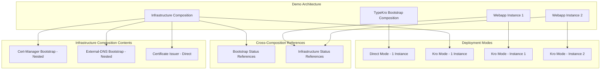

# TypeKro Nested Compositions Demo

This demo showcases TypeKro's nested composition capabilities through a complete three-composition architecture that demonstrates real-world infrastructure patterns.

## Architecture Overview

The demo implements exactly three distinct compositions with cross-composition referencing:



## Key Features Demonstrated

### 1. Nested Composition Calls
The Infrastructure Composition directly calls other compositions as nested compositions:

```typescript
const certManagerInstance = certManager.certManagerBootstrap({
  name: 'cert-manager',
  namespace: 'cert-manager',
  version: '1.13.3',
  // ... configuration
});

const externalDnsInstance = externalDns.externalDnsBootstrap({
  name: 'external-dns',
  namespace: 'external-dns',
  provider: 'aws',
  // ... configuration
});
```

### 2. Cross-Composition Status References
Natural status references work seamlessly across compositions:

```typescript
return {
  // Reference nested composition status naturally
  certManagerReady: certManagerInstance.status.ready,
  externalDnsReady: externalDnsInstance.status.ready,
  issuerReady: issuer.status.conditions?.some(c => 
    c.type === 'Ready' && c.status === 'True') || false,
};
```

### 3. Automatic Resource Flattening
All resources from nested compositions are automatically merged into the parent composition's ResourceGraphDefinition, creating a single cohesive deployment unit.

### 4. Cross-Composition References Between Compositions
The demo shows how to pass status from one composition to another:

```typescript
// Infrastructure references bootstrap status
const infrastructure = await infraFactory.deploy({
  domain: 'example.com',
  runtimePhase: bootstrap.status.phase, // Cross-composition reference
  kroSystemReady: bootstrap.status.components.kroSystem // Cross-composition reference
});

// Webapp references infrastructure status
const webapp = await webappFactory.deploy({
  name: 'hello-world-1',
  issuerName: infrastructure.status.issuerName, // Cross-composition reference
  dnsProvider: infrastructure.status.dnsProvider // Cross-composition reference
});
```

## Files Overview

### Core Demo Files

- **`hello-world-nested-compositions.ts`** - Complete three-composition demo with cluster deployment
- **`test-nested-compositions-yaml.ts`** - YAML generation test without cluster requirement
- **`test/integration/nested-compositions/three-composition-demo.test.ts`** - Integration tests

### Demo Components

1. **TypeKro Bootstrap Composition** (Direct Mode)
   - Deploys Flux CD and Kro controller
   - Provides runtime readiness status
   - Single instance deployment

2. **Infrastructure Composition** (Kro Mode)
   - **Contains nested compositions**: cert-manager and external-dns bootstrap calls
   - Creates ClusterIssuer directly
   - Provides infrastructure readiness status
   - Single instance deployment

3. **Webapp Composition** (Kro Mode)
   - Creates Deployment, Service, Certificate, and Ingress
   - References infrastructure status for issuer and DNS configuration
   - Two instances deployed with different configurations

## Running the Demo

### Prerequisites

1. **Kubernetes Cluster**: Running cluster with kubectl configured
2. **AWS Credentials**: For Route53 DNS management
3. **Environment Variables** (optional, defaults provided):
   ```bash
   export DEMO_DOMAIN="your-domain.com"
   export DEMO_EMAIL="your-email@example.com"
   export AWS_REGION="us-east-1"
   export HOSTED_ZONE_ID="Z1234567890"
   export ACME_SERVER="https://acme-staging-v02.api.letsencrypt.org/directory"
   ```

### Quick Test (No Cluster Required)

Test the nested composition functionality without cluster deployment:

```bash
bun run test-nested-compositions-yaml.ts
```

This validates:
- ✅ Nested composition calls work
- ✅ Cross-composition references work
- ✅ YAML generation works
- ✅ Factory creation works

### Full Demo (Requires Cluster)

Deploy the complete three-composition architecture:

```bash
bun run examples/hello-world-nested-compositions.ts
```

This will:
1. Validate configuration and cluster connectivity
2. Deploy TypeKro Bootstrap (Direct Mode)
3. Deploy Infrastructure Stack with nested compositions (Kro Mode)
4. Deploy two Webapp instances with cross-composition references (Kro Mode)
5. Wait for DNS propagation and test HTTPS connectivity

### Integration Tests

Run the comprehensive integration tests:

```bash
bun test test/integration/nested-compositions/three-composition-demo.test.ts
```

## Expected Output

### YAML Generation Test
```
🧪 Testing Nested Compositions YAML Generation
===============================================

📦 Test 1: TypeKro Bootstrap Composition
✅ Bootstrap YAML generated successfully
   Length: 1562 characters

🏗️  Test 2: Infrastructure Composition (with nested compositions)
✅ Infrastructure YAML generated successfully
   Length: 5209 characters

🌐 Test 3: Webapp Composition
✅ Webapp YAML generated successfully
   Length: 3295 characters

🎉 All Tests Passed!
```

### Full Demo Output
```
🚀 TypeKro Nested Compositions Demo
=====================================

📦 Step 1: Deploying TypeKro Bootstrap (Direct Mode)...
  ✅ Bootstrap deployed - Phase: Ready
  ✅ Kro System Ready: true

🏗️  Step 2: Deploying Infrastructure Stack (Kro Mode with nested compositions)...
  ✅ Infrastructure deployed
  ✅ Cert-Manager Ready: true
  ✅ External-DNS Ready: true
  ✅ Issuer Ready: true

🌐 Step 3: Deploying Webapp Instances (Kro Mode with cross-composition references)...
  ✅ Webapp 1: https://app1.example.com (Ready: true)
  ✅ Webapp 2: https://app2.example.com (Ready: true)

🏆 Three-Composition Demo Successfully Completed!
```

## Architecture Benefits

### Modularity
- Each composition encapsulates its own concerns
- Infrastructure components can be reused across applications
- Clean separation between platform and application concerns

### Type Safety
- Full TypeScript support for nested composition calls
- Cross-composition references are type-checked
- IDE autocomplete works for nested status fields

### Operational Excellence
- Single ResourceGraphDefinition per composition for easy management
- Event monitoring across all nested resources
- Automatic dependency resolution and ordering

### Developer Experience
- Natural function call syntax for nested compositions
- Familiar JavaScript expressions automatically converted to CEL
- Clear error messages for configuration and deployment issues

## Troubleshooting

### Common Issues

1. **Cluster Connectivity**
   ```
   ❌ Cluster not accessible
   ```
   - Ensure kubectl is configured: `kubectl cluster-info`
   - Check current context: `kubectl config current-context`

2. **AWS Credentials**
   ```
   ⚠️  AWS credentials not configured
   ```
   - Set AWS_ACCESS_KEY_ID and AWS_SECRET_ACCESS_KEY
   - Or configure AWS_PROFILE

3. **DNS Issues**
   ```
   ❌ DNS propagation failed
   ```
   - Verify Route53 hosted zone exists
   - Check HOSTED_ZONE_ID is correct
   - Wait longer for DNS propagation (up to 5 minutes)

4. **TLS Certificate Issues**
   ```
   ❌ Certificate not ready
   ```
   - Check cert-manager logs: `kubectl logs -n cert-manager deployment/cert-manager`
   - Verify ACME server is accessible
   - Check DNS01 challenge configuration

### Debug Commands

```bash
# Check composition status
kubectl get resourcegraphdefinitions

# Check nested resources
kubectl get all -n cert-manager
kubectl get all -n external-dns
kubectl get all -n default

# Check events
kubectl get events --sort-by='.lastTimestamp'

# Check logs
kubectl logs -n kro-system deployment/kro-controller-manager
kubectl logs -n flux-system deployment/helm-controller
```

## Next Steps

After running this demo, you can:

1. **Explore the Generated YAML**: Examine how nested compositions are flattened
2. **Create Your Own Compositions**: Use the patterns demonstrated here
3. **Add More Nested Compositions**: Extend the infrastructure stack
4. **Implement Custom Status Logic**: Add more sophisticated cross-composition references

## Code Structure

The demo is designed to be under 200 lines while remaining complete and demonstrating all key features:

- **Configuration**: Environment-based with sensible defaults
- **Validation**: Prerequisites and connectivity checks
- **Error Handling**: Comprehensive error messages and troubleshooting guidance
- **Testing**: Multiple levels from unit to integration tests
- **Documentation**: Complete examples and troubleshooting guides

This demonstrates TypeKro's ability to create powerful, modular infrastructure compositions with minimal code while maintaining full type safety and operational excellence.